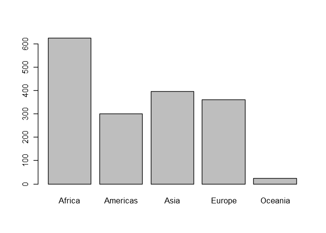
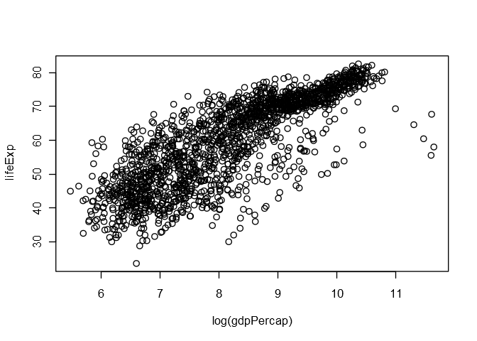
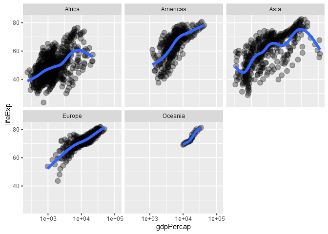
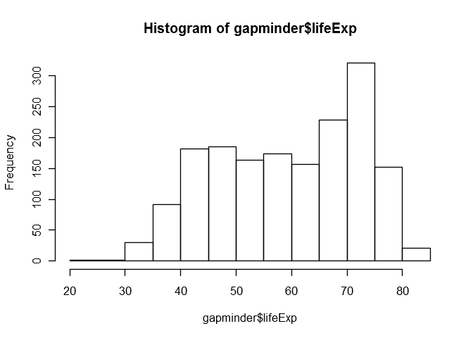
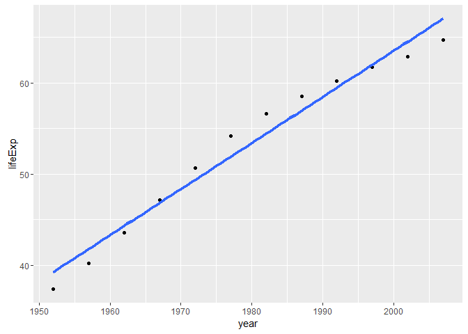

Exploring Gapminder Data
================
Gokul Raj Suresh Kumar
2016-10-03

Loading the Gapminder data
--------------------------

``` r
library("gapminder")
gapminder
```

    ## # A tibble: 1,704 × 6
    ##        country continent  year lifeExp      pop gdpPercap
    ##         <fctr>    <fctr> <int>   <dbl>    <int>     <dbl>
    ## 1  Afghanistan      Asia  1952  28.801  8425333  779.4453
    ## 2  Afghanistan      Asia  1957  30.332  9240934  820.8530
    ## 3  Afghanistan      Asia  1962  31.997 10267083  853.1007
    ## 4  Afghanistan      Asia  1967  34.020 11537966  836.1971
    ## 5  Afghanistan      Asia  1972  36.088 13079460  739.9811
    ## 6  Afghanistan      Asia  1977  38.438 14880372  786.1134
    ## 7  Afghanistan      Asia  1982  39.854 12881816  978.0114
    ## 8  Afghanistan      Asia  1987  40.822 13867957  852.3959
    ## 9  Afghanistan      Asia  1992  41.674 16317921  649.3414
    ## 10 Afghanistan      Asia  1997  41.763 22227415  635.3414
    ## # ... with 1,694 more rows

Summarizing the Gapminder data
------------------------------

``` r
summary(gapminder)
```

    ##         country        continent        year         lifeExp     
    ##  Afghanistan:  12   Africa  :624   Min.   :1952   Min.   :23.60  
    ##  Albania    :  12   Americas:300   1st Qu.:1966   1st Qu.:48.20  
    ##  Algeria    :  12   Asia    :396   Median :1980   Median :60.71  
    ##  Angola     :  12   Europe  :360   Mean   :1980   Mean   :59.47  
    ##  Argentina  :  12   Oceania : 24   3rd Qu.:1993   3rd Qu.:70.85  
    ##  Australia  :  12                  Max.   :2007   Max.   :82.60  
    ##  (Other)    :1632                                                
    ##       pop              gdpPercap       
    ##  Min.   :6.001e+04   Min.   :   241.2  
    ##  1st Qu.:2.794e+06   1st Qu.:  1202.1  
    ##  Median :7.024e+06   Median :  3531.8  
    ##  Mean   :2.960e+07   Mean   :  7215.3  
    ##  3rd Qu.:1.959e+07   3rd Qu.:  9325.5  
    ##  Max.   :1.319e+09   Max.   :113523.1  
    ## 

Observations associated with each continent
-------------------------------------------

``` r
barplot(table(gapminder$continent))
```



Life Expectancy vs GDP per capita
---------------------------------

``` r
plot(lifeExp ~ log(gdpPercap), gapminder)
```



Life Expectancy vs GDP per capita - Segregated View
---------------------------------------------------

``` r
library(ggplot2)
p <- ggplot(subset(gapminder),
            aes(x = gdpPercap, y = lifeExp)) 
p <- p + scale_x_log10()
p + geom_point(alpha = (1/3), size = 3) + facet_wrap(~ continent) + 
geom_smooth(lwd = 1.5, se = FALSE)
```



Frequency of occurence of Life Expectancy
-----------------------------------------

``` r
hist(gapminder$lifeExp)
```



Life Expectancy vs Year for India
---------------------------------

``` r
p <- ggplot(subset(gapminder, country == "India"),
           aes(x = year, y = lifeExp)) 
p + geom_point() + geom_smooth(lwd = 1.5, se = FALSE, method = "lm")
```



Correlation of Life Expectancy and GDP per capita for India
-----------------------------------------------------------

``` r
with(subset(gapminder, subset = country == "India"),
       cor(lifeExp, gdpPercap))
```

    ## [1] 0.8006954
