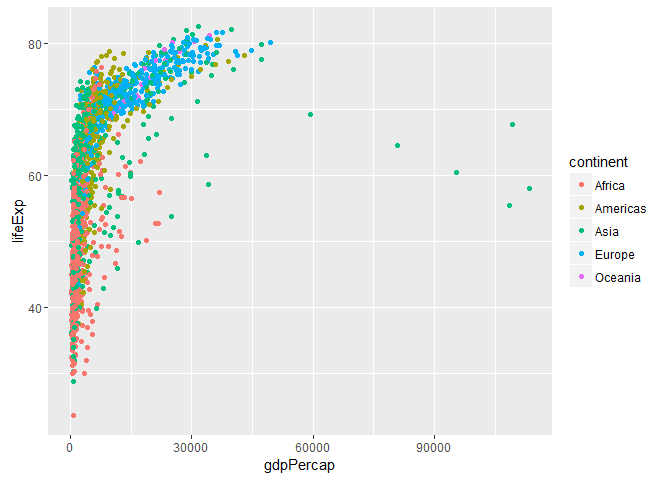

hw02\_explore-gapminder-dplyr
================
Gokul Raj
September 20, 2016

Explore Gapminder with the tidyverse
====================================

#### Load the packages

``` r
suppressPackageStartupMessages(library(dplyr))
library(gapminder)
```

#### Exploring the Gapminder data frame

``` r
gapminder
```

    ## # A tibble: 1,704 × 6
    ##        country continent  year lifeExp      pop gdpPercap
    ##         <fctr>    <fctr> <int>   <dbl>    <int>     <dbl>
    ## 1  Afghanistan      Asia  1952  28.801  8425333  779.4453
    ## 2  Afghanistan      Asia  1957  30.332  9240934  820.8530
    ## 3  Afghanistan      Asia  1962  31.997 10267083  853.1007
    ## 4  Afghanistan      Asia  1967  34.020 11537966  836.1971
    ## 5  Afghanistan      Asia  1972  36.088 13079460  739.9811
    ## 6  Afghanistan      Asia  1977  38.438 14880372  786.1134
    ## 7  Afghanistan      Asia  1982  39.854 12881816  978.0114
    ## 8  Afghanistan      Asia  1987  40.822 13867957  852.3959
    ## 9  Afghanistan      Asia  1992  41.674 16317921  649.3414
    ## 10 Afghanistan      Asia  1997  41.763 22227415  635.3414
    ## # ... with 1,694 more rows

``` r
str(gapminder)
```

    ## Classes 'tbl_df', 'tbl' and 'data.frame':    1704 obs. of  6 variables:
    ##  $ country  : Factor w/ 142 levels "Afghanistan",..: 1 1 1 1 1 1 1 1 1 1 ...
    ##  $ continent: Factor w/ 5 levels "Africa","Americas",..: 3 3 3 3 3 3 3 3 3 3 ...
    ##  $ year     : int  1952 1957 1962 1967 1972 1977 1982 1987 1992 1997 ...
    ##  $ lifeExp  : num  28.8 30.3 32 34 36.1 ...
    ##  $ pop      : int  8425333 9240934 10267083 11537966 13079460 14880372 12881816 13867957 16317921 22227415 ...
    ##  $ gdpPercap: num  779 821 853 836 740 ...

``` r
glimpse(gapminder)
```

    ## Observations: 1,704
    ## Variables: 6
    ## $ country   <fctr> Afghanistan, Afghanistan, Afghanistan, Afghanistan,...
    ## $ continent <fctr> Asia, Asia, Asia, Asia, Asia, Asia, Asia, Asia, Asi...
    ## $ year      <int> 1952, 1957, 1962, 1967, 1972, 1977, 1982, 1987, 1992...
    ## $ lifeExp   <dbl> 28.801, 30.332, 31.997, 34.020, 36.088, 38.438, 39.8...
    ## $ pop       <int> 8425333, 9240934, 10267083, 11537966, 13079460, 1488...
    ## $ gdpPercap <dbl> 779.4453, 820.8530, 853.1007, 836.1971, 739.9811, 78...

``` r
head(gapminder)
```

    ## # A tibble: 6 × 6
    ##       country continent  year lifeExp      pop gdpPercap
    ##        <fctr>    <fctr> <int>   <dbl>    <int>     <dbl>
    ## 1 Afghanistan      Asia  1952  28.801  8425333  779.4453
    ## 2 Afghanistan      Asia  1957  30.332  9240934  820.8530
    ## 3 Afghanistan      Asia  1962  31.997 10267083  853.1007
    ## 4 Afghanistan      Asia  1967  34.020 11537966  836.1971
    ## 5 Afghanistan      Asia  1972  36.088 13079460  739.9811
    ## 6 Afghanistan      Asia  1977  38.438 14880372  786.1134

``` r
tail(gapminder)
```

    ## # A tibble: 6 × 6
    ##    country continent  year lifeExp      pop gdpPercap
    ##     <fctr>    <fctr> <int>   <dbl>    <int>     <dbl>
    ## 1 Zimbabwe    Africa  1982  60.363  7636524  788.8550
    ## 2 Zimbabwe    Africa  1987  62.351  9216418  706.1573
    ## 3 Zimbabwe    Africa  1992  60.377 10704340  693.4208
    ## 4 Zimbabwe    Africa  1997  46.809 11404948  792.4500
    ## 5 Zimbabwe    Africa  2002  39.989 11926563  672.0386
    ## 6 Zimbabwe    Africa  2007  43.487 12311143  469.7093

#### Let's filter to certain rows and select certain columns

``` r
filter(gapminder, country == "Canada")
```

    ## # A tibble: 12 × 6
    ##    country continent  year lifeExp      pop gdpPercap
    ##     <fctr>    <fctr> <int>   <dbl>    <int>     <dbl>
    ## 1   Canada  Americas  1952  68.750 14785584  11367.16
    ## 2   Canada  Americas  1957  69.960 17010154  12489.95
    ## 3   Canada  Americas  1962  71.300 18985849  13462.49
    ## 4   Canada  Americas  1967  72.130 20819767  16076.59
    ## 5   Canada  Americas  1972  72.880 22284500  18970.57
    ## 6   Canada  Americas  1977  74.210 23796400  22090.88
    ## 7   Canada  Americas  1982  75.760 25201900  22898.79
    ## 8   Canada  Americas  1987  76.860 26549700  26626.52
    ## 9   Canada  Americas  1992  77.950 28523502  26342.88
    ## 10  Canada  Americas  1997  78.610 30305843  28954.93
    ## 11  Canada  Americas  2002  79.770 31902268  33328.97
    ## 12  Canada  Americas  2007  80.653 33390141  36319.24

``` r
filter(gapminder, year > 2000)
```

    ## # A tibble: 284 × 6
    ##        country continent  year lifeExp      pop  gdpPercap
    ##         <fctr>    <fctr> <int>   <dbl>    <int>      <dbl>
    ## 1  Afghanistan      Asia  2002  42.129 25268405   726.7341
    ## 2  Afghanistan      Asia  2007  43.828 31889923   974.5803
    ## 3      Albania    Europe  2002  75.651  3508512  4604.2117
    ## 4      Albania    Europe  2007  76.423  3600523  5937.0295
    ## 5      Algeria    Africa  2002  70.994 31287142  5288.0404
    ## 6      Algeria    Africa  2007  72.301 33333216  6223.3675
    ## 7       Angola    Africa  2002  41.003 10866106  2773.2873
    ## 8       Angola    Africa  2007  42.731 12420476  4797.2313
    ## 9    Argentina  Americas  2002  74.340 38331121  8797.6407
    ## 10   Argentina  Americas  2007  75.320 40301927 12779.3796
    ## # ... with 274 more rows

``` r
filter(gapminder, continent == "Europe", year == 2007)
```

    ## # A tibble: 30 × 6
    ##                   country continent  year lifeExp      pop gdpPercap
    ##                    <fctr>    <fctr> <int>   <dbl>    <int>     <dbl>
    ## 1                 Albania    Europe  2007  76.423  3600523  5937.030
    ## 2                 Austria    Europe  2007  79.829  8199783 36126.493
    ## 3                 Belgium    Europe  2007  79.441 10392226 33692.605
    ## 4  Bosnia and Herzegovina    Europe  2007  74.852  4552198  7446.299
    ## 5                Bulgaria    Europe  2007  73.005  7322858 10680.793
    ## 6                 Croatia    Europe  2007  75.748  4493312 14619.223
    ## 7          Czech Republic    Europe  2007  76.486 10228744 22833.309
    ## 8                 Denmark    Europe  2007  78.332  5468120 35278.419
    ## 9                 Finland    Europe  2007  79.313  5238460 33207.084
    ## 10                 France    Europe  2007  80.657 61083916 30470.017
    ## # ... with 20 more rows

``` r
filter(gapminder, country == "Bulgaria" | year == 2007)
```

    ## # A tibble: 153 × 6
    ##        country continent  year lifeExp       pop  gdpPercap
    ##         <fctr>    <fctr> <int>   <dbl>     <int>      <dbl>
    ## 1  Afghanistan      Asia  2007  43.828  31889923   974.5803
    ## 2      Albania    Europe  2007  76.423   3600523  5937.0295
    ## 3      Algeria    Africa  2007  72.301  33333216  6223.3675
    ## 4       Angola    Africa  2007  42.731  12420476  4797.2313
    ## 5    Argentina  Americas  2007  75.320  40301927 12779.3796
    ## 6    Australia   Oceania  2007  81.235  20434176 34435.3674
    ## 7      Austria    Europe  2007  79.829   8199783 36126.4927
    ## 8      Bahrain      Asia  2007  75.635    708573 29796.0483
    ## 9   Bangladesh      Asia  2007  64.062 150448339  1391.2538
    ## 10     Belgium    Europe  2007  79.441  10392226 33692.6051
    ## # ... with 143 more rows

``` r
filter(gapminder, country == "Bulgaria" | country == "Albania")
```

    ## # A tibble: 24 × 6
    ##    country continent  year lifeExp     pop gdpPercap
    ##     <fctr>    <fctr> <int>   <dbl>   <int>     <dbl>
    ## 1  Albania    Europe  1952  55.230 1282697  1601.056
    ## 2  Albania    Europe  1957  59.280 1476505  1942.284
    ## 3  Albania    Europe  1962  64.820 1728137  2312.889
    ## 4  Albania    Europe  1967  66.220 1984060  2760.197
    ## 5  Albania    Europe  1972  67.690 2263554  3313.422
    ## 6  Albania    Europe  1977  68.930 2509048  3533.004
    ## 7  Albania    Europe  1982  70.420 2780097  3630.881
    ## 8  Albania    Europe  1987  72.000 3075321  3738.933
    ## 9  Albania    Europe  1992  71.581 3326498  2497.438
    ## 10 Albania    Europe  1997  72.950 3428038  3193.055
    ## # ... with 14 more rows

``` r
filter(gapminder, country %in% c("Bulgaria", "Albania"))
```

    ## # A tibble: 24 × 6
    ##    country continent  year lifeExp     pop gdpPercap
    ##     <fctr>    <fctr> <int>   <dbl>   <int>     <dbl>
    ## 1  Albania    Europe  1952  55.230 1282697  1601.056
    ## 2  Albania    Europe  1957  59.280 1476505  1942.284
    ## 3  Albania    Europe  1962  64.820 1728137  2312.889
    ## 4  Albania    Europe  1967  66.220 1984060  2760.197
    ## 5  Albania    Europe  1972  67.690 2263554  3313.422
    ## 6  Albania    Europe  1977  68.930 2509048  3533.004
    ## 7  Albania    Europe  1982  70.420 2780097  3630.881
    ## 8  Albania    Europe  1987  72.000 3075321  3738.933
    ## 9  Albania    Europe  1992  71.581 3326498  2497.438
    ## 10 Albania    Europe  1997  72.950 3428038  3193.055
    ## # ... with 14 more rows

``` r
select(gapminder, year, lifeExp)
```

    ## # A tibble: 1,704 × 2
    ##     year lifeExp
    ##    <int>   <dbl>
    ## 1   1952  28.801
    ## 2   1957  30.332
    ## 3   1962  31.997
    ## 4   1967  34.020
    ## 5   1972  36.088
    ## 6   1977  38.438
    ## 7   1982  39.854
    ## 8   1987  40.822
    ## 9   1992  41.674
    ## 10  1997  41.763
    ## # ... with 1,694 more rows

``` r
select(                                #This is the one implemented first with pipe
  filter(gapminder, 
         country == "Canada"), 
  year, lifeExp)
```

    ## # A tibble: 12 × 2
    ##     year lifeExp
    ##    <int>   <dbl>
    ## 1   1952  68.750
    ## 2   1957  69.960
    ## 3   1962  71.300
    ## 4   1967  72.130
    ## 5   1972  72.880
    ## 6   1977  74.210
    ## 7   1982  75.760
    ## 8   1987  76.860
    ## 9   1992  77.950
    ## 10  1997  78.610
    ## 11  2002  79.770
    ## 12  2007  80.653

``` r
filter(
  select(gapminder,
         year, 
         lifeExp,
         country), 
  country == "Canada")
```

    ## # A tibble: 12 × 3
    ##     year lifeExp country
    ##    <int>   <dbl>  <fctr>
    ## 1   1952  68.750  Canada
    ## 2   1957  69.960  Canada
    ## 3   1962  71.300  Canada
    ## 4   1967  72.130  Canada
    ## 5   1972  72.880  Canada
    ## 6   1977  74.210  Canada
    ## 7   1982  75.760  Canada
    ## 8   1987  76.860  Canada
    ## 9   1992  77.950  Canada
    ## 10  1997  78.610  Canada
    ## 11  2002  79.770  Canada
    ## 12  2007  80.653  Canada

#### Let's use the pipe

``` r
gapminder %>% 
  filter(country == "Canada") %>%  #myfn(arg1,arg2,arg3,..) # arg1 usually a tibble
  select(year, lifeExp)            #arg1 %>%  myfn(arg2,arg3,..)
```

    ## # A tibble: 12 × 2
    ##     year lifeExp
    ##    <int>   <dbl>
    ## 1   1952  68.750
    ## 2   1957  69.960
    ## 3   1962  71.300
    ## 4   1967  72.130
    ## 5   1972  72.880
    ## 6   1977  74.210
    ## 7   1982  75.760
    ## 8   1987  76.860
    ## 9   1992  77.950
    ## 10  1997  78.610
    ## 11  2002  79.770
    ## 12  2007  80.653

``` r
gapminder %>%
  select(year, lifeExp, country) %>% 
  filter(country == "Canada") %>% 
  select(-country)
```

    ## # A tibble: 12 × 2
    ##     year lifeExp
    ##    <int>   <dbl>
    ## 1   1952  68.750
    ## 2   1957  69.960
    ## 3   1962  71.300
    ## 4   1967  72.130
    ## 5   1972  72.880
    ## 6   1977  74.210
    ## 7   1982  75.760
    ## 8   1987  76.860
    ## 9   1992  77.950
    ## 10  1997  78.610
    ## 11  2002  79.770
    ## 12  2007  80.653

``` r
y <- gapminder %>% 
  select(starts_with("co"))
```

Let's look at some functions to get to know a data frame

``` r
names(gapminder)
```

    ## [1] "country"   "continent" "year"      "lifeExp"   "pop"       "gdpPercap"

``` r
colnames(gapminder)
```

    ## [1] "country"   "continent" "year"      "lifeExp"   "pop"       "gdpPercap"

``` r
ncol(gapminder)
```

    ## [1] 6

``` r
length(gapminder)
```

    ## [1] 6

``` r
dim(gapminder)
```

    ## [1] 1704    6

``` r
nrow(gapminder)
```

    ## [1] 1704

Shift from describing the whole object to looking at the variable inside

``` r
summary(gapminder)
```

    ##         country        continent        year         lifeExp     
    ##  Afghanistan:  12   Africa  :624   Min.   :1952   Min.   :23.60  
    ##  Albania    :  12   Americas:300   1st Qu.:1966   1st Qu.:48.20  
    ##  Algeria    :  12   Asia    :396   Median :1980   Median :60.71  
    ##  Angola     :  12   Europe  :360   Mean   :1980   Mean   :59.47  
    ##  Argentina  :  12   Oceania : 24   3rd Qu.:1993   3rd Qu.:70.85  
    ##  Australia  :  12                  Max.   :2007   Max.   :82.60  
    ##  (Other)    :1632                                                
    ##       pop              gdpPercap       
    ##  Min.   :6.001e+04   Min.   :   241.2  
    ##  1st Qu.:2.794e+06   1st Qu.:  1202.1  
    ##  Median :7.024e+06   Median :  3531.8  
    ##  Mean   :2.960e+07   Mean   :  7215.3  
    ##  3rd Qu.:1.959e+07   3rd Qu.:  9325.5  
    ##  Max.   :1.319e+09   Max.   :113523.1  
    ## 

``` r
gapminder$lifeExp
```

    ##    [1] 28.80100 30.33200 31.99700 34.02000 36.08800 38.43800 39.85400
    ##    [8] 40.82200 41.67400 41.76300 42.12900 43.82800 55.23000 59.28000
    ##   [15] 64.82000 66.22000 67.69000 68.93000 70.42000 72.00000 71.58100
    ##   [22] 72.95000 75.65100 76.42300 43.07700 45.68500 48.30300 51.40700
    ##   [29] 54.51800 58.01400 61.36800 65.79900 67.74400 69.15200 70.99400
    ##   [36] 72.30100 30.01500 31.99900 34.00000 35.98500 37.92800 39.48300
    ##   [43] 39.94200 39.90600 40.64700 40.96300 41.00300 42.73100 62.48500
    ##   [50] 64.39900 65.14200 65.63400 67.06500 68.48100 69.94200 70.77400
    ##   [57] 71.86800 73.27500 74.34000 75.32000 69.12000 70.33000 70.93000
    ##   [64] 71.10000 71.93000 73.49000 74.74000 76.32000 77.56000 78.83000
    ##   [71] 80.37000 81.23500 66.80000 67.48000 69.54000 70.14000 70.63000
    ##   [78] 72.17000 73.18000 74.94000 76.04000 77.51000 78.98000 79.82900
    ##   [85] 50.93900 53.83200 56.92300 59.92300 63.30000 65.59300 69.05200
    ##   [92] 70.75000 72.60100 73.92500 74.79500 75.63500 37.48400 39.34800
    ##   [99] 41.21600 43.45300 45.25200 46.92300 50.00900 52.81900 56.01800
    ##  [106] 59.41200 62.01300 64.06200 68.00000 69.24000 70.25000 70.94000
    ##  [113] 71.44000 72.80000 73.93000 75.35000 76.46000 77.53000 78.32000
    ##  [120] 79.44100 38.22300 40.35800 42.61800 44.88500 47.01400 49.19000
    ##  [127] 50.90400 52.33700 53.91900 54.77700 54.40600 56.72800 40.41400
    ##  [134] 41.89000 43.42800 45.03200 46.71400 50.02300 53.85900 57.25100
    ##  [141] 59.95700 62.05000 63.88300 65.55400 53.82000 58.45000 61.93000
    ##  [148] 64.79000 67.45000 69.86000 70.69000 71.14000 72.17800 73.24400
    ##  [155] 74.09000 74.85200 47.62200 49.61800 51.52000 53.29800 56.02400
    ##  [162] 59.31900 61.48400 63.62200 62.74500 52.55600 46.63400 50.72800
    ##  [169] 50.91700 53.28500 55.66500 57.63200 59.50400 61.48900 63.33600
    ##  [176] 65.20500 67.05700 69.38800 71.00600 72.39000 59.60000 66.61000
    ##  [183] 69.51000 70.42000 70.90000 70.81000 71.08000 71.34000 71.19000
    ##  [190] 70.32000 72.14000 73.00500 31.97500 34.90600 37.81400 40.69700
    ##  [197] 43.59100 46.13700 48.12200 49.55700 50.26000 50.32400 50.65000
    ##  [204] 52.29500 39.03100 40.53300 42.04500 43.54800 44.05700 45.91000
    ##  [211] 47.47100 48.21100 44.73600 45.32600 47.36000 49.58000 39.41700
    ##  [218] 41.36600 43.41500 45.41500 40.31700 31.22000 50.95700 53.91400
    ##  [225] 55.80300 56.53400 56.75200 59.72300 38.52300 40.42800 42.64300
    ##  [232] 44.79900 47.04900 49.35500 52.96100 54.98500 54.31400 52.19900
    ##  [239] 49.85600 50.43000 68.75000 69.96000 71.30000 72.13000 72.88000
    ##  [246] 74.21000 75.76000 76.86000 77.95000 78.61000 79.77000 80.65300
    ##  [253] 35.46300 37.46400 39.47500 41.47800 43.45700 46.77500 48.29500
    ##  [260] 50.48500 49.39600 46.06600 43.30800 44.74100 38.09200 39.88100
    ##  [267] 41.71600 43.60100 45.56900 47.38300 49.51700 51.05100 51.72400
    ##  [274] 51.57300 50.52500 50.65100 54.74500 56.07400 57.92400 60.52300
    ##  [281] 63.44100 67.05200 70.56500 72.49200 74.12600 75.81600 77.86000
    ##  [288] 78.55300 44.00000 50.54896 44.50136 58.38112 63.11888 63.96736
    ##  [295] 65.52500 67.27400 68.69000 70.42600 72.02800 72.96100 50.64300
    ##  [302] 55.11800 57.86300 59.96300 61.62300 63.83700 66.65300 67.76800
    ##  [309] 68.42100 70.31300 71.68200 72.88900 40.71500 42.46000 44.46700
    ##  [316] 46.47200 48.94400 50.93900 52.93300 54.92600 57.93900 60.66000
    ##  [323] 62.97400 65.15200 39.14300 40.65200 42.12200 44.05600 45.98900
    ##  [330] 47.80400 47.78400 47.41200 45.54800 42.58700 44.96600 46.46200
    ##  [337] 42.11100 45.05300 48.43500 52.04000 54.90700 55.62500 56.69500
    ##  [344] 57.47000 56.43300 52.96200 52.97000 55.32200 57.20600 60.02600
    ##  [351] 62.84200 65.42400 67.84900 70.75000 73.45000 74.75200 75.71300
    ##  [358] 77.26000 78.12300 78.78200 40.47700 42.46900 44.93000 47.35000
    ##  [365] 49.80100 52.37400 53.98300 54.65500 52.04400 47.99100 46.83200
    ##  [372] 48.32800 61.21000 64.77000 67.13000 68.50000 69.61000 70.64000
    ##  [379] 70.46000 71.52000 72.52700 73.68000 74.87600 75.74800 59.42100
    ##  [386] 62.32500 65.24600 68.29000 70.72300 72.64900 73.71700 74.17400
    ##  [393] 74.41400 76.15100 77.15800 78.27300 66.87000 69.03000 69.90000
    ##  [400] 70.38000 70.29000 70.71000 70.96000 71.58000 72.40000 74.01000
    ##  [407] 75.51000 76.48600 70.78000 71.81000 72.35000 72.96000 73.47000
    ##  [414] 74.69000 74.63000 74.80000 75.33000 76.11000 77.18000 78.33200
    ##  [421] 34.81200 37.32800 39.69300 42.07400 44.36600 46.51900 48.81200
    ##  [428] 50.04000 51.60400 53.15700 53.37300 54.79100 45.92800 49.82800
    ##  [435] 53.45900 56.75100 59.63100 61.78800 63.72700 66.04600 68.45700
    ##  [442] 69.95700 70.84700 72.23500 48.35700 51.35600 54.64000 56.67800
    ##  [449] 58.79600 61.31000 64.34200 67.23100 69.61300 72.31200 74.17300
    ##  [456] 74.99400 41.89300 44.44400 46.99200 49.29300 51.13700 53.31900
    ##  [463] 56.00600 59.79700 63.67400 67.21700 69.80600 71.33800 45.26200
    ##  [470] 48.57000 52.30700 55.85500 58.20700 56.69600 56.60400 63.15400
    ##  [477] 66.79800 69.53500 70.73400 71.87800 34.48200 35.98300 37.48500
    ##  [484] 38.98700 40.51600 42.02400 43.66200 45.66400 47.54500 48.24500
    ##  [491] 49.34800 51.57900 35.92800 38.04700 40.15800 42.18900 44.14200
    ##  [498] 44.53500 43.89000 46.45300 49.99100 53.37800 55.24000 58.04000
    ##  [505] 34.07800 36.66700 40.05900 42.11500 43.51500 44.51000 44.91600
    ##  [512] 46.68400 48.09100 49.40200 50.72500 52.94700 66.55000 67.49000
    ##  [519] 68.75000 69.83000 70.87000 72.52000 74.55000 74.83000 75.70000
    ##  [526] 77.13000 78.37000 79.31300 67.41000 68.93000 70.51000 71.55000
    ##  [533] 72.38000 73.83000 74.89000 76.34000 77.46000 78.64000 79.59000
    ##  [540] 80.65700 37.00300 38.99900 40.48900 44.59800 48.69000 52.79000
    ##  [547] 56.56400 60.19000 61.36600 60.46100 56.76100 56.73500 30.00000
    ##  [554] 32.06500 33.89600 35.85700 38.30800 41.84200 45.58000 49.26500
    ##  [561] 52.64400 55.86100 58.04100 59.44800 67.50000 69.10000 70.30000
    ##  [568] 70.80000 71.00000 72.50000 73.80000 74.84700 76.07000 77.34000
    ##  [575] 78.67000 79.40600 43.14900 44.77900 46.45200 48.07200 49.87500
    ##  [582] 51.75600 53.74400 55.72900 57.50100 58.55600 58.45300 60.02200
    ##  [589] 65.86000 67.86000 69.51000 71.00000 72.34000 73.68000 75.24000
    ##  [596] 76.67000 77.03000 77.86900 78.25600 79.48300 42.02300 44.14200
    ##  [603] 46.95400 50.01600 53.73800 56.02900 58.13700 60.78200 63.37300
    ##  [610] 66.32200 68.97800 70.25900 33.60900 34.55800 35.75300 37.19700
    ##  [617] 38.84200 40.76200 42.89100 45.55200 48.57600 51.45500 53.67600
    ##  [624] 56.00700 32.50000 33.48900 34.48800 35.49200 36.48600 37.46500
    ##  [631] 39.32700 41.24500 43.26600 44.87300 45.50400 46.38800 37.57900
    ##  [638] 40.69600 43.59000 46.24300 48.04200 49.92300 51.46100 53.63600
    ##  [645] 55.08900 56.67100 58.13700 60.91600 41.91200 44.66500 48.04100
    ##  [652] 50.92400 53.88400 57.40200 60.90900 64.49200 66.39900 67.65900
    ##  [659] 68.56500 70.19800 60.96000 64.75000 67.65000 70.00000 72.00000
    ##  [666] 73.60000 75.45000 76.20000 77.60100 80.00000 81.49500 82.20800
    ##  [673] 64.03000 66.41000 67.96000 69.50000 69.76000 69.95000 69.39000
    ##  [680] 69.58000 69.17000 71.04000 72.59000 73.33800 72.49000 73.47000
    ##  [687] 73.68000 73.73000 74.46000 76.11000 76.99000 77.23000 78.77000
    ##  [694] 78.95000 80.50000 81.75700 37.37300 40.24900 43.60500 47.19300
    ##  [701] 50.65100 54.20800 56.59600 58.55300 60.22300 61.76500 62.87900
    ##  [708] 64.69800 37.46800 39.91800 42.51800 45.96400 49.20300 52.70200
    ##  [715] 56.15900 60.13700 62.68100 66.04100 68.58800 70.65000 44.86900
    ##  [722] 47.18100 49.32500 52.46900 55.23400 57.70200 59.62000 63.04000
    ##  [729] 65.74200 68.04200 69.45100 70.96400 45.32000 48.43700 51.45700
    ##  [736] 54.45900 56.95000 60.41300 62.03800 65.04400 59.46100 58.81100
    ##  [743] 57.04600 59.54500 66.91000 68.90000 70.29000 71.08000 71.28000
    ##  [750] 72.03000 73.10000 74.36000 75.46700 76.12200 77.78300 78.88500
    ##  [757] 65.39000 67.84000 69.39000 70.75000 71.63000 73.06000 74.45000
    ##  [764] 75.60000 76.93000 78.26900 79.69600 80.74500 65.94000 67.81000
    ##  [771] 69.24000 71.06000 72.19000 73.48000 74.98000 76.42000 77.44000
    ##  [778] 78.82000 80.24000 80.54600 58.53000 62.61000 65.61000 67.51000
    ##  [785] 69.00000 70.11000 71.21000 71.77000 71.76600 72.26200 72.04700
    ##  [792] 72.56700 63.03000 65.50000 68.73000 71.43000 73.42000 75.38000
    ##  [799] 77.11000 78.67000 79.36000 80.69000 82.00000 82.60300 43.15800
    ##  [806] 45.66900 48.12600 51.62900 56.52800 61.13400 63.73900 65.86900
    ##  [813] 68.01500 69.77200 71.26300 72.53500 42.27000 44.68600 47.94900
    ##  [820] 50.65400 53.55900 56.15500 58.76600 59.33900 59.28500 54.40700
    ##  [827] 50.99200 54.11000 50.05600 54.08100 56.65600 59.94200 63.98300
    ##  [834] 67.15900 69.10000 70.64700 69.97800 67.72700 66.66200 67.29700
    ##  [841] 47.45300 52.68100 55.29200 57.71600 62.61200 64.76600 67.12300
    ##  [848] 69.81000 72.24400 74.64700 77.04500 78.62300 55.56500 58.03300
    ##  [855] 60.47000 64.62400 67.71200 69.34300 71.30900 74.17400 75.19000
    ##  [862] 76.15600 76.90400 77.58800 55.92800 59.48900 62.09400 63.87000
    ##  [869] 65.42100 66.09900 66.98300 67.92600 69.29200 70.26500 71.02800
    ##  [876] 71.99300 42.13800 45.04700 47.74700 48.49200 49.76700 52.20800
    ##  [883] 55.07800 57.18000 59.68500 55.55800 44.59300 42.59200 38.48000
    ##  [890] 39.48600 40.50200 41.53600 42.61400 43.76400 44.85200 46.02700
    ##  [897] 40.80200 42.22100 43.75300 45.67800 42.72300 45.28900 47.80800
    ##  [904] 50.22700 52.77300 57.44200 62.15500 66.23400 68.75500 71.55500
    ##  [911] 72.73700 73.95200 36.68100 38.86500 40.84800 42.88100 44.85100
    ##  [918] 46.88100 48.96900 49.35000 52.21400 54.97800 57.28600 59.44300
    ##  [925] 36.25600 37.20700 38.41000 39.48700 41.76600 43.76700 45.64200
    ##  [932] 47.45700 49.42000 47.49500 45.00900 48.30300 48.46300 52.10200
    ##  [939] 55.73700 59.37100 63.01000 65.25600 68.00000 69.50000 70.69300
    ##  [946] 71.93800 73.04400 74.24100 33.68500 35.30700 36.93600 38.48700
    ##  [953] 39.97700 41.71400 43.91600 46.36400 48.38800 49.90300 51.81800
    ##  [960] 54.46700 40.54300 42.33800 44.24800 46.28900 48.43700 50.85200
    ##  [967] 53.59900 56.14500 58.33300 60.43000 62.24700 64.16400 50.98600
    ##  [974] 58.08900 60.24600 61.55700 62.94400 64.93000 66.71100 68.74000
    ##  [981] 69.74500 70.73600 71.95400 72.80100 50.78900 55.19000 58.29900
    ##  [988] 60.11000 62.36100 65.03200 67.40500 69.49800 71.45500 73.67000
    ##  [995] 74.90200 76.19500 42.24400 45.24800 48.25100 51.25300 53.75400
    ## [1002] 55.49100 57.48900 60.22200 61.27100 63.62500 65.03300 66.80300
    ## [1009] 59.16400 61.44800 63.72800 67.17800 70.63600 73.06600 74.10100
    ## [1016] 74.86500 75.43500 75.44500 73.98100 74.54300 42.87300 45.42300
    ## [1023] 47.92400 50.33500 52.86200 55.73000 59.65000 62.67700 65.39300
    ## [1030] 67.66000 69.61500 71.16400 31.28600 33.77900 36.16100 38.11300
    ## [1037] 40.32800 42.49500 42.79500 42.86100 44.28400 46.34400 44.02600
    ## [1044] 42.08200 36.31900 41.90500 45.10800 49.37900 53.07000 56.05900
    ## [1051] 58.05600 58.33900 59.32000 60.32800 59.90800 62.06900 41.72500
    ## [1058] 45.22600 48.38600 51.15900 53.86700 56.43700 58.96800 60.83500
    ## [1065] 61.99900 58.90900 51.47900 52.90600 36.15700 37.68600 39.39300
    ## [1072] 41.47200 43.97100 46.74800 49.59400 52.53700 55.72700 59.42600
    ## [1079] 61.34000 63.78500 72.13000 72.99000 73.23000 73.82000 73.75000
    ## [1086] 75.24000 76.05000 76.83000 77.42000 78.03000 78.53000 79.76200
    ## [1093] 69.39000 70.26000 71.24000 71.52000 71.89000 72.22000 73.84000
    ## [1100] 74.32000 76.33000 77.55000 79.11000 80.20400 42.31400 45.43200
    ## [1107] 48.63200 51.88400 55.15100 57.47000 59.29800 62.00800 65.84300
    ## [1114] 68.42600 70.83600 72.89900 37.44400 38.59800 39.48700 40.11800
    ## [1121] 40.54600 41.29100 42.59800 44.55500 47.39100 51.31300 54.49600
    ## [1128] 56.86700 36.32400 37.80200 39.36000 41.04000 42.82100 44.51400
    ## [1135] 45.82600 46.88600 47.47200 47.46400 46.60800 46.85900 72.67000
    ## [1142] 73.44000 73.47000 74.08000 74.34000 75.37000 75.97000 75.89000
    ## [1149] 77.32000 78.32000 79.05000 80.19600 37.57800 40.08000 43.16500
    ## [1156] 46.98800 52.14300 57.36700 62.72800 67.73400 71.19700 72.49900
    ## [1163] 74.19300 75.64000 43.43600 45.55700 47.67000 49.80000 51.92900
    ## [1170] 54.04300 56.15800 58.24500 60.83800 61.81800 63.61000 65.48300
    ## [1177] 55.19100 59.20100 61.81700 64.07100 66.21600 68.68100 70.47200
    ## [1184] 71.52300 72.46200 73.73800 74.71200 75.53700 62.64900 63.19600
    ## [1191] 64.36100 64.95100 65.81500 66.35300 66.87400 67.37800 68.22500
    ## [1198] 69.40000 70.75500 71.75200 43.90200 46.26300 49.09600 51.44500
    ## [1205] 55.44800 58.44700 61.40600 64.13400 66.45800 68.38600 69.90600
    ## [1212] 71.42100 47.75200 51.33400 54.75700 56.39300 58.06500 60.06000
    ## [1219] 62.08200 64.15100 66.45800 68.56400 70.30300 71.68800 61.31000
    ## [1226] 65.77000 67.64000 69.61000 70.85000 70.67000 71.32000 70.98000
    ## [1233] 70.99000 72.75000 74.67000 75.56300 59.82000 61.51000 64.39000
    ## [1240] 66.60000 69.26000 70.41000 72.77000 74.06000 74.86000 75.97000
    ## [1247] 77.29000 78.09800 64.28000 68.54000 69.62000 71.10000 72.16000
    ## [1254] 73.44000 73.75000 74.63000 73.91100 74.91700 77.77800 78.74600
    ## [1261] 52.72400 55.09000 57.66600 60.54200 64.27400 67.06400 69.88500
    ## [1268] 71.91300 73.61500 74.77200 75.74400 76.44200 61.05000 64.10000
    ## [1275] 66.80000 66.80000 69.21000 69.46000 69.66000 69.53000 69.36000
    ## [1282] 69.72000 71.32200 72.47600 40.00000 41.50000 43.00000 44.10000
    ## [1289] 44.60000 45.00000 46.21800 44.02000 23.59900 36.08700 43.41300
    ## [1296] 46.24200 46.47100 48.94500 51.89300 54.42500 56.48000 58.55000
    ## [1303] 60.35100 61.72800 62.74200 63.30600 64.33700 65.52800 39.87500
    ## [1310] 42.86800 45.91400 49.90100 53.88600 58.69000 63.01200 66.29500
    ## [1317] 68.76800 70.53300 71.62600 72.77700 37.27800 39.32900 41.45400
    ## [1324] 43.56300 45.81500 48.87900 52.37900 55.76900 58.19600 60.18700
    ## [1331] 61.60000 63.06200 57.99600 61.68500 64.53100 66.91400 68.70000
    ## [1338] 70.30000 70.16200 71.21800 71.65900 72.23200 73.21300 74.00200
    ## [1345] 30.33100 31.57000 32.76700 34.11300 35.40000 36.78800 38.44500
    ## [1352] 40.00600 38.33300 39.89700 41.01200 42.56800 60.39600 63.17900
    ## [1359] 65.79800 67.94600 69.52100 70.79500 71.76000 73.56000 75.78800
    ## [1366] 77.15800 78.77000 79.97200 64.36000 67.45000 70.33000 70.98000
    ## [1373] 70.35000 70.45000 70.80000 71.08000 71.38000 72.71000 73.80000
    ## [1380] 74.66300 65.57000 67.85000 69.15000 69.18000 69.82000 70.97000
    ## [1387] 71.06300 72.25000 73.64000 75.13000 76.66000 77.92600 32.97800
    ## [1394] 34.97700 36.98100 38.97700 40.97300 41.97400 42.95500 44.50100
    ## [1401] 39.65800 43.79500 45.93600 48.15900 45.00900 47.98500 49.95100
    ## [1408] 51.92700 53.69600 55.52700 58.16100 60.83400 61.88800 60.23600
    ## [1415] 53.36500 49.33900 64.94000 66.66000 69.69000 71.44000 73.06000
    ## [1422] 74.39000 76.30000 76.90000 77.57000 78.77000 79.78000 80.94100
    ## [1429] 57.59300 61.45600 62.19200 64.26600 65.04200 65.94900 68.75700
    ## [1436] 69.01100 70.37900 70.45700 70.81500 72.39600 38.63500 39.62400
    ## [1443] 40.87000 42.85800 45.08300 47.80000 50.33800 51.74400 53.55600
    ## [1450] 55.37300 56.36900 58.55600 41.40700 43.42400 44.99200 46.63300
    ## [1457] 49.55200 52.53700 55.56100 57.67800 58.47400 54.28900 43.86900
    ## [1464] 39.61300 71.86000 72.49000 73.37000 74.16000 74.72000 75.44000
    ## [1471] 76.42000 77.19000 78.16000 79.39000 80.04000 80.88400 69.62000
    ## [1478] 70.56000 71.32000 72.77000 73.78000 75.39000 76.21000 77.41000
    ## [1485] 78.03000 79.37000 80.62000 81.70100 45.88300 48.28400 50.30500
    ## [1492] 53.65500 57.29600 61.19500 64.59000 66.97400 69.24900 71.52700
    ## [1499] 73.05300 74.14300 58.50000 62.40000 65.20000 67.50000 69.39000
    ## [1506] 70.59000 72.16000 73.40000 74.26000 75.25000 76.99000 78.40000
    ## [1513] 41.21500 42.97400 44.24600 45.75700 47.62000 49.91900 50.60800
    ## [1520] 51.53500 50.44000 48.46600 49.65100 52.51700 50.84800 53.63000
    ## [1527] 56.06100 58.28500 60.40500 62.49400 64.59700 66.08400 67.29800
    ## [1534] 67.52100 68.56400 70.61600 38.59600 41.20800 43.92200 46.76900
    ## [1541] 49.75900 52.88700 55.47100 56.94100 58.06100 58.39000 57.56100
    ## [1548] 58.42000 59.10000 61.80000 64.90000 65.40000 65.90000 68.30000
    ## [1555] 68.83200 69.58200 69.86200 69.46500 68.97600 69.81900 44.60000
    ## [1562] 47.10000 49.57900 52.05300 55.60200 59.83700 64.04800 66.89400
    ## [1569] 70.00100 71.97300 73.04200 73.92300 43.58500 48.07900 52.09800
    ## [1576] 54.33600 57.00500 59.50700 61.03600 63.10800 66.14600 68.83500
    ## [1583] 70.84500 71.77700 39.97800 42.57100 45.34400 48.05100 51.01600
    ## [1590] 50.35000 49.84900 51.50900 48.82500 44.57800 47.81300 51.54200
    ## [1597] 69.18000 70.42000 70.76000 71.36000 72.01000 72.76000 74.04000
    ## [1604] 75.00700 76.42000 77.21800 78.47100 79.42500 68.44000 69.49000
    ## [1611] 70.21000 70.76000 71.34000 73.38000 74.65000 75.02000 76.09000
    ## [1618] 76.81000 77.31000 78.24200 66.07100 67.04400 68.25300 68.46800
    ## [1625] 68.67300 69.48100 70.80500 71.91800 72.75200 74.22300 75.30700
    ## [1632] 76.38400 55.08800 57.90700 60.77000 63.47900 65.71200 67.45600
    ## [1639] 68.55700 70.19000 71.15000 72.14600 72.76600 73.74700 40.41200
    ## [1646] 42.88700 45.36300 47.83800 50.25400 55.76400 58.81600 62.82000
    ## [1653] 67.66200 70.67200 73.01700 74.24900 43.16000 45.67100 48.12700
    ## [1660] 51.63100 56.53200 60.76500 64.40600 67.04600 69.71800 71.09600
    ## [1667] 72.37000 73.42200 32.54800 33.97000 35.18000 36.98400 39.84800
    ## [1674] 44.17500 49.11300 52.92200 55.59900 58.02000 60.30800 62.69800
    ## [1681] 42.03800 44.07700 46.02300 47.76800 50.10700 51.38600 51.82100
    ## [1688] 50.82100 46.10000 40.23800 39.19300 42.38400 48.45100 50.46900
    ## [1695] 52.35800 53.99500 55.63500 57.67400 60.36300 62.35100 60.37700
    ## [1702] 46.80900 39.98900 43.48700

``` r
gapminder[["gdpPercap"]]
```

    ##    [1]    779.4453    820.8530    853.1007    836.1971    739.9811
    ##    [6]    786.1134    978.0114    852.3959    649.3414    635.3414
    ##   [11]    726.7341    974.5803   1601.0561   1942.2842   2312.8890
    ##   [16]   2760.1969   3313.4222   3533.0039   3630.8807   3738.9327
    ##   [21]   2497.4379   3193.0546   4604.2117   5937.0295   2449.0082
    ##   [26]   3013.9760   2550.8169   3246.9918   4182.6638   4910.4168
    ##   [31]   5745.1602   5681.3585   5023.2166   4797.2951   5288.0404
    ##   [36]   6223.3675   3520.6103   3827.9405   4269.2767   5522.7764
    ##   [41]   5473.2880   3008.6474   2756.9537   2430.2083   2627.8457
    ##   [46]   2277.1409   2773.2873   4797.2313   5911.3151   6856.8562
    ##   [51]   7133.1660   8052.9530   9443.0385  10079.0267   8997.8974
    ##   [56]   9139.6714   9308.4187  10967.2820   8797.6407  12779.3796
    ##   [61]  10039.5956  10949.6496  12217.2269  14526.1246  16788.6295
    ##   [66]  18334.1975  19477.0093  21888.8890  23424.7668  26997.9366
    ##   [71]  30687.7547  34435.3674   6137.0765   8842.5980  10750.7211
    ##   [76]  12834.6024  16661.6256  19749.4223  21597.0836  23687.8261
    ##   [81]  27042.0187  29095.9207  32417.6077  36126.4927   9867.0848
    ##   [86]  11635.7995  12753.2751  14804.6727  18268.6584  19340.1020
    ##   [91]  19211.1473  18524.0241  19035.5792  20292.0168  23403.5593
    ##   [96]  29796.0483    684.2442    661.6375    686.3416    721.1861
    ##  [101]    630.2336    659.8772    676.9819    751.9794    837.8102
    ##  [106]    972.7700   1136.3904   1391.2538   8343.1051   9714.9606
    ##  [111]  10991.2068  13149.0412  16672.1436  19117.9745  20979.8459
    ##  [116]  22525.5631  25575.5707  27561.1966  30485.8838  33692.6051
    ##  [121]   1062.7522    959.6011    949.4991   1035.8314   1085.7969
    ##  [126]   1029.1613   1277.8976   1225.8560   1191.2077   1232.9753
    ##  [131]   1372.8779   1441.2849   2677.3263   2127.6863   2180.9725
    ##  [136]   2586.8861   2980.3313   3548.0978   3156.5105   2753.6915
    ##  [141]   2961.6997   3326.1432   3413.2627   3822.1371    973.5332
    ##  [146]   1353.9892   1709.6837   2172.3524   2860.1698   3528.4813
    ##  [151]   4126.6132   4314.1148   2546.7814   4766.3559   6018.9752
    ##  [156]   7446.2988    851.2411    918.2325    983.6540   1214.7093
    ##  [161]   2263.6111   3214.8578   4551.1421   6205.8839   7954.1116
    ##  [166]   8647.1423  11003.6051  12569.8518   2108.9444   2487.3660
    ##  [171]   3336.5858   3429.8644   4985.7115   6660.1187   7030.8359
    ##  [176]   7807.0958   6950.2830   7957.9808   8131.2128   9065.8008
    ##  [181]   2444.2866   3008.6707   4254.3378   5577.0028   6597.4944
    ##  [186]   7612.2404   8224.1916   8239.8548   6302.6234   5970.3888
    ##  [191]   7696.7777  10680.7928    543.2552    617.1835    722.5120
    ##  [196]    794.8266    854.7360    743.3870    807.1986    912.0631
    ##  [201]    931.7528    946.2950   1037.6452   1217.0330    339.2965
    ##  [206]    379.5646    355.2032    412.9775    464.0995    556.1033
    ##  [211]    559.6032    621.8188    631.6999    463.1151    446.4035
    ##  [216]    430.0707    368.4693    434.0383    496.9136    523.4323
    ##  [221]    421.6240    524.9722    624.4755    683.8956    682.3032
    ##  [226]    734.2852    896.2260   1713.7787   1172.6677   1313.0481
    ##  [231]   1399.6074   1508.4531   1684.1465   1783.4329   2367.9833
    ##  [236]   2602.6642   1793.1633   1694.3375   1934.0114   2042.0952
    ##  [241]  11367.1611  12489.9501  13462.4855  16076.5880  18970.5709
    ##  [246]  22090.8831  22898.7921  26626.5150  26342.8843  28954.9259
    ##  [251]  33328.9651  36319.2350   1071.3107   1190.8443   1193.0688
    ##  [256]   1136.0566   1070.0133   1109.3743    956.7530    844.8764
    ##  [261]    747.9055    740.5063    738.6906    706.0165   1178.6659
    ##  [266]   1308.4956   1389.8176   1196.8106   1104.1040   1133.9850
    ##  [271]    797.9081    952.3861   1058.0643   1004.9614   1156.1819
    ##  [276]   1704.0637   3939.9788   4315.6227   4519.0943   5106.6543
    ##  [281]   5494.0244   4756.7638   5095.6657   5547.0638   7596.1260
    ##  [286]  10118.0532  10778.7838  13171.6388    400.4486    575.9870
    ##  [291]    487.6740    612.7057    676.9001    741.2375    962.4214
    ##  [296]   1378.9040   1655.7842   2289.2341   3119.2809   4959.1149
    ##  [301]   2144.1151   2323.8056   2492.3511   2678.7298   3264.6600
    ##  [306]   3815.8079   4397.5757   4903.2191   5444.6486   6117.3617
    ##  [311]   5755.2600   7006.5804   1102.9909   1211.1485   1406.6483
    ##  [316]   1876.0296   1937.5777   1172.6030   1267.1001   1315.9808
    ##  [321]   1246.9074   1173.6182   1075.8116    986.1479    780.5423
    ##  [326]    905.8602    896.3146    861.5932    904.8961    795.7573
    ##  [331]    673.7478    672.7748    457.7192    312.1884    241.1659
    ##  [336]    277.5519   2125.6214   2315.0566   2464.7832   2677.9396
    ##  [341]   3213.1527   3259.1790   4879.5075   4201.1949   4016.2395
    ##  [346]   3484.1644   3484.0620   3632.5578   2627.0095   2990.0108
    ##  [351]   3460.9370   4161.7278   5118.1469   5926.8770   5262.7348
    ##  [356]   5629.9153   6160.4163   6677.0453   7723.4472   9645.0614
    ##  [361]   1388.5947   1500.8959   1728.8694   2052.0505   2378.2011
    ##  [366]   2517.7365   2602.7102   2156.9561   1648.0738   1786.2654
    ##  [371]   1648.8008   1544.7501   3119.2365   4338.2316   5477.8900
    ##  [376]   6960.2979   9164.0901  11305.3852  13221.8218  13822.5839
    ##  [381]   8447.7949   9875.6045  11628.3890  14619.2227   5586.5388
    ##  [386]   6092.1744   5180.7559   5690.2680   5305.4453   6380.4950
    ##  [391]   7316.9181   7532.9248   5592.8440   5431.9904   6340.6467
    ##  [396]   8948.1029   6876.1403   8256.3439  10136.8671  11399.4449
    ##  [401]  13108.4536  14800.1606  15377.2285  16310.4434  14297.0212
    ##  [406]  16048.5142  17596.2102  22833.3085   9692.3852  11099.6593
    ##  [411]  13583.3135  15937.2112  18866.2072  20422.9015  21688.0405
    ##  [416]  25116.1758  26406.7399  29804.3457  32166.5001  35278.4187
    ##  [421]   2669.5295   2864.9691   3020.9893   3020.0505   3694.2124
    ##  [426]   3081.7610   2879.4681   2880.1026   2377.1562   1895.0170
    ##  [431]   1908.2609   2082.4816   1397.7171   1544.4030   1662.1374
    ##  [436]   1653.7230   2189.8745   2681.9889   2861.0924   2899.8422
    ##  [441]   3044.2142   3614.1013   4563.8082   6025.3748   3522.1107
    ##  [446]   3780.5467   4086.1141   4579.0742   5280.9947   6679.6233
    ##  [451]   7213.7913   6481.7770   7103.7026   7429.4559   5773.0445
    ##  [456]   6873.2623   1418.8224   1458.9153   1693.3359   1814.8807
    ##  [461]   2024.0081   2785.4936   3503.7296   3885.4607   3794.7552
    ##  [466]   4173.1818   4754.6044   5581.1810   3048.3029   3421.5232
    ##  [471]   3776.8036   4358.5954   4520.2460   5138.9224   4098.3442
    ##  [476]   4140.4421   4444.2317   5154.8255   5351.5687   5728.3535
    ##  [481]    375.6431    426.0964    582.8420    915.5960    672.4123
    ##  [486]    958.5668    927.8253    966.8968   1132.0550   2814.4808
    ##  [491]   7703.4959  12154.0897    328.9406    344.1619    380.9958
    ##  [496]    468.7950    514.3242    505.7538    524.8758    521.1341
    ##  [501]    582.8585    913.4708    765.3500    641.3695    362.1463
    ##  [506]    378.9042    419.4564    516.1186    566.2439    556.8084
    ##  [511]    577.8607    573.7413    421.3535    515.8894    530.0535
    ##  [516]    690.8056   6424.5191   7545.4154   9371.8426  10921.6363
    ##  [521]  14358.8759  15605.4228  18533.1576  21141.0122  20647.1650
    ##  [526]  23723.9502  28204.5906  33207.0844   7029.8093   8662.8349
    ##  [531]  10560.4855  12999.9177  16107.1917  18292.6351  20293.8975
    ##  [536]  22066.4421  24703.7961  25889.7849  28926.0323  30470.0167
    ##  [541]   4293.4765   4976.1981   6631.4592   8358.7620  11401.9484
    ##  [546]  21745.5733  15113.3619  11864.4084  13522.1575  14722.8419
    ##  [551]  12521.7139  13206.4845    485.2307    520.9267    599.6503
    ##  [556]    734.7829    756.0868    884.7553    835.8096    611.6589
    ##  [561]    665.6244    653.7302    660.5856    752.7497   7144.1144
    ##  [566]  10187.8267  12902.4629  14745.6256  18016.1803  20512.9212
    ##  [571]  22031.5327  24639.1857  26505.3032  27788.8842  30035.8020
    ##  [576]  32170.3744    911.2989   1043.5615   1190.0411   1125.6972
    ##  [581]   1178.2237    993.2240    876.0326    847.0061    925.0602
    ##  [586]   1005.2458   1111.9846   1327.6089   3530.6901   4916.2999
    ##  [591]   6017.1907   8513.0970  12724.8296  14195.5243  15268.4209
    ##  [596]  16120.5284  17541.4963  18747.6981  22514.2548  27538.4119
    ##  [601]   2428.2378   2617.1560   2750.3644   3242.5311   4031.4083
    ##  [606]   4879.9927   4820.4948   4246.4860   4439.4508   4684.3138
    ##  [611]   4858.3475   5186.0500    510.1965    576.2670    686.3737
    ##  [616]    708.7595    741.6662    874.6859    857.2504    805.5725
    ##  [621]    794.3484    869.4498    945.5836    942.6542    299.8503
    ##  [626]    431.7905    522.0344    715.5806    820.2246    764.7260
    ##  [631]    838.1240    736.4154    745.5399    796.6645    575.7047
    ##  [636]    579.2317   1840.3669   1726.8879   1796.5890   1452.0577
    ##  [641]   1654.4569   1874.2989   2011.1595   1823.0160   1456.3095
    ##  [646]   1341.7269   1270.3649   1201.6372   2194.9262   2220.4877
    ##  [651]   2291.1568   2538.2694   2529.8423   3203.2081   3121.7608
    ##  [656]   3023.0967   3081.6946   3160.4549   3099.7287   3548.3308
    ##  [661]   3054.4212   3629.0765   4692.6483   6197.9628   8315.9281
    ##  [666]  11186.1413  14560.5305  20038.4727  24757.6030  28377.6322
    ##  [671]  30209.0152  39724.9787   5263.6738   6040.1800   7550.3599
    ##  [676]   9326.6447  10168.6561  11674.8374  12545.9907  12986.4800
    ##  [681]  10535.6285  11712.7768  14843.9356  18008.9444   7267.6884
    ##  [686]   9244.0014  10350.1591  13319.8957  15798.0636  19654.9625
    ##  [691]  23269.6075  26923.2063  25144.3920  28061.0997  31163.2020
    ##  [696]  36180.7892    546.5657    590.0620    658.3472    700.7706
    ##  [701]    724.0325    813.3373    855.7235    976.5127   1164.4068
    ##  [706]   1458.8174   1746.7695   2452.2104    749.6817    858.9003
    ##  [711]    849.2898    762.4318   1111.1079   1382.7021   1516.8730
    ##  [716]   1748.3570   2383.1409   3119.3356   2873.9129   3540.6516
    ##  [721]   3035.3260   3290.2576   4187.3298   5906.7318   9613.8186
    ##  [726]  11888.5951   7608.3346   6642.8814   7235.6532   8263.5903
    ##  [731]   9240.7620  11605.7145   4129.7661   6229.3336   8341.7378
    ##  [736]   8931.4598   9576.0376  14688.2351  14517.9071  11643.5727
    ##  [741]   3745.6407   3076.2398   4390.7173   4471.0619   5210.2803
    ##  [746]   5599.0779   6631.5973   7655.5690   9530.7729  11150.9811
    ##  [751]  12618.3214  13872.8665  17558.8155  24521.9471  34077.0494
    ##  [756]  40675.9964   4086.5221   5385.2785   7105.6307   8393.7414
    ##  [761]  12786.9322  13306.6192  15367.0292  17122.4799  18051.5225
    ##  [766]  20896.6092  21905.5951  25523.2771   4931.4042   6248.6562
    ##  [771]   8243.5823  10022.4013  12269.2738  14255.9847  16537.4835
    ##  [776]  19207.2348  22013.6449  24675.0245  27968.0982  28569.7197
    ##  [781]   2898.5309   4756.5258   5246.1075   6124.7035   7433.8893
    ##  [786]   6650.1956   6068.0513   6351.2375   7404.9237   7121.9247
    ##  [791]   6994.7749   7320.8803   3216.9563   4317.6944   6576.6495
    ##  [796]   9847.7886  14778.7864  16610.3770  19384.1057  22375.9419
    ##  [801]  26824.8951  28816.5850  28604.5919  31656.0681   1546.9078
    ##  [806]   1886.0806   2348.0092   2741.7963   2110.8563   2852.3516
    ##  [811]   4161.4160   4448.6799   3431.5936   3645.3796   3844.9172
    ##  [816]   4519.4612    853.5409    944.4383    896.9664   1056.7365
    ##  [821]   1222.3600   1267.6132   1348.2258   1361.9369   1341.9217
    ##  [826]   1360.4850   1287.5147   1463.2493   1088.2778   1571.1347
    ##  [831]   1621.6936   2143.5406   3701.6215   4106.3012   4106.5253
    ##  [836]   4106.4923   3726.0635   1690.7568   1646.7582   1593.0655
    ##  [841]   1030.5922   1487.5935   1536.3444   2029.2281   3030.8767
    ##  [846]   4657.2210   5622.9425   8533.0888  12104.2787  15993.5280
    ##  [851]  19233.9882  23348.1397 108382.3529 113523.1329  95458.1118
    ##  [856]  80894.8833 109347.8670  59265.4771  31354.0357  28118.4300
    ##  [861]  34932.9196  40300.6200  35110.1057  47306.9898   4834.8041
    ##  [866]   6089.7869   5714.5606   6006.9830   7486.3843   8659.6968
    ##  [871]   7640.5195   5377.0913   6890.8069   8754.9639   9313.9388
    ##  [876]  10461.0587    298.8462    335.9971    411.8006    498.6390
    ##  [881]    496.5816    745.3695    797.2631    773.9932    977.4863
    ##  [886]   1186.1480   1275.1846   1569.3314    575.5730    620.9700
    ##  [891]    634.1952    713.6036    803.0055    640.3224    572.1996
    ##  [896]    506.1139    636.6229    609.1740    531.4824    414.5073
    ##  [901]   2387.5481   3448.2844   6757.0308  18772.7517  21011.4972
    ##  [906]  21951.2118  17364.2754  11770.5898   9640.1385   9467.4461
    ##  [911]   9534.6775  12057.4993   1443.0117   1589.2027   1643.3871
    ##  [916]   1634.0473   1748.5630   1544.2286   1302.8787   1155.4419
    ##  [921]   1040.6762    986.2959    894.6371   1044.7701    369.1651
    ##  [926]    416.3698    427.9011    495.5148    584.6220    663.2237
    ##  [931]    632.8039    635.5174    563.2000    692.2758    665.4231
    ##  [936]    759.3499   1831.1329   1810.0670   2036.8849   2277.7424
    ##  [941]   2849.0948   3827.9216   4920.3560   5249.8027   7277.9128
    ##  [946]  10132.9096  10206.9779  12451.6558    452.3370    490.3822
    ##  [951]    496.1743    545.0099    581.3689    686.3953    618.0141
    ##  [956]    684.1716    739.0144    790.2580    951.4098   1042.5816
    ##  [961]    743.1159    846.1203   1055.8960   1421.1452   1586.8518
    ##  [966]   1497.4922   1481.1502   1421.6036   1361.3698   1483.1361
    ##  [971]   1579.0195   1803.1515   1967.9557   2034.0380   2529.0675
    ##  [976]   2475.3876   2575.4842   3710.9830   3688.0377   4783.5869
    ##  [981]   6058.2538   7425.7053   9021.8159  10956.9911   3478.1255
    ##  [986]   4131.5466   4581.6094   5754.7339   6809.4067   7674.9291
    ##  [991]   9611.1475   8688.1560   9472.3843   9767.2975  10742.4405
    ##  [996]  11977.5750    786.5669    912.6626   1056.3540   1226.0411
    ## [1001]   1421.7420   1647.5117   2000.6031   2338.0083   1785.4020
    ## [1006]   1902.2521   2140.7393   3095.7723   2647.5856   3682.2599
    ## [1011]   4649.5938   5907.8509   7778.4140   9595.9299  11222.5876
    ## [1016]  11732.5102   7003.3390   6465.6133   6557.1943   9253.8961
    ## [1021]   1688.2036   1642.0023   1566.3535   1711.0448   1930.1950
    ## [1026]   2370.6200   2702.6204   2755.0470   2948.0473   2982.1019
    ## [1031]   3258.4956   3820.1752    468.5260    495.5868    556.6864
    ## [1036]    566.6692    724.9178    502.3197    462.2114    389.8762
    ## [1041]    410.8968    472.3461    633.6179    823.6856    331.0000
    ## [1046]    350.0000    388.0000    349.0000    357.0000    371.0000
    ## [1051]    424.0000    385.0000    347.0000    415.0000    611.0000
    ## [1056]    944.0000   2423.7804   2621.4481   3173.2156   3793.6948
    ## [1061]   3746.0809   3876.4860   4191.1005   3693.7313   3804.5380
    ## [1066]   3899.5243   4072.3248   4811.0604    545.8657    597.9364
    ## [1071]    652.3969    676.4422    674.7881    694.1124    718.3731
    ## [1076]    775.6325    897.7404   1010.8921   1057.2063   1091.3598
    ## [1081]   8941.5719  11276.1934  12790.8496  15363.2514  18794.7457
    ## [1086]  21209.0592  21399.4605  23651.3236  26790.9496  30246.1306
    ## [1091]  33724.7578  36797.9333  10556.5757  12247.3953  13175.6780
    ## [1096]  14463.9189  16046.0373  16233.7177  17632.4104  19007.1913
    ## [1101]  18363.3249  21050.4138  23189.8014  25185.0091   3112.3639
    ## [1106]   3457.4159   3634.3644   4643.3935   4688.5933   5486.3711
    ## [1111]   3470.3382   2955.9844   2170.1517   2253.0230   2474.5488
    ## [1116]   2749.3210    761.8794    835.5234    997.7661   1054.3849
    ## [1121]    954.2092    808.8971    909.7221    668.3000    581.1827
    ## [1126]    580.3052    601.0745    619.6769   1077.2819   1100.5926
    ## [1131]   1150.9275   1014.5141   1698.3888   1981.9518   1576.9738
    ## [1136]   1385.0296   1619.8482   1624.9413   1615.2864   2013.9773
    ## [1141]  10095.4217  11653.9730  13450.4015  16361.8765  18965.0555
    ## [1146]  23311.3494  26298.6353  31540.9748  33965.6611  41283.1643
    ## [1151]  44683.9753  49357.1902   1828.2303   2242.7466   2924.6381
    ## [1156]   4720.9427  10618.0385  11848.3439  12954.7910  18115.2231
    ## [1161]  18616.7069  19702.0558  19774.8369  22316.1929    684.5971
    ## [1166]    747.0835    803.3427    942.4083   1049.9390   1175.9212
    ## [1171]   1443.4298   1704.6866   1971.8295   2049.3505   2092.7124
    ## [1176]   2605.9476   2480.3803   2961.8009   3536.5403   4421.0091
    ## [1181]   5364.2497   5351.9121   7009.6016   7034.7792   6618.7431
    ## [1186]   7113.6923   7356.0319   9809.1856   1952.3087   2046.1547
    ## [1191]   2148.0271   2299.3763   2523.3380   3248.3733   4258.5036
    ## [1196]   3998.8757   4196.4111   4247.4003   3783.6742   4172.8385
    ## [1201]   3758.5234   4245.2567   4957.0380   5788.0933   5937.8273
    ## [1206]   6281.2909   6434.5018   6360.9434   4446.3809   5838.3477
    ## [1211]   5909.0201   7408.9056   1272.8810   1547.9448   1649.5522
    ## [1216]   1814.1274   1989.3741   2373.2043   2603.2738   2189.6350
    ## [1221]   2279.3240   2536.5349   2650.9211   3190.4810   4029.3297
    ## [1226]   4734.2530   5338.7521   6557.1528   8006.5070   9508.1415
    ## [1231]   8451.5310   9082.3512   7738.8812  10159.5837  12002.2391
    ## [1236]  15389.9247   3068.3199   3774.5717   4727.9549   6361.5180
    ## [1241]   9022.2474  10172.4857  11753.8429  13039.3088  16207.2666
    ## [1246]  17641.0316  19970.9079  20509.6478   3081.9598   3907.1562
    ## [1251]   5108.3446   6929.2777   9123.0417   9770.5249  10330.9891
    ## [1256]  12281.3419  14641.5871  16999.4333  18855.6062  19328.7090
    ## [1261]   2718.8853   2769.4518   3173.7233   4021.1757   5047.6586
    ## [1266]   4319.8041   5267.2194   5303.3775   6101.2558   6071.9414
    ## [1271]   6316.1652   7670.1226   3144.6132   3943.3702   4734.9976
    ## [1276]   6470.8665   8011.4144   9356.3972   9605.3141   9696.2733
    ## [1281]   6598.4099   7346.5476   7885.3601  10808.4756    493.3239
    ## [1286]    540.2894    597.4731    510.9637    590.5807    670.0806
    ## [1291]    881.5706    847.9912    737.0686    589.9445    785.6538
    ## [1296]    863.0885    879.5836    860.7369   1071.5511   1384.8406
    ## [1301]   1532.9853   1737.5617   1890.2181   1516.5255   1428.7778
    ## [1306]   1339.0760   1353.0924   1598.4351   6459.5548   8157.5912
    ## [1311]  11626.4197  16903.0489  24837.4287  34167.7626  33693.1753
    ## [1316]  21198.2614  24841.6178  20586.6902  19014.5412  21654.8319
    ## [1321]   1450.3570   1567.6530   1654.9887   1612.4046   1597.7121
    ## [1326]   1561.7691   1518.4800   1441.7207   1367.8994   1392.3683
    ## [1331]   1519.6353   1712.4721   3581.4594   4981.0909   6289.6292
    ## [1336]   7991.7071  10522.0675  12980.6696  15181.0927  15870.8785
    ## [1341]   9325.0682   7914.3203   7236.0753   9786.5347    879.7877
    ## [1346]   1004.4844   1116.6399   1206.0435   1353.7598   1348.2852
    ## [1351]   1465.0108   1294.4478   1068.6963    574.6482    699.4897
    ## [1356]    862.5408   2315.1382   2843.1044   3674.7356   4977.4185
    ## [1361]   8597.7562  11210.0895  15169.1611  18861.5308  24769.8912
    ## [1366]  33519.4766  36023.1054  47143.1796   5074.6591   6093.2630
    ## [1371]   7481.1076   8412.9024   9674.1676  10922.6640  11348.5459
    ## [1376]  12037.2676   9498.4677  12126.2306  13638.7784  18678.3144
    ## [1381]   4215.0417   5862.2766   7402.3034   9405.4894  12383.4862
    ## [1386]  15277.0302  17866.7218  18678.5349  14214.7168  17161.1073
    ## [1391]  20660.0194  25768.2576   1135.7498   1258.1474   1369.4883
    ## [1396]   1284.7332   1254.5761   1450.9925   1176.8070   1093.2450
    ## [1401]    926.9603    930.5964    882.0818    926.1411   4725.2955
    ## [1406]   5487.1042   5768.7297   7114.4780   7765.9626   8028.6514
    ## [1411]   8568.2662   7825.8234   7225.0693   7479.1882   7710.9464
    ## [1416]   9269.6578   3834.0347   4564.8024   5693.8439   7993.5123
    ## [1421]  10638.7513  13236.9212  13926.1700  15764.9831  18603.0645
    ## [1426]  20445.2990  24835.4717  28821.0637   1083.5320   1072.5466
    ## [1431]   1074.4720   1135.5143   1213.3955   1348.7757   1648.0798
    ## [1436]   1876.7668   2153.7392   2664.4773   3015.3788   3970.0954
    ## [1441]   1615.9911   1770.3371   1959.5938   1687.9976   1659.6528
    ## [1446]   2202.9884   1895.5441   1507.8192   1492.1970   1632.2108
    ## [1451]   1993.3983   2602.3950   1148.3766   1244.7084   1856.1821
    ## [1456]   2613.1017   3364.8366   3781.4106   3895.3840   3984.8398
    ## [1461]   3553.0224   3876.7685   4128.1169   4513.4806   8527.8447
    ## [1466]   9911.8782  12329.4419  15258.2970  17832.0246  18855.7252
    ## [1471]  20667.3812  23586.9293  23880.0168  25266.5950  29341.6309
    ## [1476]  33859.7484  14734.2327  17909.4897  20431.0927  22966.1443
    ## [1481]  27195.1130  26982.2905  28397.7151  30281.7046  31871.5303
    ## [1486]  32135.3230  34480.9577  37506.4191   1643.4854   2117.2349
    ## [1491]   2193.0371   1881.9236   2571.4230   3195.4846   3761.8377
    ## [1496]   3116.7743   3340.5428   4014.2390   4090.9253   4184.5481
    ## [1501]   1206.9479   1507.8613   1822.8790   2643.8587   4062.5239
    ## [1506]   5596.5198   7426.3548  11054.5618  15215.6579  20206.8210
    ## [1511]  23235.4233  28718.2768    716.6501    698.5356    722.0038
    ## [1516]    848.2187    915.9851    962.4923    874.2426    831.8221
    ## [1521]    825.6825    789.1862    899.0742   1107.4822    757.7974
    ## [1526]    793.5774   1002.1992   1295.4607   1524.3589   1961.2246
    ## [1531]   2393.2198   2982.6538   4616.8965   5852.6255   5913.1875
    ## [1536]   7458.3963    859.8087    925.9083   1067.5348   1477.5968
    ## [1541]   1649.6602   1532.7770   1344.5780   1202.2014   1034.2989
    ## [1546]    982.2869    886.2206    882.9699   3023.2719   4100.3934
    ## [1551]   4997.5240   5621.3685   6619.5514   7899.5542   9119.5286
    ## [1556]   7388.5978   7370.9909   8792.5731  11460.6002  18008.5092
    ## [1561]   1468.4756   1395.2325   1660.3032   1932.3602   2753.2860
    ## [1566]   3120.8768   3560.2332   3810.4193   4332.7202   4876.7986
    ## [1571]   5722.8957   7092.9230   1969.1010   2218.7543   2322.8699
    ## [1576]   2826.3564   3450.6964   4269.1223   4241.3563   5089.0437
    ## [1581]   5678.3483   6601.4299   6508.0857   8458.2764    734.7535
    ## [1586]    774.3711    767.2717    908.9185    950.7359    843.7331
    ## [1591]    682.2662    617.7244    644.1708    816.5591    927.7210
    ## [1596]   1056.3801   9979.5085  11283.1779  12477.1771  14142.8509
    ## [1601]  15895.1164  17428.7485  18232.4245  21664.7877  22705.0925
    ## [1606]  26074.5314  29478.9992  33203.2613  13990.4821  14847.1271
    ## [1611]  16173.1459  19530.3656  21806.0359  24072.6321  25009.5591
    ## [1616]  29884.3504  32003.9322  35767.4330  39097.0995  42951.6531
    ## [1621]   5716.7667   6150.7730   5603.3577   5444.6196   5703.4089
    ## [1626]   6504.3397   6920.2231   7452.3990   8137.0048   9230.2407
    ## [1631]   7727.0020  10611.4630   7689.7998   9802.4665   8422.9742
    ## [1636]   9541.4742  10505.2597  13143.9510  11152.4101   9883.5846
    ## [1641]  10733.9263  10165.4952   8605.0478  11415.8057    605.0665
    ## [1646]    676.2854    772.0492    637.1233    699.5016    713.5371
    ## [1651]    707.2358    820.7994    989.0231   1385.8968   1764.4567
    ## [1656]   2441.5764   1515.5923   1827.0677   2198.9563   2649.7150
    ## [1661]   3133.4093   3682.8315   4336.0321   5107.1974   6017.6548
    ## [1666]   7110.6676   4515.4876   3025.3498    781.7176    804.8305
    ## [1671]    825.6232    862.4421   1265.0470   1829.7652   1977.5570
    ## [1676]   1971.7415   1879.4967   2117.4845   2234.8208   2280.7699
    ## [1681]   1147.3888   1311.9568   1452.7258   1777.0773   1773.4983
    ## [1686]   1588.6883   1408.6786   1213.3151   1210.8846   1071.3538
    ## [1691]   1071.6139   1271.2116    406.8841    518.7643    527.2722
    ## [1696]    569.7951    799.3622    685.5877    788.8550    706.1573
    ## [1701]    693.4208    792.4500    672.0386    469.7093

``` r
gapminder[c("year" , "country")]
```

    ## # A tibble: 1,704 × 2
    ##     year     country
    ##    <int>      <fctr>
    ## 1   1952 Afghanistan
    ## 2   1957 Afghanistan
    ## 3   1962 Afghanistan
    ## 4   1967 Afghanistan
    ## 5   1972 Afghanistan
    ## 6   1977 Afghanistan
    ## 7   1982 Afghanistan
    ## 8   1987 Afghanistan
    ## 9   1992 Afghanistan
    ## 10  1997 Afghanistan
    ## # ... with 1,694 more rows

``` r
my_fav_var <-  "country"
gapminder[[my_fav_var]]
```

    ##    [1] Afghanistan              Afghanistan             
    ##    [3] Afghanistan              Afghanistan             
    ##    [5] Afghanistan              Afghanistan             
    ##    [7] Afghanistan              Afghanistan             
    ##    [9] Afghanistan              Afghanistan             
    ##   [11] Afghanistan              Afghanistan             
    ##   [13] Albania                  Albania                 
    ##   [15] Albania                  Albania                 
    ##   [17] Albania                  Albania                 
    ##   [19] Albania                  Albania                 
    ##   [21] Albania                  Albania                 
    ##   [23] Albania                  Albania                 
    ##   [25] Algeria                  Algeria                 
    ##   [27] Algeria                  Algeria                 
    ##   [29] Algeria                  Algeria                 
    ##   [31] Algeria                  Algeria                 
    ##   [33] Algeria                  Algeria                 
    ##   [35] Algeria                  Algeria                 
    ##   [37] Angola                   Angola                  
    ##   [39] Angola                   Angola                  
    ##   [41] Angola                   Angola                  
    ##   [43] Angola                   Angola                  
    ##   [45] Angola                   Angola                  
    ##   [47] Angola                   Angola                  
    ##   [49] Argentina                Argentina               
    ##   [51] Argentina                Argentina               
    ##   [53] Argentina                Argentina               
    ##   [55] Argentina                Argentina               
    ##   [57] Argentina                Argentina               
    ##   [59] Argentina                Argentina               
    ##   [61] Australia                Australia               
    ##   [63] Australia                Australia               
    ##   [65] Australia                Australia               
    ##   [67] Australia                Australia               
    ##   [69] Australia                Australia               
    ##   [71] Australia                Australia               
    ##   [73] Austria                  Austria                 
    ##   [75] Austria                  Austria                 
    ##   [77] Austria                  Austria                 
    ##   [79] Austria                  Austria                 
    ##   [81] Austria                  Austria                 
    ##   [83] Austria                  Austria                 
    ##   [85] Bahrain                  Bahrain                 
    ##   [87] Bahrain                  Bahrain                 
    ##   [89] Bahrain                  Bahrain                 
    ##   [91] Bahrain                  Bahrain                 
    ##   [93] Bahrain                  Bahrain                 
    ##   [95] Bahrain                  Bahrain                 
    ##   [97] Bangladesh               Bangladesh              
    ##   [99] Bangladesh               Bangladesh              
    ##  [101] Bangladesh               Bangladesh              
    ##  [103] Bangladesh               Bangladesh              
    ##  [105] Bangladesh               Bangladesh              
    ##  [107] Bangladesh               Bangladesh              
    ##  [109] Belgium                  Belgium                 
    ##  [111] Belgium                  Belgium                 
    ##  [113] Belgium                  Belgium                 
    ##  [115] Belgium                  Belgium                 
    ##  [117] Belgium                  Belgium                 
    ##  [119] Belgium                  Belgium                 
    ##  [121] Benin                    Benin                   
    ##  [123] Benin                    Benin                   
    ##  [125] Benin                    Benin                   
    ##  [127] Benin                    Benin                   
    ##  [129] Benin                    Benin                   
    ##  [131] Benin                    Benin                   
    ##  [133] Bolivia                  Bolivia                 
    ##  [135] Bolivia                  Bolivia                 
    ##  [137] Bolivia                  Bolivia                 
    ##  [139] Bolivia                  Bolivia                 
    ##  [141] Bolivia                  Bolivia                 
    ##  [143] Bolivia                  Bolivia                 
    ##  [145] Bosnia and Herzegovina   Bosnia and Herzegovina  
    ##  [147] Bosnia and Herzegovina   Bosnia and Herzegovina  
    ##  [149] Bosnia and Herzegovina   Bosnia and Herzegovina  
    ##  [151] Bosnia and Herzegovina   Bosnia and Herzegovina  
    ##  [153] Bosnia and Herzegovina   Bosnia and Herzegovina  
    ##  [155] Bosnia and Herzegovina   Bosnia and Herzegovina  
    ##  [157] Botswana                 Botswana                
    ##  [159] Botswana                 Botswana                
    ##  [161] Botswana                 Botswana                
    ##  [163] Botswana                 Botswana                
    ##  [165] Botswana                 Botswana                
    ##  [167] Botswana                 Botswana                
    ##  [169] Brazil                   Brazil                  
    ##  [171] Brazil                   Brazil                  
    ##  [173] Brazil                   Brazil                  
    ##  [175] Brazil                   Brazil                  
    ##  [177] Brazil                   Brazil                  
    ##  [179] Brazil                   Brazil                  
    ##  [181] Bulgaria                 Bulgaria                
    ##  [183] Bulgaria                 Bulgaria                
    ##  [185] Bulgaria                 Bulgaria                
    ##  [187] Bulgaria                 Bulgaria                
    ##  [189] Bulgaria                 Bulgaria                
    ##  [191] Bulgaria                 Bulgaria                
    ##  [193] Burkina Faso             Burkina Faso            
    ##  [195] Burkina Faso             Burkina Faso            
    ##  [197] Burkina Faso             Burkina Faso            
    ##  [199] Burkina Faso             Burkina Faso            
    ##  [201] Burkina Faso             Burkina Faso            
    ##  [203] Burkina Faso             Burkina Faso            
    ##  [205] Burundi                  Burundi                 
    ##  [207] Burundi                  Burundi                 
    ##  [209] Burundi                  Burundi                 
    ##  [211] Burundi                  Burundi                 
    ##  [213] Burundi                  Burundi                 
    ##  [215] Burundi                  Burundi                 
    ##  [217] Cambodia                 Cambodia                
    ##  [219] Cambodia                 Cambodia                
    ##  [221] Cambodia                 Cambodia                
    ##  [223] Cambodia                 Cambodia                
    ##  [225] Cambodia                 Cambodia                
    ##  [227] Cambodia                 Cambodia                
    ##  [229] Cameroon                 Cameroon                
    ##  [231] Cameroon                 Cameroon                
    ##  [233] Cameroon                 Cameroon                
    ##  [235] Cameroon                 Cameroon                
    ##  [237] Cameroon                 Cameroon                
    ##  [239] Cameroon                 Cameroon                
    ##  [241] Canada                   Canada                  
    ##  [243] Canada                   Canada                  
    ##  [245] Canada                   Canada                  
    ##  [247] Canada                   Canada                  
    ##  [249] Canada                   Canada                  
    ##  [251] Canada                   Canada                  
    ##  [253] Central African Republic Central African Republic
    ##  [255] Central African Republic Central African Republic
    ##  [257] Central African Republic Central African Republic
    ##  [259] Central African Republic Central African Republic
    ##  [261] Central African Republic Central African Republic
    ##  [263] Central African Republic Central African Republic
    ##  [265] Chad                     Chad                    
    ##  [267] Chad                     Chad                    
    ##  [269] Chad                     Chad                    
    ##  [271] Chad                     Chad                    
    ##  [273] Chad                     Chad                    
    ##  [275] Chad                     Chad                    
    ##  [277] Chile                    Chile                   
    ##  [279] Chile                    Chile                   
    ##  [281] Chile                    Chile                   
    ##  [283] Chile                    Chile                   
    ##  [285] Chile                    Chile                   
    ##  [287] Chile                    Chile                   
    ##  [289] China                    China                   
    ##  [291] China                    China                   
    ##  [293] China                    China                   
    ##  [295] China                    China                   
    ##  [297] China                    China                   
    ##  [299] China                    China                   
    ##  [301] Colombia                 Colombia                
    ##  [303] Colombia                 Colombia                
    ##  [305] Colombia                 Colombia                
    ##  [307] Colombia                 Colombia                
    ##  [309] Colombia                 Colombia                
    ##  [311] Colombia                 Colombia                
    ##  [313] Comoros                  Comoros                 
    ##  [315] Comoros                  Comoros                 
    ##  [317] Comoros                  Comoros                 
    ##  [319] Comoros                  Comoros                 
    ##  [321] Comoros                  Comoros                 
    ##  [323] Comoros                  Comoros                 
    ##  [325] Congo, Dem. Rep.         Congo, Dem. Rep.        
    ##  [327] Congo, Dem. Rep.         Congo, Dem. Rep.        
    ##  [329] Congo, Dem. Rep.         Congo, Dem. Rep.        
    ##  [331] Congo, Dem. Rep.         Congo, Dem. Rep.        
    ##  [333] Congo, Dem. Rep.         Congo, Dem. Rep.        
    ##  [335] Congo, Dem. Rep.         Congo, Dem. Rep.        
    ##  [337] Congo, Rep.              Congo, Rep.             
    ##  [339] Congo, Rep.              Congo, Rep.             
    ##  [341] Congo, Rep.              Congo, Rep.             
    ##  [343] Congo, Rep.              Congo, Rep.             
    ##  [345] Congo, Rep.              Congo, Rep.             
    ##  [347] Congo, Rep.              Congo, Rep.             
    ##  [349] Costa Rica               Costa Rica              
    ##  [351] Costa Rica               Costa Rica              
    ##  [353] Costa Rica               Costa Rica              
    ##  [355] Costa Rica               Costa Rica              
    ##  [357] Costa Rica               Costa Rica              
    ##  [359] Costa Rica               Costa Rica              
    ##  [361] Cote d'Ivoire            Cote d'Ivoire           
    ##  [363] Cote d'Ivoire            Cote d'Ivoire           
    ##  [365] Cote d'Ivoire            Cote d'Ivoire           
    ##  [367] Cote d'Ivoire            Cote d'Ivoire           
    ##  [369] Cote d'Ivoire            Cote d'Ivoire           
    ##  [371] Cote d'Ivoire            Cote d'Ivoire           
    ##  [373] Croatia                  Croatia                 
    ##  [375] Croatia                  Croatia                 
    ##  [377] Croatia                  Croatia                 
    ##  [379] Croatia                  Croatia                 
    ##  [381] Croatia                  Croatia                 
    ##  [383] Croatia                  Croatia                 
    ##  [385] Cuba                     Cuba                    
    ##  [387] Cuba                     Cuba                    
    ##  [389] Cuba                     Cuba                    
    ##  [391] Cuba                     Cuba                    
    ##  [393] Cuba                     Cuba                    
    ##  [395] Cuba                     Cuba                    
    ##  [397] Czech Republic           Czech Republic          
    ##  [399] Czech Republic           Czech Republic          
    ##  [401] Czech Republic           Czech Republic          
    ##  [403] Czech Republic           Czech Republic          
    ##  [405] Czech Republic           Czech Republic          
    ##  [407] Czech Republic           Czech Republic          
    ##  [409] Denmark                  Denmark                 
    ##  [411] Denmark                  Denmark                 
    ##  [413] Denmark                  Denmark                 
    ##  [415] Denmark                  Denmark                 
    ##  [417] Denmark                  Denmark                 
    ##  [419] Denmark                  Denmark                 
    ##  [421] Djibouti                 Djibouti                
    ##  [423] Djibouti                 Djibouti                
    ##  [425] Djibouti                 Djibouti                
    ##  [427] Djibouti                 Djibouti                
    ##  [429] Djibouti                 Djibouti                
    ##  [431] Djibouti                 Djibouti                
    ##  [433] Dominican Republic       Dominican Republic      
    ##  [435] Dominican Republic       Dominican Republic      
    ##  [437] Dominican Republic       Dominican Republic      
    ##  [439] Dominican Republic       Dominican Republic      
    ##  [441] Dominican Republic       Dominican Republic      
    ##  [443] Dominican Republic       Dominican Republic      
    ##  [445] Ecuador                  Ecuador                 
    ##  [447] Ecuador                  Ecuador                 
    ##  [449] Ecuador                  Ecuador                 
    ##  [451] Ecuador                  Ecuador                 
    ##  [453] Ecuador                  Ecuador                 
    ##  [455] Ecuador                  Ecuador                 
    ##  [457] Egypt                    Egypt                   
    ##  [459] Egypt                    Egypt                   
    ##  [461] Egypt                    Egypt                   
    ##  [463] Egypt                    Egypt                   
    ##  [465] Egypt                    Egypt                   
    ##  [467] Egypt                    Egypt                   
    ##  [469] El Salvador              El Salvador             
    ##  [471] El Salvador              El Salvador             
    ##  [473] El Salvador              El Salvador             
    ##  [475] El Salvador              El Salvador             
    ##  [477] El Salvador              El Salvador             
    ##  [479] El Salvador              El Salvador             
    ##  [481] Equatorial Guinea        Equatorial Guinea       
    ##  [483] Equatorial Guinea        Equatorial Guinea       
    ##  [485] Equatorial Guinea        Equatorial Guinea       
    ##  [487] Equatorial Guinea        Equatorial Guinea       
    ##  [489] Equatorial Guinea        Equatorial Guinea       
    ##  [491] Equatorial Guinea        Equatorial Guinea       
    ##  [493] Eritrea                  Eritrea                 
    ##  [495] Eritrea                  Eritrea                 
    ##  [497] Eritrea                  Eritrea                 
    ##  [499] Eritrea                  Eritrea                 
    ##  [501] Eritrea                  Eritrea                 
    ##  [503] Eritrea                  Eritrea                 
    ##  [505] Ethiopia                 Ethiopia                
    ##  [507] Ethiopia                 Ethiopia                
    ##  [509] Ethiopia                 Ethiopia                
    ##  [511] Ethiopia                 Ethiopia                
    ##  [513] Ethiopia                 Ethiopia                
    ##  [515] Ethiopia                 Ethiopia                
    ##  [517] Finland                  Finland                 
    ##  [519] Finland                  Finland                 
    ##  [521] Finland                  Finland                 
    ##  [523] Finland                  Finland                 
    ##  [525] Finland                  Finland                 
    ##  [527] Finland                  Finland                 
    ##  [529] France                   France                  
    ##  [531] France                   France                  
    ##  [533] France                   France                  
    ##  [535] France                   France                  
    ##  [537] France                   France                  
    ##  [539] France                   France                  
    ##  [541] Gabon                    Gabon                   
    ##  [543] Gabon                    Gabon                   
    ##  [545] Gabon                    Gabon                   
    ##  [547] Gabon                    Gabon                   
    ##  [549] Gabon                    Gabon                   
    ##  [551] Gabon                    Gabon                   
    ##  [553] Gambia                   Gambia                  
    ##  [555] Gambia                   Gambia                  
    ##  [557] Gambia                   Gambia                  
    ##  [559] Gambia                   Gambia                  
    ##  [561] Gambia                   Gambia                  
    ##  [563] Gambia                   Gambia                  
    ##  [565] Germany                  Germany                 
    ##  [567] Germany                  Germany                 
    ##  [569] Germany                  Germany                 
    ##  [571] Germany                  Germany                 
    ##  [573] Germany                  Germany                 
    ##  [575] Germany                  Germany                 
    ##  [577] Ghana                    Ghana                   
    ##  [579] Ghana                    Ghana                   
    ##  [581] Ghana                    Ghana                   
    ##  [583] Ghana                    Ghana                   
    ##  [585] Ghana                    Ghana                   
    ##  [587] Ghana                    Ghana                   
    ##  [589] Greece                   Greece                  
    ##  [591] Greece                   Greece                  
    ##  [593] Greece                   Greece                  
    ##  [595] Greece                   Greece                  
    ##  [597] Greece                   Greece                  
    ##  [599] Greece                   Greece                  
    ##  [601] Guatemala                Guatemala               
    ##  [603] Guatemala                Guatemala               
    ##  [605] Guatemala                Guatemala               
    ##  [607] Guatemala                Guatemala               
    ##  [609] Guatemala                Guatemala               
    ##  [611] Guatemala                Guatemala               
    ##  [613] Guinea                   Guinea                  
    ##  [615] Guinea                   Guinea                  
    ##  [617] Guinea                   Guinea                  
    ##  [619] Guinea                   Guinea                  
    ##  [621] Guinea                   Guinea                  
    ##  [623] Guinea                   Guinea                  
    ##  [625] Guinea-Bissau            Guinea-Bissau           
    ##  [627] Guinea-Bissau            Guinea-Bissau           
    ##  [629] Guinea-Bissau            Guinea-Bissau           
    ##  [631] Guinea-Bissau            Guinea-Bissau           
    ##  [633] Guinea-Bissau            Guinea-Bissau           
    ##  [635] Guinea-Bissau            Guinea-Bissau           
    ##  [637] Haiti                    Haiti                   
    ##  [639] Haiti                    Haiti                   
    ##  [641] Haiti                    Haiti                   
    ##  [643] Haiti                    Haiti                   
    ##  [645] Haiti                    Haiti                   
    ##  [647] Haiti                    Haiti                   
    ##  [649] Honduras                 Honduras                
    ##  [651] Honduras                 Honduras                
    ##  [653] Honduras                 Honduras                
    ##  [655] Honduras                 Honduras                
    ##  [657] Honduras                 Honduras                
    ##  [659] Honduras                 Honduras                
    ##  [661] Hong Kong, China         Hong Kong, China        
    ##  [663] Hong Kong, China         Hong Kong, China        
    ##  [665] Hong Kong, China         Hong Kong, China        
    ##  [667] Hong Kong, China         Hong Kong, China        
    ##  [669] Hong Kong, China         Hong Kong, China        
    ##  [671] Hong Kong, China         Hong Kong, China        
    ##  [673] Hungary                  Hungary                 
    ##  [675] Hungary                  Hungary                 
    ##  [677] Hungary                  Hungary                 
    ##  [679] Hungary                  Hungary                 
    ##  [681] Hungary                  Hungary                 
    ##  [683] Hungary                  Hungary                 
    ##  [685] Iceland                  Iceland                 
    ##  [687] Iceland                  Iceland                 
    ##  [689] Iceland                  Iceland                 
    ##  [691] Iceland                  Iceland                 
    ##  [693] Iceland                  Iceland                 
    ##  [695] Iceland                  Iceland                 
    ##  [697] India                    India                   
    ##  [699] India                    India                   
    ##  [701] India                    India                   
    ##  [703] India                    India                   
    ##  [705] India                    India                   
    ##  [707] India                    India                   
    ##  [709] Indonesia                Indonesia               
    ##  [711] Indonesia                Indonesia               
    ##  [713] Indonesia                Indonesia               
    ##  [715] Indonesia                Indonesia               
    ##  [717] Indonesia                Indonesia               
    ##  [719] Indonesia                Indonesia               
    ##  [721] Iran                     Iran                    
    ##  [723] Iran                     Iran                    
    ##  [725] Iran                     Iran                    
    ##  [727] Iran                     Iran                    
    ##  [729] Iran                     Iran                    
    ##  [731] Iran                     Iran                    
    ##  [733] Iraq                     Iraq                    
    ##  [735] Iraq                     Iraq                    
    ##  [737] Iraq                     Iraq                    
    ##  [739] Iraq                     Iraq                    
    ##  [741] Iraq                     Iraq                    
    ##  [743] Iraq                     Iraq                    
    ##  [745] Ireland                  Ireland                 
    ##  [747] Ireland                  Ireland                 
    ##  [749] Ireland                  Ireland                 
    ##  [751] Ireland                  Ireland                 
    ##  [753] Ireland                  Ireland                 
    ##  [755] Ireland                  Ireland                 
    ##  [757] Israel                   Israel                  
    ##  [759] Israel                   Israel                  
    ##  [761] Israel                   Israel                  
    ##  [763] Israel                   Israel                  
    ##  [765] Israel                   Israel                  
    ##  [767] Israel                   Israel                  
    ##  [769] Italy                    Italy                   
    ##  [771] Italy                    Italy                   
    ##  [773] Italy                    Italy                   
    ##  [775] Italy                    Italy                   
    ##  [777] Italy                    Italy                   
    ##  [779] Italy                    Italy                   
    ##  [781] Jamaica                  Jamaica                 
    ##  [783] Jamaica                  Jamaica                 
    ##  [785] Jamaica                  Jamaica                 
    ##  [787] Jamaica                  Jamaica                 
    ##  [789] Jamaica                  Jamaica                 
    ##  [791] Jamaica                  Jamaica                 
    ##  [793] Japan                    Japan                   
    ##  [795] Japan                    Japan                   
    ##  [797] Japan                    Japan                   
    ##  [799] Japan                    Japan                   
    ##  [801] Japan                    Japan                   
    ##  [803] Japan                    Japan                   
    ##  [805] Jordan                   Jordan                  
    ##  [807] Jordan                   Jordan                  
    ##  [809] Jordan                   Jordan                  
    ##  [811] Jordan                   Jordan                  
    ##  [813] Jordan                   Jordan                  
    ##  [815] Jordan                   Jordan                  
    ##  [817] Kenya                    Kenya                   
    ##  [819] Kenya                    Kenya                   
    ##  [821] Kenya                    Kenya                   
    ##  [823] Kenya                    Kenya                   
    ##  [825] Kenya                    Kenya                   
    ##  [827] Kenya                    Kenya                   
    ##  [829] Korea, Dem. Rep.         Korea, Dem. Rep.        
    ##  [831] Korea, Dem. Rep.         Korea, Dem. Rep.        
    ##  [833] Korea, Dem. Rep.         Korea, Dem. Rep.        
    ##  [835] Korea, Dem. Rep.         Korea, Dem. Rep.        
    ##  [837] Korea, Dem. Rep.         Korea, Dem. Rep.        
    ##  [839] Korea, Dem. Rep.         Korea, Dem. Rep.        
    ##  [841] Korea, Rep.              Korea, Rep.             
    ##  [843] Korea, Rep.              Korea, Rep.             
    ##  [845] Korea, Rep.              Korea, Rep.             
    ##  [847] Korea, Rep.              Korea, Rep.             
    ##  [849] Korea, Rep.              Korea, Rep.             
    ##  [851] Korea, Rep.              Korea, Rep.             
    ##  [853] Kuwait                   Kuwait                  
    ##  [855] Kuwait                   Kuwait                  
    ##  [857] Kuwait                   Kuwait                  
    ##  [859] Kuwait                   Kuwait                  
    ##  [861] Kuwait                   Kuwait                  
    ##  [863] Kuwait                   Kuwait                  
    ##  [865] Lebanon                  Lebanon                 
    ##  [867] Lebanon                  Lebanon                 
    ##  [869] Lebanon                  Lebanon                 
    ##  [871] Lebanon                  Lebanon                 
    ##  [873] Lebanon                  Lebanon                 
    ##  [875] Lebanon                  Lebanon                 
    ##  [877] Lesotho                  Lesotho                 
    ##  [879] Lesotho                  Lesotho                 
    ##  [881] Lesotho                  Lesotho                 
    ##  [883] Lesotho                  Lesotho                 
    ##  [885] Lesotho                  Lesotho                 
    ##  [887] Lesotho                  Lesotho                 
    ##  [889] Liberia                  Liberia                 
    ##  [891] Liberia                  Liberia                 
    ##  [893] Liberia                  Liberia                 
    ##  [895] Liberia                  Liberia                 
    ##  [897] Liberia                  Liberia                 
    ##  [899] Liberia                  Liberia                 
    ##  [901] Libya                    Libya                   
    ##  [903] Libya                    Libya                   
    ##  [905] Libya                    Libya                   
    ##  [907] Libya                    Libya                   
    ##  [909] Libya                    Libya                   
    ##  [911] Libya                    Libya                   
    ##  [913] Madagascar               Madagascar              
    ##  [915] Madagascar               Madagascar              
    ##  [917] Madagascar               Madagascar              
    ##  [919] Madagascar               Madagascar              
    ##  [921] Madagascar               Madagascar              
    ##  [923] Madagascar               Madagascar              
    ##  [925] Malawi                   Malawi                  
    ##  [927] Malawi                   Malawi                  
    ##  [929] Malawi                   Malawi                  
    ##  [931] Malawi                   Malawi                  
    ##  [933] Malawi                   Malawi                  
    ##  [935] Malawi                   Malawi                  
    ##  [937] Malaysia                 Malaysia                
    ##  [939] Malaysia                 Malaysia                
    ##  [941] Malaysia                 Malaysia                
    ##  [943] Malaysia                 Malaysia                
    ##  [945] Malaysia                 Malaysia                
    ##  [947] Malaysia                 Malaysia                
    ##  [949] Mali                     Mali                    
    ##  [951] Mali                     Mali                    
    ##  [953] Mali                     Mali                    
    ##  [955] Mali                     Mali                    
    ##  [957] Mali                     Mali                    
    ##  [959] Mali                     Mali                    
    ##  [961] Mauritania               Mauritania              
    ##  [963] Mauritania               Mauritania              
    ##  [965] Mauritania               Mauritania              
    ##  [967] Mauritania               Mauritania              
    ##  [969] Mauritania               Mauritania              
    ##  [971] Mauritania               Mauritania              
    ##  [973] Mauritius                Mauritius               
    ##  [975] Mauritius                Mauritius               
    ##  [977] Mauritius                Mauritius               
    ##  [979] Mauritius                Mauritius               
    ##  [981] Mauritius                Mauritius               
    ##  [983] Mauritius                Mauritius               
    ##  [985] Mexico                   Mexico                  
    ##  [987] Mexico                   Mexico                  
    ##  [989] Mexico                   Mexico                  
    ##  [991] Mexico                   Mexico                  
    ##  [993] Mexico                   Mexico                  
    ##  [995] Mexico                   Mexico                  
    ##  [997] Mongolia                 Mongolia                
    ##  [999] Mongolia                 Mongolia                
    ## [1001] Mongolia                 Mongolia                
    ## [1003] Mongolia                 Mongolia                
    ## [1005] Mongolia                 Mongolia                
    ## [1007] Mongolia                 Mongolia                
    ## [1009] Montenegro               Montenegro              
    ## [1011] Montenegro               Montenegro              
    ## [1013] Montenegro               Montenegro              
    ## [1015] Montenegro               Montenegro              
    ## [1017] Montenegro               Montenegro              
    ## [1019] Montenegro               Montenegro              
    ## [1021] Morocco                  Morocco                 
    ## [1023] Morocco                  Morocco                 
    ## [1025] Morocco                  Morocco                 
    ## [1027] Morocco                  Morocco                 
    ## [1029] Morocco                  Morocco                 
    ## [1031] Morocco                  Morocco                 
    ## [1033] Mozambique               Mozambique              
    ## [1035] Mozambique               Mozambique              
    ## [1037] Mozambique               Mozambique              
    ## [1039] Mozambique               Mozambique              
    ## [1041] Mozambique               Mozambique              
    ## [1043] Mozambique               Mozambique              
    ## [1045] Myanmar                  Myanmar                 
    ## [1047] Myanmar                  Myanmar                 
    ## [1049] Myanmar                  Myanmar                 
    ## [1051] Myanmar                  Myanmar                 
    ## [1053] Myanmar                  Myanmar                 
    ## [1055] Myanmar                  Myanmar                 
    ## [1057] Namibia                  Namibia                 
    ## [1059] Namibia                  Namibia                 
    ## [1061] Namibia                  Namibia                 
    ## [1063] Namibia                  Namibia                 
    ## [1065] Namibia                  Namibia                 
    ## [1067] Namibia                  Namibia                 
    ## [1069] Nepal                    Nepal                   
    ## [1071] Nepal                    Nepal                   
    ## [1073] Nepal                    Nepal                   
    ## [1075] Nepal                    Nepal                   
    ## [1077] Nepal                    Nepal                   
    ## [1079] Nepal                    Nepal                   
    ## [1081] Netherlands              Netherlands             
    ## [1083] Netherlands              Netherlands             
    ## [1085] Netherlands              Netherlands             
    ## [1087] Netherlands              Netherlands             
    ## [1089] Netherlands              Netherlands             
    ## [1091] Netherlands              Netherlands             
    ## [1093] New Zealand              New Zealand             
    ## [1095] New Zealand              New Zealand             
    ## [1097] New Zealand              New Zealand             
    ## [1099] New Zealand              New Zealand             
    ## [1101] New Zealand              New Zealand             
    ## [1103] New Zealand              New Zealand             
    ## [1105] Nicaragua                Nicaragua               
    ## [1107] Nicaragua                Nicaragua               
    ## [1109] Nicaragua                Nicaragua               
    ## [1111] Nicaragua                Nicaragua               
    ## [1113] Nicaragua                Nicaragua               
    ## [1115] Nicaragua                Nicaragua               
    ## [1117] Niger                    Niger                   
    ## [1119] Niger                    Niger                   
    ## [1121] Niger                    Niger                   
    ## [1123] Niger                    Niger                   
    ## [1125] Niger                    Niger                   
    ## [1127] Niger                    Niger                   
    ## [1129] Nigeria                  Nigeria                 
    ## [1131] Nigeria                  Nigeria                 
    ## [1133] Nigeria                  Nigeria                 
    ## [1135] Nigeria                  Nigeria                 
    ## [1137] Nigeria                  Nigeria                 
    ## [1139] Nigeria                  Nigeria                 
    ## [1141] Norway                   Norway                  
    ## [1143] Norway                   Norway                  
    ## [1145] Norway                   Norway                  
    ## [1147] Norway                   Norway                  
    ## [1149] Norway                   Norway                  
    ## [1151] Norway                   Norway                  
    ## [1153] Oman                     Oman                    
    ## [1155] Oman                     Oman                    
    ## [1157] Oman                     Oman                    
    ## [1159] Oman                     Oman                    
    ## [1161] Oman                     Oman                    
    ## [1163] Oman                     Oman                    
    ## [1165] Pakistan                 Pakistan                
    ## [1167] Pakistan                 Pakistan                
    ## [1169] Pakistan                 Pakistan                
    ## [1171] Pakistan                 Pakistan                
    ## [1173] Pakistan                 Pakistan                
    ## [1175] Pakistan                 Pakistan                
    ## [1177] Panama                   Panama                  
    ## [1179] Panama                   Panama                  
    ## [1181] Panama                   Panama                  
    ## [1183] Panama                   Panama                  
    ## [1185] Panama                   Panama                  
    ## [1187] Panama                   Panama                  
    ## [1189] Paraguay                 Paraguay                
    ## [1191] Paraguay                 Paraguay                
    ## [1193] Paraguay                 Paraguay                
    ## [1195] Paraguay                 Paraguay                
    ## [1197] Paraguay                 Paraguay                
    ## [1199] Paraguay                 Paraguay                
    ## [1201] Peru                     Peru                    
    ## [1203] Peru                     Peru                    
    ## [1205] Peru                     Peru                    
    ## [1207] Peru                     Peru                    
    ## [1209] Peru                     Peru                    
    ## [1211] Peru                     Peru                    
    ## [1213] Philippines              Philippines             
    ## [1215] Philippines              Philippines             
    ## [1217] Philippines              Philippines             
    ## [1219] Philippines              Philippines             
    ## [1221] Philippines              Philippines             
    ## [1223] Philippines              Philippines             
    ## [1225] Poland                   Poland                  
    ## [1227] Poland                   Poland                  
    ## [1229] Poland                   Poland                  
    ## [1231] Poland                   Poland                  
    ## [1233] Poland                   Poland                  
    ## [1235] Poland                   Poland                  
    ## [1237] Portugal                 Portugal                
    ## [1239] Portugal                 Portugal                
    ## [1241] Portugal                 Portugal                
    ## [1243] Portugal                 Portugal                
    ## [1245] Portugal                 Portugal                
    ## [1247] Portugal                 Portugal                
    ## [1249] Puerto Rico              Puerto Rico             
    ## [1251] Puerto Rico              Puerto Rico             
    ## [1253] Puerto Rico              Puerto Rico             
    ## [1255] Puerto Rico              Puerto Rico             
    ## [1257] Puerto Rico              Puerto Rico             
    ## [1259] Puerto Rico              Puerto Rico             
    ## [1261] Reunion                  Reunion                 
    ## [1263] Reunion                  Reunion                 
    ## [1265] Reunion                  Reunion                 
    ## [1267] Reunion                  Reunion                 
    ## [1269] Reunion                  Reunion                 
    ## [1271] Reunion                  Reunion                 
    ## [1273] Romania                  Romania                 
    ## [1275] Romania                  Romania                 
    ## [1277] Romania                  Romania                 
    ## [1279] Romania                  Romania                 
    ## [1281] Romania                  Romania                 
    ## [1283] Romania                  Romania                 
    ## [1285] Rwanda                   Rwanda                  
    ## [1287] Rwanda                   Rwanda                  
    ## [1289] Rwanda                   Rwanda                  
    ## [1291] Rwanda                   Rwanda                  
    ## [1293] Rwanda                   Rwanda                  
    ## [1295] Rwanda                   Rwanda                  
    ## [1297] Sao Tome and Principe    Sao Tome and Principe   
    ## [1299] Sao Tome and Principe    Sao Tome and Principe   
    ## [1301] Sao Tome and Principe    Sao Tome and Principe   
    ## [1303] Sao Tome and Principe    Sao Tome and Principe   
    ## [1305] Sao Tome and Principe    Sao Tome and Principe   
    ## [1307] Sao Tome and Principe    Sao Tome and Principe   
    ## [1309] Saudi Arabia             Saudi Arabia            
    ## [1311] Saudi Arabia             Saudi Arabia            
    ## [1313] Saudi Arabia             Saudi Arabia            
    ## [1315] Saudi Arabia             Saudi Arabia            
    ## [1317] Saudi Arabia             Saudi Arabia            
    ## [1319] Saudi Arabia             Saudi Arabia            
    ## [1321] Senegal                  Senegal                 
    ## [1323] Senegal                  Senegal                 
    ## [1325] Senegal                  Senegal                 
    ## [1327] Senegal                  Senegal                 
    ## [1329] Senegal                  Senegal                 
    ## [1331] Senegal                  Senegal                 
    ## [1333] Serbia                   Serbia                  
    ## [1335] Serbia                   Serbia                  
    ## [1337] Serbia                   Serbia                  
    ## [1339] Serbia                   Serbia                  
    ## [1341] Serbia                   Serbia                  
    ## [1343] Serbia                   Serbia                  
    ## [1345] Sierra Leone             Sierra Leone            
    ## [1347] Sierra Leone             Sierra Leone            
    ## [1349] Sierra Leone             Sierra Leone            
    ## [1351] Sierra Leone             Sierra Leone            
    ## [1353] Sierra Leone             Sierra Leone            
    ## [1355] Sierra Leone             Sierra Leone            
    ## [1357] Singapore                Singapore               
    ## [1359] Singapore                Singapore               
    ## [1361] Singapore                Singapore               
    ## [1363] Singapore                Singapore               
    ## [1365] Singapore                Singapore               
    ## [1367] Singapore                Singapore               
    ## [1369] Slovak Republic          Slovak Republic         
    ## [1371] Slovak Republic          Slovak Republic         
    ## [1373] Slovak Republic          Slovak Republic         
    ## [1375] Slovak Republic          Slovak Republic         
    ## [1377] Slovak Republic          Slovak Republic         
    ## [1379] Slovak Republic          Slovak Republic         
    ## [1381] Slovenia                 Slovenia                
    ## [1383] Slovenia                 Slovenia                
    ## [1385] Slovenia                 Slovenia                
    ## [1387] Slovenia                 Slovenia                
    ## [1389] Slovenia                 Slovenia                
    ## [1391] Slovenia                 Slovenia                
    ## [1393] Somalia                  Somalia                 
    ## [1395] Somalia                  Somalia                 
    ## [1397] Somalia                  Somalia                 
    ## [1399] Somalia                  Somalia                 
    ## [1401] Somalia                  Somalia                 
    ## [1403] Somalia                  Somalia                 
    ## [1405] South Africa             South Africa            
    ## [1407] South Africa             South Africa            
    ## [1409] South Africa             South Africa            
    ## [1411] South Africa             South Africa            
    ## [1413] South Africa             South Africa            
    ## [1415] South Africa             South Africa            
    ## [1417] Spain                    Spain                   
    ## [1419] Spain                    Spain                   
    ## [1421] Spain                    Spain                   
    ## [1423] Spain                    Spain                   
    ## [1425] Spain                    Spain                   
    ## [1427] Spain                    Spain                   
    ## [1429] Sri Lanka                Sri Lanka               
    ## [1431] Sri Lanka                Sri Lanka               
    ## [1433] Sri Lanka                Sri Lanka               
    ## [1435] Sri Lanka                Sri Lanka               
    ## [1437] Sri Lanka                Sri Lanka               
    ## [1439] Sri Lanka                Sri Lanka               
    ## [1441] Sudan                    Sudan                   
    ## [1443] Sudan                    Sudan                   
    ## [1445] Sudan                    Sudan                   
    ## [1447] Sudan                    Sudan                   
    ## [1449] Sudan                    Sudan                   
    ## [1451] Sudan                    Sudan                   
    ## [1453] Swaziland                Swaziland               
    ## [1455] Swaziland                Swaziland               
    ## [1457] Swaziland                Swaziland               
    ## [1459] Swaziland                Swaziland               
    ## [1461] Swaziland                Swaziland               
    ## [1463] Swaziland                Swaziland               
    ## [1465] Sweden                   Sweden                  
    ## [1467] Sweden                   Sweden                  
    ## [1469] Sweden                   Sweden                  
    ## [1471] Sweden                   Sweden                  
    ## [1473] Sweden                   Sweden                  
    ## [1475] Sweden                   Sweden                  
    ## [1477] Switzerland              Switzerland             
    ## [1479] Switzerland              Switzerland             
    ## [1481] Switzerland              Switzerland             
    ## [1483] Switzerland              Switzerland             
    ## [1485] Switzerland              Switzerland             
    ## [1487] Switzerland              Switzerland             
    ## [1489] Syria                    Syria                   
    ## [1491] Syria                    Syria                   
    ## [1493] Syria                    Syria                   
    ## [1495] Syria                    Syria                   
    ## [1497] Syria                    Syria                   
    ## [1499] Syria                    Syria                   
    ## [1501] Taiwan                   Taiwan                  
    ## [1503] Taiwan                   Taiwan                  
    ## [1505] Taiwan                   Taiwan                  
    ## [1507] Taiwan                   Taiwan                  
    ## [1509] Taiwan                   Taiwan                  
    ## [1511] Taiwan                   Taiwan                  
    ## [1513] Tanzania                 Tanzania                
    ## [1515] Tanzania                 Tanzania                
    ## [1517] Tanzania                 Tanzania                
    ## [1519] Tanzania                 Tanzania                
    ## [1521] Tanzania                 Tanzania                
    ## [1523] Tanzania                 Tanzania                
    ## [1525] Thailand                 Thailand                
    ## [1527] Thailand                 Thailand                
    ## [1529] Thailand                 Thailand                
    ## [1531] Thailand                 Thailand                
    ## [1533] Thailand                 Thailand                
    ## [1535] Thailand                 Thailand                
    ## [1537] Togo                     Togo                    
    ## [1539] Togo                     Togo                    
    ## [1541] Togo                     Togo                    
    ## [1543] Togo                     Togo                    
    ## [1545] Togo                     Togo                    
    ## [1547] Togo                     Togo                    
    ## [1549] Trinidad and Tobago      Trinidad and Tobago     
    ## [1551] Trinidad and Tobago      Trinidad and Tobago     
    ## [1553] Trinidad and Tobago      Trinidad and Tobago     
    ## [1555] Trinidad and Tobago      Trinidad and Tobago     
    ## [1557] Trinidad and Tobago      Trinidad and Tobago     
    ## [1559] Trinidad and Tobago      Trinidad and Tobago     
    ## [1561] Tunisia                  Tunisia                 
    ## [1563] Tunisia                  Tunisia                 
    ## [1565] Tunisia                  Tunisia                 
    ## [1567] Tunisia                  Tunisia                 
    ## [1569] Tunisia                  Tunisia                 
    ## [1571] Tunisia                  Tunisia                 
    ## [1573] Turkey                   Turkey                  
    ## [1575] Turkey                   Turkey                  
    ## [1577] Turkey                   Turkey                  
    ## [1579] Turkey                   Turkey                  
    ## [1581] Turkey                   Turkey                  
    ## [1583] Turkey                   Turkey                  
    ## [1585] Uganda                   Uganda                  
    ## [1587] Uganda                   Uganda                  
    ## [1589] Uganda                   Uganda                  
    ## [1591] Uganda                   Uganda                  
    ## [1593] Uganda                   Uganda                  
    ## [1595] Uganda                   Uganda                  
    ## [1597] United Kingdom           United Kingdom          
    ## [1599] United Kingdom           United Kingdom          
    ## [1601] United Kingdom           United Kingdom          
    ## [1603] United Kingdom           United Kingdom          
    ## [1605] United Kingdom           United Kingdom          
    ## [1607] United Kingdom           United Kingdom          
    ## [1609] United States            United States           
    ## [1611] United States            United States           
    ## [1613] United States            United States           
    ## [1615] United States            United States           
    ## [1617] United States            United States           
    ## [1619] United States            United States           
    ## [1621] Uruguay                  Uruguay                 
    ## [1623] Uruguay                  Uruguay                 
    ## [1625] Uruguay                  Uruguay                 
    ## [1627] Uruguay                  Uruguay                 
    ## [1629] Uruguay                  Uruguay                 
    ## [1631] Uruguay                  Uruguay                 
    ## [1633] Venezuela                Venezuela               
    ## [1635] Venezuela                Venezuela               
    ## [1637] Venezuela                Venezuela               
    ## [1639] Venezuela                Venezuela               
    ## [1641] Venezuela                Venezuela               
    ## [1643] Venezuela                Venezuela               
    ## [1645] Vietnam                  Vietnam                 
    ## [1647] Vietnam                  Vietnam                 
    ## [1649] Vietnam                  Vietnam                 
    ## [1651] Vietnam                  Vietnam                 
    ## [1653] Vietnam                  Vietnam                 
    ## [1655] Vietnam                  Vietnam                 
    ## [1657] West Bank and Gaza       West Bank and Gaza      
    ## [1659] West Bank and Gaza       West Bank and Gaza      
    ## [1661] West Bank and Gaza       West Bank and Gaza      
    ## [1663] West Bank and Gaza       West Bank and Gaza      
    ## [1665] West Bank and Gaza       West Bank and Gaza      
    ## [1667] West Bank and Gaza       West Bank and Gaza      
    ## [1669] Yemen, Rep.              Yemen, Rep.             
    ## [1671] Yemen, Rep.              Yemen, Rep.             
    ## [1673] Yemen, Rep.              Yemen, Rep.             
    ## [1675] Yemen, Rep.              Yemen, Rep.             
    ## [1677] Yemen, Rep.              Yemen, Rep.             
    ## [1679] Yemen, Rep.              Yemen, Rep.             
    ## [1681] Zambia                   Zambia                  
    ## [1683] Zambia                   Zambia                  
    ## [1685] Zambia                   Zambia                  
    ## [1687] Zambia                   Zambia                  
    ## [1689] Zambia                   Zambia                  
    ## [1691] Zambia                   Zambia                  
    ## [1693] Zimbabwe                 Zimbabwe                
    ## [1695] Zimbabwe                 Zimbabwe                
    ## [1697] Zimbabwe                 Zimbabwe                
    ## [1699] Zimbabwe                 Zimbabwe                
    ## [1701] Zimbabwe                 Zimbabwe                
    ## [1703] Zimbabwe                 Zimbabwe                
    ## 142 Levels: Afghanistan Albania Algeria Angola Argentina ... Zimbabwe

``` r
#can't use gapminder$my_fav_var
str(gapminder$lifeExp)
```

    ##  num [1:1704] 28.8 30.3 32 34 36.1 ...

``` r
#str(gapminder[[lifeExp]])
```

Now we know how to get 1 variable. Let's explore single variables.

``` r
summary(gapminder$continent)
```

    ##   Africa Americas     Asia   Europe  Oceania 
    ##      624      300      396      360       24

``` r
table(gapminder$continent)
```

    ## 
    ##   Africa Americas     Asia   Europe  Oceania 
    ##      624      300      396      360       24

``` r
class(gapminder$continent)
```

    ## [1] "factor"

``` r
levels(gapminder$continent)
```

    ## [1] "Africa"   "Americas" "Asia"     "Europe"   "Oceania"

``` r
nlevels(gapminder$continent)
```

    ## [1] 5

``` r
barplot(table(gapminder$continent))
```


``` r
summary(gapminder$lifeExp)
```

    ##    Min. 1st Qu.  Median    Mean 3rd Qu.    Max. 
    ##   23.60   48.20   60.71   59.47   70.85   82.60

``` r
quantile(gapminder$lifeExp)
```

    ##      0%     25%     50%     75%    100% 
    ## 23.5990 48.1980 60.7125 70.8455 82.6030

``` r
mean(gapminder$lifeExp)
```

    ## [1] 59.47444

``` r
median(gapminder$lifeExp)
```

    ## [1] 60.7125

``` r
hist(gapminder$lifeExp)
```


Let's make a few figures

``` r
library(ggplot2)
ggplot(gapminder, aes(x = gdpPercap , y = lifeExp)) + 
  geom_point()
```


``` r
ggplot(gapminder, aes(x= gdpPercap, y = lifeExp)) + 
  geom_point()
```


``` r
gapminder %>% 
  ggplot(aes(x = gdpPercap, y = lifeExp)) + 
  geom_point()
```


``` r
p <- ggplot(gapminder, aes(x = gdpPercap , y = lifeExp))
#p + geom_point()
p + geom_point(aes(color = continent))
```


