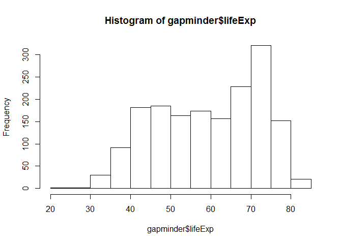

hw02\_explore-gapminder-dplyr
================
Gokul Raj Suresh Kumar
2016-09-27

Explore Gapminder with dplyr
============================

Bringing rectangular data in
----------------------------

#### Loading the gapminder and dplyr packages

``` r
suppressPackageStartupMessages(library(dplyr))
library(gapminder)
```

Smell testing the data
----------------------

#### Displaying a tibble

``` r
gapminder
```

    ## # A tibble: 1,704 × 6
    ##        country continent  year lifeExp      pop gdpPercap
    ##         <fctr>    <fctr> <int>   <dbl>    <int>     <dbl>
    ## 1  Afghanistan      Asia  1952  28.801  8425333  779.4453
    ## 2  Afghanistan      Asia  1957  30.332  9240934  820.8530
    ## 3  Afghanistan      Asia  1962  31.997 10267083  853.1007
    ## 4  Afghanistan      Asia  1967  34.020 11537966  836.1971
    ## 5  Afghanistan      Asia  1972  36.088 13079460  739.9811
    ## 6  Afghanistan      Asia  1977  38.438 14880372  786.1134
    ## 7  Afghanistan      Asia  1982  39.854 12881816  978.0114
    ## 8  Afghanistan      Asia  1987  40.822 13867957  852.3959
    ## 9  Afghanistan      Asia  1992  41.674 16317921  649.3414
    ## 10 Afghanistan      Asia  1997  41.763 22227415  635.3414
    ## # ... with 1,694 more rows

-   A `data.frame` is a list of vectors of equal length.
-   Printing the `gapminder` object prints a tibble.
-   A tibble is a `data.frame` reimagined to retrieve just the effective information.

``` r
summary(gapminder)
```

    ##         country        continent        year         lifeExp     
    ##  Afghanistan:  12   Africa  :624   Min.   :1952   Min.   :23.60  
    ##  Albania    :  12   Americas:300   1st Qu.:1966   1st Qu.:48.20  
    ##  Algeria    :  12   Asia    :396   Median :1980   Median :60.71  
    ##  Angola     :  12   Europe  :360   Mean   :1980   Mean   :59.47  
    ##  Argentina  :  12   Oceania : 24   3rd Qu.:1993   3rd Qu.:70.85  
    ##  Australia  :  12                  Max.   :2007   Max.   :82.60  
    ##  (Other)    :1632                                                
    ##       pop              gdpPercap       
    ##  Min.   :6.001e+04   Min.   :   241.2  
    ##  1st Qu.:2.794e+06   1st Qu.:  1202.1  
    ##  Median :7.024e+06   Median :  3531.8  
    ##  Mean   :2.960e+07   Mean   :  7215.3  
    ##  3rd Qu.:1.959e+07   3rd Qu.:  9325.5  
    ##  Max.   :1.319e+09   Max.   :113523.1  
    ## 

#### Determining the class

``` r
class(gapminder)
```

    ## [1] "tbl_df"     "tbl"        "data.frame"

-   The `gapminder` object is a regular data frame.
-   It is a tibble as well.

#### Determining the number of variables

``` r
ncol(gapminder)
```

    ## [1] 6

#### Determining the number of observations

``` r
nrow(gapminder)
```

    ## [1] 1704

#### Alternate ways of determining the size

``` r
dim(gapminder)
```

    ## [1] 1704    6

-   The 2 functions described in the subsequent section can also be considered as alternate ways of determining the size.

#### Determining the flavour of each variable

``` r
str(gapminder)
```

    ## Classes 'tbl_df', 'tbl' and 'data.frame':    1704 obs. of  6 variables:
    ##  $ country  : Factor w/ 142 levels "Afghanistan",..: 1 1 1 1 1 1 1 1 1 1 ...
    ##  $ continent: Factor w/ 5 levels "Africa","Americas",..: 3 3 3 3 3 3 3 3 3 3 ...
    ##  $ year     : int  1952 1957 1962 1967 1972 1977 1982 1987 1992 1997 ...
    ##  $ lifeExp  : num  28.8 30.3 32 34 36.1 ...
    ##  $ pop      : int  8425333 9240934 10267083 11537966 13079460 14880372 12881816 13867957 16317921 22227415 ...
    ##  $ gdpPercap: num  779 821 853 836 740 ...

``` r
glimpse(gapminder)
```

    ## Observations: 1,704
    ## Variables: 6
    ## $ country   <fctr> Afghanistan, Afghanistan, Afghanistan, Afghanistan,...
    ## $ continent <fctr> Asia, Asia, Asia, Asia, Asia, Asia, Asia, Asia, Asi...
    ## $ year      <int> 1952, 1957, 1962, 1967, 1972, 1977, 1982, 1987, 1992...
    ## $ lifeExp   <dbl> 28.801, 30.332, 31.997, 34.020, 36.088, 38.438, 39.8...
    ## $ pop       <int> 8425333, 9240934, 10267083, 11537966, 13079460, 1488...
    ## $ gdpPercap <dbl> 779.4453, 820.8530, 853.1007, 836.1971, 739.9811, 78...

1.  **country** is of type **Factor**.
2.  **continent** is of type **Factor**.
3.  **year** is of type **int**.
4.  **lifeExp** is of type **num**.
5.  **pop** is of type **int**.

Exploring individual variables
------------------------------

The variables **pop** and **lifeExp** have been chosen as quantitative variables for this analysis.

``` r
class(gapminder$pop)
```

    ## [1] "integer"

``` r
summary(gapminder$pop)
```

    ##      Min.   1st Qu.    Median      Mean   3rd Qu.      Max. 
    ## 6.001e+04 2.794e+06 7.024e+06 2.960e+07 1.959e+07 1.319e+09

``` r
quantile(gapminder$pop)
```

    ##         0%        25%        50%        75%       100% 
    ##      60011    2793664    7023596   19585222 1318683096

``` r
mean(gapminder$pop)
```

    ## [1] 29601212

``` r
median(gapminder$pop)
```

    ## [1] 7023596

``` r
class(gapminder$lifeExp)
```

    ## [1] "numeric"

``` r
summary(gapminder$lifeExp)
```

    ##    Min. 1st Qu.  Median    Mean 3rd Qu.    Max. 
    ##   23.60   48.20   60.71   59.47   70.85   82.60

``` r
quantile(gapminder$lifeExp)
```

    ##      0%     25%     50%     75%    100% 
    ## 23.5990 48.1980 60.7125 70.8455 82.6030

``` r
mean(gapminder$lifeExp)
```

    ## [1] 59.47444

``` r
median(gapminder$lifeExp)
```

    ## [1] 60.7125

``` r
hist(gapminder$lifeExp)
```



The variables **continent** and **country** have been chosen as categorical variables for this analysis.

``` r
summary(gapminder$continent)
```

    ##   Africa Americas     Asia   Europe  Oceania 
    ##      624      300      396      360       24

``` r
class(gapminder$continent)
```

    ## [1] "factor"

``` r
levels(gapminder$continent)
```

    ## [1] "Africa"   "Americas" "Asia"     "Europe"   "Oceania"

``` r
nlevels(gapminder$continent)
```

    ## [1] 5

``` r
class(gapminder$country)
```

    ## [1] "factor"

``` r
barplot(table(gapminder$continent))
```


``` r
class(gapminder$country)
```

    ## [1] "factor"

``` r
nlevels(gapminder$country)
```

    ## [1] 142

Exploring various plot types
----------------------------

#### Loading `ggplot2`

``` r
library(ggplot2)
```

#### Scatterplots

``` r
p <- ggplot(filter(gapminder,continent == "Asia"), aes(x = gdpPercap , y = lifeExp))
p + geom_point(alpha = 1/4, size = 4) + scale_x_log10() + geom_smooth(lwd = 2, se = FALSE)
```


#### Stripplots

``` r
p <- ggplot(gapminder, aes(x = continent, y = pop)) 
p + geom_jitter()
```


#### Boxplots

``` r
p <- ggplot(filter(gapminder, continent != "Asia"), aes(x = continent, y = lifeExp)) 
p + geom_boxplot()
```


#### Histogram

``` r
p <- ggplot(gapminder , aes(x = pop)) 
p + geom_histogram() + scale_x_log10()
```

    ## `stat_bin()` using `bins = 30`. Pick better value with `binwidth`.


Using `filter()` , `select()` and `%>%`
---------------------------------------

#### `filter()`

``` r
filter(gapminder, country %in% c("India" , "Canada" ), year == 2007)
```

    ## # A tibble: 2 × 6
    ##   country continent  year lifeExp        pop gdpPercap
    ##    <fctr>    <fctr> <int>   <dbl>      <int>     <dbl>
    ## 1  Canada  Americas  2007  80.653   33390141  36319.24
    ## 2   India      Asia  2007  64.698 1110396331   2452.21

#### `select()`

``` r
select(gapminder, country , pop)
```

    ## # A tibble: 1,704 × 2
    ##        country      pop
    ##         <fctr>    <int>
    ## 1  Afghanistan  8425333
    ## 2  Afghanistan  9240934
    ## 3  Afghanistan 10267083
    ## 4  Afghanistan 11537966
    ## 5  Afghanistan 13079460
    ## 6  Afghanistan 14880372
    ## 7  Afghanistan 12881816
    ## 8  Afghanistan 13867957
    ## 9  Afghanistan 16317921
    ## 10 Afghanistan 22227415
    ## # ... with 1,694 more rows

#### `filter()` and `select()`

``` r
filter(select(gapminder, country, year, pop), country == "India" , year == 2007)
```

    ## # A tibble: 1 × 3
    ##   country  year        pop
    ##    <fctr> <int>      <int>
    ## 1   India  2007 1110396331

``` r
select(filter(gapminder, country == "India" , year == 2007), country , year , pop)
```

    ## # A tibble: 1 × 3
    ##   country  year        pop
    ##    <fctr> <int>      <int>
    ## 1   India  2007 1110396331

#### The **PIPE** `%>%`

``` r
gapminder %>% filter(country == "India" , year == 2007)
```

    ## # A tibble: 1 × 6
    ##   country continent  year lifeExp        pop gdpPercap
    ##    <fctr>    <fctr> <int>   <dbl>      <int>     <dbl>
    ## 1   India      Asia  2007  64.698 1110396331   2452.21

``` r
gapminder %>% select(country , pop)
```

    ## # A tibble: 1,704 × 2
    ##        country      pop
    ##         <fctr>    <int>
    ## 1  Afghanistan  8425333
    ## 2  Afghanistan  9240934
    ## 3  Afghanistan 10267083
    ## 4  Afghanistan 11537966
    ## 5  Afghanistan 13079460
    ## 6  Afghanistan 14880372
    ## 7  Afghanistan 12881816
    ## 8  Afghanistan 13867957
    ## 9  Afghanistan 16317921
    ## 10 Afghanistan 22227415
    ## # ... with 1,694 more rows

#### `filter()` , `select()` and `%>%`

``` r
gapminder %>% select(country , year , pop) %>% filter(country == "India", year == 2007)
```

    ## # A tibble: 1 × 3
    ##   country  year        pop
    ##    <fctr> <int>      <int>
    ## 1   India  2007 1110396331

``` r
gapminder %>% filter(country == "India" , year == 2007) %>% select( country , year, pop)
```

    ## # A tibble: 1 × 3
    ##   country  year        pop
    ##    <fctr> <int>      <int>
    ## 1   India  2007 1110396331

#### Piping into `ggplot()`

``` r
p <- ggplot(filter(gapminder, continent != "Asia"), aes(x = continent, y = lifeExp)) 
p + geom_boxplot()
```

Implementing the above boxplot I had done earlier, using the pipe.

``` r
p <- gapminder %>% filter(continent != "Asia") %>% ggplot(aes(x = continent, y = lifeExp))
p + geom_boxplot()
```


Venturing a bit further
-----------------------

``` r
filter(gapminder, country == c("Rwanda", "Afghanistan"))
```

    ## # A tibble: 12 × 6
    ##        country continent  year lifeExp      pop gdpPercap
    ##         <fctr>    <fctr> <int>   <dbl>    <int>     <dbl>
    ## 1  Afghanistan      Asia  1957  30.332  9240934  820.8530
    ## 2  Afghanistan      Asia  1967  34.020 11537966  836.1971
    ## 3  Afghanistan      Asia  1977  38.438 14880372  786.1134
    ## 4  Afghanistan      Asia  1987  40.822 13867957  852.3959
    ## 5  Afghanistan      Asia  1997  41.763 22227415  635.3414
    ## 6  Afghanistan      Asia  2007  43.828 31889923  974.5803
    ## 7       Rwanda    Africa  1952  40.000  2534927  493.3239
    ## 8       Rwanda    Africa  1962  43.000  3051242  597.4731
    ## 9       Rwanda    Africa  1972  44.600  3992121  590.5807
    ## 10      Rwanda    Africa  1982  46.218  5507565  881.5706
    ## 11      Rwanda    Africa  1992  23.599  7290203  737.0686
    ## 12      Rwanda    Africa  2002  43.413  7852401  785.6538

I believe that the Analyst' script is not fetching all the data that she needs. In order to fetch the complete data after applying the constraints, she has to replace the `==` with the `%in%`.

``` r
filter(gapminder, country %in% c("Rwanda" , "Afghanistan"))
```

    ## # A tibble: 24 × 6
    ##        country continent  year lifeExp      pop gdpPercap
    ##         <fctr>    <fctr> <int>   <dbl>    <int>     <dbl>
    ## 1  Afghanistan      Asia  1952  28.801  8425333  779.4453
    ## 2  Afghanistan      Asia  1957  30.332  9240934  820.8530
    ## 3  Afghanistan      Asia  1962  31.997 10267083  853.1007
    ## 4  Afghanistan      Asia  1967  34.020 11537966  836.1971
    ## 5  Afghanistan      Asia  1972  36.088 13079460  739.9811
    ## 6  Afghanistan      Asia  1977  38.438 14880372  786.1134
    ## 7  Afghanistan      Asia  1982  39.854 12881816  978.0114
    ## 8  Afghanistan      Asia  1987  40.822 13867957  852.3959
    ## 9  Afghanistan      Asia  1992  41.674 16317921  649.3414
    ## 10 Afghanistan      Asia  1997  41.763 22227415  635.3414
    ## # ... with 14 more rows
