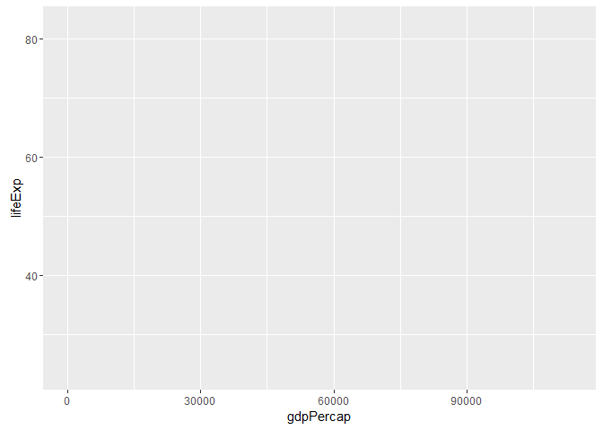
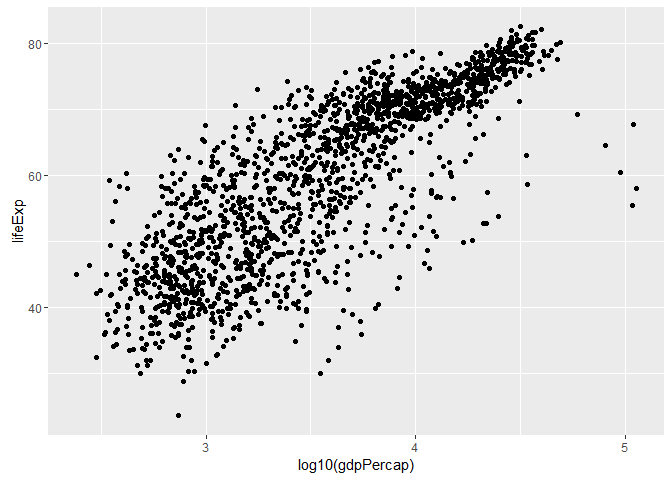
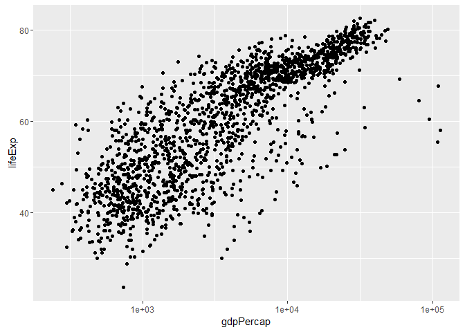
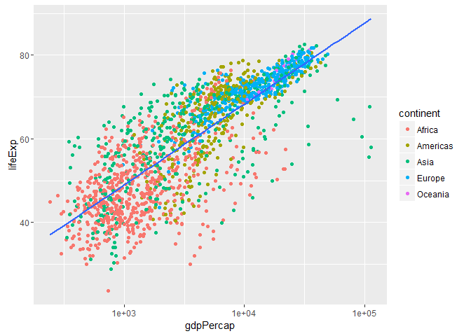

Gapminder, ggplot2 and dplyr single table verbs
================
Gokul Raj
September 27, 2016

Blah blah
---------

Let's make scatterplots

``` r
library(tidyverse) #gets me ggplot2
```

    ## Loading tidyverse: ggplot2
    ## Loading tidyverse: tibble
    ## Loading tidyverse: tidyr
    ## Loading tidyverse: readr
    ## Loading tidyverse: purrr
    ## Loading tidyverse: dplyr

    ## Conflicts with tidy packages ----------------------------------------------

    ## filter(): dplyr, stats
    ## lag():    dplyr, stats

``` r
library(gapminder)

ggplot(gapminder , aes(x = gdpPercap, y = lifeExp)) # won't plot anything
```



``` r
p <- ggplot(gapminder , aes(x = gdpPercap, y = lifeExp))

## add points
p + geom_point()
```


``` r
## let's log the x axis (brute force)
p <- ggplot(gapminder , aes(x = log10(gdpPercap), y = lifeExp))
p + geom_point()
```



``` r
# a better way
p <- ggplot(gapminder , aes(x = gdpPercap, y = lifeExp))
p + scale_x_log10() + geom_point()
```



``` r
## let's save that
p <- ggplot(gapminder , aes(x = gdpPercap, y = lifeExp)) + scale_x_log10()
p + geom_point()
```


``` r
##color by continent
p + geom_point(aes(color = continent)) ## mapping an aesthetic
```


``` r
##deal with overplotting
p + geom_point(alpha = 1/3 , size = 3) ## setting an aesthetic
```


