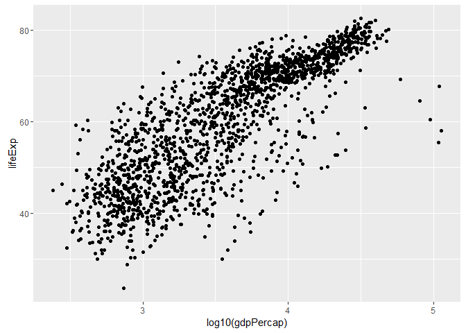
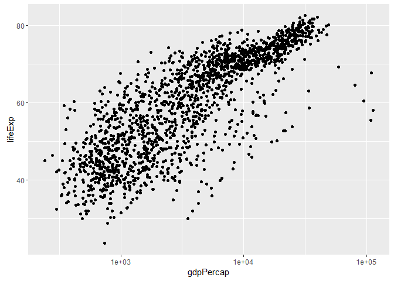
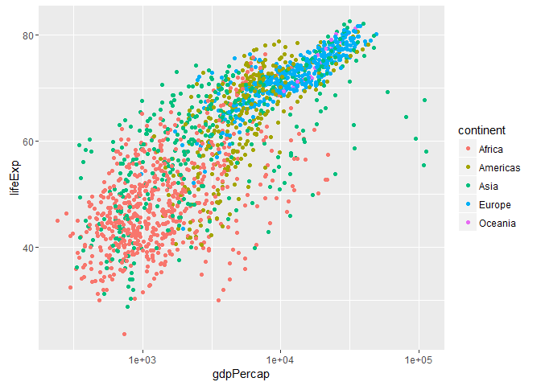
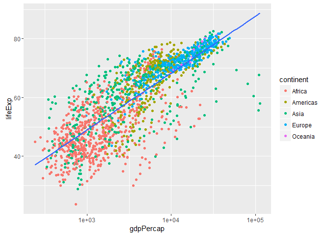
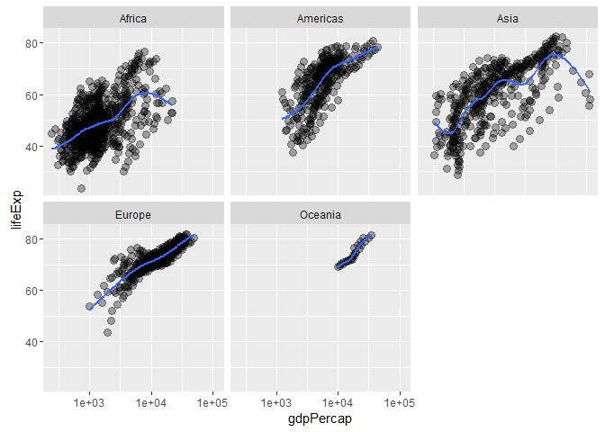
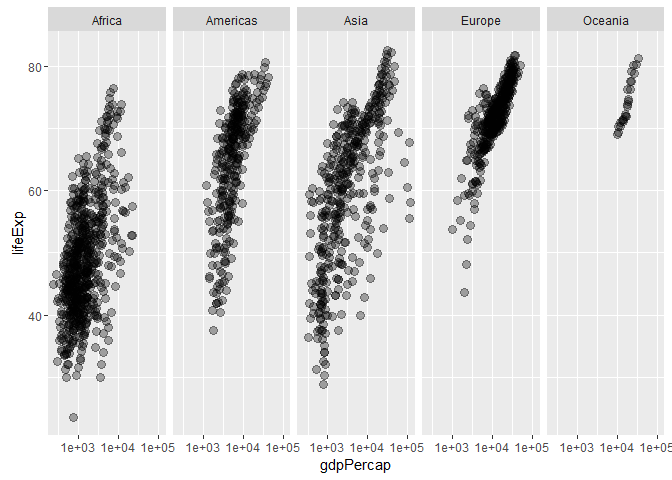

Gapminder, ggplot2 and dplyr single table verbs
================
Gokul Raj
September 27, 2016

Blah blah
---------

Let's make scatterplots

``` r
library(tidyverse) #gets me ggplot2
```

    ## Loading tidyverse: ggplot2
    ## Loading tidyverse: tibble
    ## Loading tidyverse: tidyr
    ## Loading tidyverse: readr
    ## Loading tidyverse: purrr
    ## Loading tidyverse: dplyr

    ## Conflicts with tidy packages ----------------------------------------------

    ## filter(): dplyr, stats
    ## lag():    dplyr, stats

``` r
library(gapminder)

ggplot(gapminder , aes(x = gdpPercap, y = lifeExp)) # won't plot anything
```


``` r
## add points
ggplot(gapminder , aes(x = gdpPercap, y = lifeExp)) + 
  geom_point()
```


``` r
## let's log the x axis (brute force)
ggplot(gapminder , aes(x = log10(gdpPercap), y = lifeExp)) +
  geom_point()
```



``` r
# a better way
ggplot(gapminder , aes(x = gdpPercap, y = lifeExp)) + scale_x_log10() + 
  geom_point()
```



``` r
##color by continent
ggplot(gapminder , aes(x = gdpPercap, y = lifeExp)) + scale_x_log10() +
  geom_point(aes(color = continent, y = lifeExp)) ## mapping an aesthetic
```



``` r
##deal with overplotting
ggplot(gapminder , aes(x = gdpPercap, y = lifeExp)) + scale_x_log10() +
  geom_point(alpha = 1/3 , size = 3) ## setting an aesthetic
```


``` r
##add a fitted line or curve
ggplot(gapminder , aes(x = gdpPercap, y = lifeExp)) + scale_x_log10() +
  geom_point(aes(color = continent)) +
  geom_smooth(se = FALSE, method = "lm")
```



``` r
ggplot(gapminder , aes(x = gdpPercap, y = lifeExp)) + scale_x_log10() +
  geom_point(alpha = 1/3 , size = 3) + 
  facet_wrap(~ continent) + geom_smooth(se = FALSE)
```



``` r
ggplot(gapminder , aes(x = gdpPercap, y = lifeExp)) + scale_x_log10() +
  geom_point(alpha = 1/3 , size = 3) +
  facet_grid(~ continent)
```



dplyr single table verbs
------------------------

working through this material.

<http://stat545.com/block010_dplyr-end-single-table.html>

``` r
(my_gap <-  gapminder)
```

    ## # A tibble: 1,704 × 6
    ##        country continent  year lifeExp      pop gdpPercap
    ##         <fctr>    <fctr> <int>   <dbl>    <int>     <dbl>
    ## 1  Afghanistan      Asia  1952  28.801  8425333  779.4453
    ## 2  Afghanistan      Asia  1957  30.332  9240934  820.8530
    ## 3  Afghanistan      Asia  1962  31.997 10267083  853.1007
    ## 4  Afghanistan      Asia  1967  34.020 11537966  836.1971
    ## 5  Afghanistan      Asia  1972  36.088 13079460  739.9811
    ## 6  Afghanistan      Asia  1977  38.438 14880372  786.1134
    ## 7  Afghanistan      Asia  1982  39.854 12881816  978.0114
    ## 8  Afghanistan      Asia  1987  40.822 13867957  852.3959
    ## 9  Afghanistan      Asia  1992  41.674 16317921  649.3414
    ## 10 Afghanistan      Asia  1997  41.763 22227415  635.3414
    ## # ... with 1,694 more rows

``` r
## mutate() creates new variables
my_gap <- my_gap %>% 
  mutate(gdp = pop * gdpPercap) 

my_gap <-  my_gap %>% 
  mutate(gdp = NULL)
names(my_gap)
```

    ## [1] "country"   "continent" "year"      "lifeExp"   "pop"       "gdpPercap"

``` r
canada <- my_gap %>% 
  filter(country == "Canada")

rep(canada$gdpPercap, nlevels(my_gap$country))
```

    ##    [1] 11367.16 12489.95 13462.49 16076.59 18970.57 22090.88 22898.79
    ##    [8] 26626.52 26342.88 28954.93 33328.97 36319.24 11367.16 12489.95
    ##   [15] 13462.49 16076.59 18970.57 22090.88 22898.79 26626.52 26342.88
    ##   [22] 28954.93 33328.97 36319.24 11367.16 12489.95 13462.49 16076.59
    ##   [29] 18970.57 22090.88 22898.79 26626.52 26342.88 28954.93 33328.97
    ##   [36] 36319.24 11367.16 12489.95 13462.49 16076.59 18970.57 22090.88
    ##   [43] 22898.79 26626.52 26342.88 28954.93 33328.97 36319.24 11367.16
    ##   [50] 12489.95 13462.49 16076.59 18970.57 22090.88 22898.79 26626.52
    ##   [57] 26342.88 28954.93 33328.97 36319.24 11367.16 12489.95 13462.49
    ##   [64] 16076.59 18970.57 22090.88 22898.79 26626.52 26342.88 28954.93
    ##   [71] 33328.97 36319.24 11367.16 12489.95 13462.49 16076.59 18970.57
    ##   [78] 22090.88 22898.79 26626.52 26342.88 28954.93 33328.97 36319.24
    ##   [85] 11367.16 12489.95 13462.49 16076.59 18970.57 22090.88 22898.79
    ##   [92] 26626.52 26342.88 28954.93 33328.97 36319.24 11367.16 12489.95
    ##   [99] 13462.49 16076.59 18970.57 22090.88 22898.79 26626.52 26342.88
    ##  [106] 28954.93 33328.97 36319.24 11367.16 12489.95 13462.49 16076.59
    ##  [113] 18970.57 22090.88 22898.79 26626.52 26342.88 28954.93 33328.97
    ##  [120] 36319.24 11367.16 12489.95 13462.49 16076.59 18970.57 22090.88
    ##  [127] 22898.79 26626.52 26342.88 28954.93 33328.97 36319.24 11367.16
    ##  [134] 12489.95 13462.49 16076.59 18970.57 22090.88 22898.79 26626.52
    ##  [141] 26342.88 28954.93 33328.97 36319.24 11367.16 12489.95 13462.49
    ##  [148] 16076.59 18970.57 22090.88 22898.79 26626.52 26342.88 28954.93
    ##  [155] 33328.97 36319.24 11367.16 12489.95 13462.49 16076.59 18970.57
    ##  [162] 22090.88 22898.79 26626.52 26342.88 28954.93 33328.97 36319.24
    ##  [169] 11367.16 12489.95 13462.49 16076.59 18970.57 22090.88 22898.79
    ##  [176] 26626.52 26342.88 28954.93 33328.97 36319.24 11367.16 12489.95
    ##  [183] 13462.49 16076.59 18970.57 22090.88 22898.79 26626.52 26342.88
    ##  [190] 28954.93 33328.97 36319.24 11367.16 12489.95 13462.49 16076.59
    ##  [197] 18970.57 22090.88 22898.79 26626.52 26342.88 28954.93 33328.97
    ##  [204] 36319.24 11367.16 12489.95 13462.49 16076.59 18970.57 22090.88
    ##  [211] 22898.79 26626.52 26342.88 28954.93 33328.97 36319.24 11367.16
    ##  [218] 12489.95 13462.49 16076.59 18970.57 22090.88 22898.79 26626.52
    ##  [225] 26342.88 28954.93 33328.97 36319.24 11367.16 12489.95 13462.49
    ##  [232] 16076.59 18970.57 22090.88 22898.79 26626.52 26342.88 28954.93
    ##  [239] 33328.97 36319.24 11367.16 12489.95 13462.49 16076.59 18970.57
    ##  [246] 22090.88 22898.79 26626.52 26342.88 28954.93 33328.97 36319.24
    ##  [253] 11367.16 12489.95 13462.49 16076.59 18970.57 22090.88 22898.79
    ##  [260] 26626.52 26342.88 28954.93 33328.97 36319.24 11367.16 12489.95
    ##  [267] 13462.49 16076.59 18970.57 22090.88 22898.79 26626.52 26342.88
    ##  [274] 28954.93 33328.97 36319.24 11367.16 12489.95 13462.49 16076.59
    ##  [281] 18970.57 22090.88 22898.79 26626.52 26342.88 28954.93 33328.97
    ##  [288] 36319.24 11367.16 12489.95 13462.49 16076.59 18970.57 22090.88
    ##  [295] 22898.79 26626.52 26342.88 28954.93 33328.97 36319.24 11367.16
    ##  [302] 12489.95 13462.49 16076.59 18970.57 22090.88 22898.79 26626.52
    ##  [309] 26342.88 28954.93 33328.97 36319.24 11367.16 12489.95 13462.49
    ##  [316] 16076.59 18970.57 22090.88 22898.79 26626.52 26342.88 28954.93
    ##  [323] 33328.97 36319.24 11367.16 12489.95 13462.49 16076.59 18970.57
    ##  [330] 22090.88 22898.79 26626.52 26342.88 28954.93 33328.97 36319.24
    ##  [337] 11367.16 12489.95 13462.49 16076.59 18970.57 22090.88 22898.79
    ##  [344] 26626.52 26342.88 28954.93 33328.97 36319.24 11367.16 12489.95
    ##  [351] 13462.49 16076.59 18970.57 22090.88 22898.79 26626.52 26342.88
    ##  [358] 28954.93 33328.97 36319.24 11367.16 12489.95 13462.49 16076.59
    ##  [365] 18970.57 22090.88 22898.79 26626.52 26342.88 28954.93 33328.97
    ##  [372] 36319.24 11367.16 12489.95 13462.49 16076.59 18970.57 22090.88
    ##  [379] 22898.79 26626.52 26342.88 28954.93 33328.97 36319.24 11367.16
    ##  [386] 12489.95 13462.49 16076.59 18970.57 22090.88 22898.79 26626.52
    ##  [393] 26342.88 28954.93 33328.97 36319.24 11367.16 12489.95 13462.49
    ##  [400] 16076.59 18970.57 22090.88 22898.79 26626.52 26342.88 28954.93
    ##  [407] 33328.97 36319.24 11367.16 12489.95 13462.49 16076.59 18970.57
    ##  [414] 22090.88 22898.79 26626.52 26342.88 28954.93 33328.97 36319.24
    ##  [421] 11367.16 12489.95 13462.49 16076.59 18970.57 22090.88 22898.79
    ##  [428] 26626.52 26342.88 28954.93 33328.97 36319.24 11367.16 12489.95
    ##  [435] 13462.49 16076.59 18970.57 22090.88 22898.79 26626.52 26342.88
    ##  [442] 28954.93 33328.97 36319.24 11367.16 12489.95 13462.49 16076.59
    ##  [449] 18970.57 22090.88 22898.79 26626.52 26342.88 28954.93 33328.97
    ##  [456] 36319.24 11367.16 12489.95 13462.49 16076.59 18970.57 22090.88
    ##  [463] 22898.79 26626.52 26342.88 28954.93 33328.97 36319.24 11367.16
    ##  [470] 12489.95 13462.49 16076.59 18970.57 22090.88 22898.79 26626.52
    ##  [477] 26342.88 28954.93 33328.97 36319.24 11367.16 12489.95 13462.49
    ##  [484] 16076.59 18970.57 22090.88 22898.79 26626.52 26342.88 28954.93
    ##  [491] 33328.97 36319.24 11367.16 12489.95 13462.49 16076.59 18970.57
    ##  [498] 22090.88 22898.79 26626.52 26342.88 28954.93 33328.97 36319.24
    ##  [505] 11367.16 12489.95 13462.49 16076.59 18970.57 22090.88 22898.79
    ##  [512] 26626.52 26342.88 28954.93 33328.97 36319.24 11367.16 12489.95
    ##  [519] 13462.49 16076.59 18970.57 22090.88 22898.79 26626.52 26342.88
    ##  [526] 28954.93 33328.97 36319.24 11367.16 12489.95 13462.49 16076.59
    ##  [533] 18970.57 22090.88 22898.79 26626.52 26342.88 28954.93 33328.97
    ##  [540] 36319.24 11367.16 12489.95 13462.49 16076.59 18970.57 22090.88
    ##  [547] 22898.79 26626.52 26342.88 28954.93 33328.97 36319.24 11367.16
    ##  [554] 12489.95 13462.49 16076.59 18970.57 22090.88 22898.79 26626.52
    ##  [561] 26342.88 28954.93 33328.97 36319.24 11367.16 12489.95 13462.49
    ##  [568] 16076.59 18970.57 22090.88 22898.79 26626.52 26342.88 28954.93
    ##  [575] 33328.97 36319.24 11367.16 12489.95 13462.49 16076.59 18970.57
    ##  [582] 22090.88 22898.79 26626.52 26342.88 28954.93 33328.97 36319.24
    ##  [589] 11367.16 12489.95 13462.49 16076.59 18970.57 22090.88 22898.79
    ##  [596] 26626.52 26342.88 28954.93 33328.97 36319.24 11367.16 12489.95
    ##  [603] 13462.49 16076.59 18970.57 22090.88 22898.79 26626.52 26342.88
    ##  [610] 28954.93 33328.97 36319.24 11367.16 12489.95 13462.49 16076.59
    ##  [617] 18970.57 22090.88 22898.79 26626.52 26342.88 28954.93 33328.97
    ##  [624] 36319.24 11367.16 12489.95 13462.49 16076.59 18970.57 22090.88
    ##  [631] 22898.79 26626.52 26342.88 28954.93 33328.97 36319.24 11367.16
    ##  [638] 12489.95 13462.49 16076.59 18970.57 22090.88 22898.79 26626.52
    ##  [645] 26342.88 28954.93 33328.97 36319.24 11367.16 12489.95 13462.49
    ##  [652] 16076.59 18970.57 22090.88 22898.79 26626.52 26342.88 28954.93
    ##  [659] 33328.97 36319.24 11367.16 12489.95 13462.49 16076.59 18970.57
    ##  [666] 22090.88 22898.79 26626.52 26342.88 28954.93 33328.97 36319.24
    ##  [673] 11367.16 12489.95 13462.49 16076.59 18970.57 22090.88 22898.79
    ##  [680] 26626.52 26342.88 28954.93 33328.97 36319.24 11367.16 12489.95
    ##  [687] 13462.49 16076.59 18970.57 22090.88 22898.79 26626.52 26342.88
    ##  [694] 28954.93 33328.97 36319.24 11367.16 12489.95 13462.49 16076.59
    ##  [701] 18970.57 22090.88 22898.79 26626.52 26342.88 28954.93 33328.97
    ##  [708] 36319.24 11367.16 12489.95 13462.49 16076.59 18970.57 22090.88
    ##  [715] 22898.79 26626.52 26342.88 28954.93 33328.97 36319.24 11367.16
    ##  [722] 12489.95 13462.49 16076.59 18970.57 22090.88 22898.79 26626.52
    ##  [729] 26342.88 28954.93 33328.97 36319.24 11367.16 12489.95 13462.49
    ##  [736] 16076.59 18970.57 22090.88 22898.79 26626.52 26342.88 28954.93
    ##  [743] 33328.97 36319.24 11367.16 12489.95 13462.49 16076.59 18970.57
    ##  [750] 22090.88 22898.79 26626.52 26342.88 28954.93 33328.97 36319.24
    ##  [757] 11367.16 12489.95 13462.49 16076.59 18970.57 22090.88 22898.79
    ##  [764] 26626.52 26342.88 28954.93 33328.97 36319.24 11367.16 12489.95
    ##  [771] 13462.49 16076.59 18970.57 22090.88 22898.79 26626.52 26342.88
    ##  [778] 28954.93 33328.97 36319.24 11367.16 12489.95 13462.49 16076.59
    ##  [785] 18970.57 22090.88 22898.79 26626.52 26342.88 28954.93 33328.97
    ##  [792] 36319.24 11367.16 12489.95 13462.49 16076.59 18970.57 22090.88
    ##  [799] 22898.79 26626.52 26342.88 28954.93 33328.97 36319.24 11367.16
    ##  [806] 12489.95 13462.49 16076.59 18970.57 22090.88 22898.79 26626.52
    ##  [813] 26342.88 28954.93 33328.97 36319.24 11367.16 12489.95 13462.49
    ##  [820] 16076.59 18970.57 22090.88 22898.79 26626.52 26342.88 28954.93
    ##  [827] 33328.97 36319.24 11367.16 12489.95 13462.49 16076.59 18970.57
    ##  [834] 22090.88 22898.79 26626.52 26342.88 28954.93 33328.97 36319.24
    ##  [841] 11367.16 12489.95 13462.49 16076.59 18970.57 22090.88 22898.79
    ##  [848] 26626.52 26342.88 28954.93 33328.97 36319.24 11367.16 12489.95
    ##  [855] 13462.49 16076.59 18970.57 22090.88 22898.79 26626.52 26342.88
    ##  [862] 28954.93 33328.97 36319.24 11367.16 12489.95 13462.49 16076.59
    ##  [869] 18970.57 22090.88 22898.79 26626.52 26342.88 28954.93 33328.97
    ##  [876] 36319.24 11367.16 12489.95 13462.49 16076.59 18970.57 22090.88
    ##  [883] 22898.79 26626.52 26342.88 28954.93 33328.97 36319.24 11367.16
    ##  [890] 12489.95 13462.49 16076.59 18970.57 22090.88 22898.79 26626.52
    ##  [897] 26342.88 28954.93 33328.97 36319.24 11367.16 12489.95 13462.49
    ##  [904] 16076.59 18970.57 22090.88 22898.79 26626.52 26342.88 28954.93
    ##  [911] 33328.97 36319.24 11367.16 12489.95 13462.49 16076.59 18970.57
    ##  [918] 22090.88 22898.79 26626.52 26342.88 28954.93 33328.97 36319.24
    ##  [925] 11367.16 12489.95 13462.49 16076.59 18970.57 22090.88 22898.79
    ##  [932] 26626.52 26342.88 28954.93 33328.97 36319.24 11367.16 12489.95
    ##  [939] 13462.49 16076.59 18970.57 22090.88 22898.79 26626.52 26342.88
    ##  [946] 28954.93 33328.97 36319.24 11367.16 12489.95 13462.49 16076.59
    ##  [953] 18970.57 22090.88 22898.79 26626.52 26342.88 28954.93 33328.97
    ##  [960] 36319.24 11367.16 12489.95 13462.49 16076.59 18970.57 22090.88
    ##  [967] 22898.79 26626.52 26342.88 28954.93 33328.97 36319.24 11367.16
    ##  [974] 12489.95 13462.49 16076.59 18970.57 22090.88 22898.79 26626.52
    ##  [981] 26342.88 28954.93 33328.97 36319.24 11367.16 12489.95 13462.49
    ##  [988] 16076.59 18970.57 22090.88 22898.79 26626.52 26342.88 28954.93
    ##  [995] 33328.97 36319.24 11367.16 12489.95 13462.49 16076.59 18970.57
    ## [1002] 22090.88 22898.79 26626.52 26342.88 28954.93 33328.97 36319.24
    ## [1009] 11367.16 12489.95 13462.49 16076.59 18970.57 22090.88 22898.79
    ## [1016] 26626.52 26342.88 28954.93 33328.97 36319.24 11367.16 12489.95
    ## [1023] 13462.49 16076.59 18970.57 22090.88 22898.79 26626.52 26342.88
    ## [1030] 28954.93 33328.97 36319.24 11367.16 12489.95 13462.49 16076.59
    ## [1037] 18970.57 22090.88 22898.79 26626.52 26342.88 28954.93 33328.97
    ## [1044] 36319.24 11367.16 12489.95 13462.49 16076.59 18970.57 22090.88
    ## [1051] 22898.79 26626.52 26342.88 28954.93 33328.97 36319.24 11367.16
    ## [1058] 12489.95 13462.49 16076.59 18970.57 22090.88 22898.79 26626.52
    ## [1065] 26342.88 28954.93 33328.97 36319.24 11367.16 12489.95 13462.49
    ## [1072] 16076.59 18970.57 22090.88 22898.79 26626.52 26342.88 28954.93
    ## [1079] 33328.97 36319.24 11367.16 12489.95 13462.49 16076.59 18970.57
    ## [1086] 22090.88 22898.79 26626.52 26342.88 28954.93 33328.97 36319.24
    ## [1093] 11367.16 12489.95 13462.49 16076.59 18970.57 22090.88 22898.79
    ## [1100] 26626.52 26342.88 28954.93 33328.97 36319.24 11367.16 12489.95
    ## [1107] 13462.49 16076.59 18970.57 22090.88 22898.79 26626.52 26342.88
    ## [1114] 28954.93 33328.97 36319.24 11367.16 12489.95 13462.49 16076.59
    ## [1121] 18970.57 22090.88 22898.79 26626.52 26342.88 28954.93 33328.97
    ## [1128] 36319.24 11367.16 12489.95 13462.49 16076.59 18970.57 22090.88
    ## [1135] 22898.79 26626.52 26342.88 28954.93 33328.97 36319.24 11367.16
    ## [1142] 12489.95 13462.49 16076.59 18970.57 22090.88 22898.79 26626.52
    ## [1149] 26342.88 28954.93 33328.97 36319.24 11367.16 12489.95 13462.49
    ## [1156] 16076.59 18970.57 22090.88 22898.79 26626.52 26342.88 28954.93
    ## [1163] 33328.97 36319.24 11367.16 12489.95 13462.49 16076.59 18970.57
    ## [1170] 22090.88 22898.79 26626.52 26342.88 28954.93 33328.97 36319.24
    ## [1177] 11367.16 12489.95 13462.49 16076.59 18970.57 22090.88 22898.79
    ## [1184] 26626.52 26342.88 28954.93 33328.97 36319.24 11367.16 12489.95
    ## [1191] 13462.49 16076.59 18970.57 22090.88 22898.79 26626.52 26342.88
    ## [1198] 28954.93 33328.97 36319.24 11367.16 12489.95 13462.49 16076.59
    ## [1205] 18970.57 22090.88 22898.79 26626.52 26342.88 28954.93 33328.97
    ## [1212] 36319.24 11367.16 12489.95 13462.49 16076.59 18970.57 22090.88
    ## [1219] 22898.79 26626.52 26342.88 28954.93 33328.97 36319.24 11367.16
    ## [1226] 12489.95 13462.49 16076.59 18970.57 22090.88 22898.79 26626.52
    ## [1233] 26342.88 28954.93 33328.97 36319.24 11367.16 12489.95 13462.49
    ## [1240] 16076.59 18970.57 22090.88 22898.79 26626.52 26342.88 28954.93
    ## [1247] 33328.97 36319.24 11367.16 12489.95 13462.49 16076.59 18970.57
    ## [1254] 22090.88 22898.79 26626.52 26342.88 28954.93 33328.97 36319.24
    ## [1261] 11367.16 12489.95 13462.49 16076.59 18970.57 22090.88 22898.79
    ## [1268] 26626.52 26342.88 28954.93 33328.97 36319.24 11367.16 12489.95
    ## [1275] 13462.49 16076.59 18970.57 22090.88 22898.79 26626.52 26342.88
    ## [1282] 28954.93 33328.97 36319.24 11367.16 12489.95 13462.49 16076.59
    ## [1289] 18970.57 22090.88 22898.79 26626.52 26342.88 28954.93 33328.97
    ## [1296] 36319.24 11367.16 12489.95 13462.49 16076.59 18970.57 22090.88
    ## [1303] 22898.79 26626.52 26342.88 28954.93 33328.97 36319.24 11367.16
    ## [1310] 12489.95 13462.49 16076.59 18970.57 22090.88 22898.79 26626.52
    ## [1317] 26342.88 28954.93 33328.97 36319.24 11367.16 12489.95 13462.49
    ## [1324] 16076.59 18970.57 22090.88 22898.79 26626.52 26342.88 28954.93
    ## [1331] 33328.97 36319.24 11367.16 12489.95 13462.49 16076.59 18970.57
    ## [1338] 22090.88 22898.79 26626.52 26342.88 28954.93 33328.97 36319.24
    ## [1345] 11367.16 12489.95 13462.49 16076.59 18970.57 22090.88 22898.79
    ## [1352] 26626.52 26342.88 28954.93 33328.97 36319.24 11367.16 12489.95
    ## [1359] 13462.49 16076.59 18970.57 22090.88 22898.79 26626.52 26342.88
    ## [1366] 28954.93 33328.97 36319.24 11367.16 12489.95 13462.49 16076.59
    ## [1373] 18970.57 22090.88 22898.79 26626.52 26342.88 28954.93 33328.97
    ## [1380] 36319.24 11367.16 12489.95 13462.49 16076.59 18970.57 22090.88
    ## [1387] 22898.79 26626.52 26342.88 28954.93 33328.97 36319.24 11367.16
    ## [1394] 12489.95 13462.49 16076.59 18970.57 22090.88 22898.79 26626.52
    ## [1401] 26342.88 28954.93 33328.97 36319.24 11367.16 12489.95 13462.49
    ## [1408] 16076.59 18970.57 22090.88 22898.79 26626.52 26342.88 28954.93
    ## [1415] 33328.97 36319.24 11367.16 12489.95 13462.49 16076.59 18970.57
    ## [1422] 22090.88 22898.79 26626.52 26342.88 28954.93 33328.97 36319.24
    ## [1429] 11367.16 12489.95 13462.49 16076.59 18970.57 22090.88 22898.79
    ## [1436] 26626.52 26342.88 28954.93 33328.97 36319.24 11367.16 12489.95
    ## [1443] 13462.49 16076.59 18970.57 22090.88 22898.79 26626.52 26342.88
    ## [1450] 28954.93 33328.97 36319.24 11367.16 12489.95 13462.49 16076.59
    ## [1457] 18970.57 22090.88 22898.79 26626.52 26342.88 28954.93 33328.97
    ## [1464] 36319.24 11367.16 12489.95 13462.49 16076.59 18970.57 22090.88
    ## [1471] 22898.79 26626.52 26342.88 28954.93 33328.97 36319.24 11367.16
    ## [1478] 12489.95 13462.49 16076.59 18970.57 22090.88 22898.79 26626.52
    ## [1485] 26342.88 28954.93 33328.97 36319.24 11367.16 12489.95 13462.49
    ## [1492] 16076.59 18970.57 22090.88 22898.79 26626.52 26342.88 28954.93
    ## [1499] 33328.97 36319.24 11367.16 12489.95 13462.49 16076.59 18970.57
    ## [1506] 22090.88 22898.79 26626.52 26342.88 28954.93 33328.97 36319.24
    ## [1513] 11367.16 12489.95 13462.49 16076.59 18970.57 22090.88 22898.79
    ## [1520] 26626.52 26342.88 28954.93 33328.97 36319.24 11367.16 12489.95
    ## [1527] 13462.49 16076.59 18970.57 22090.88 22898.79 26626.52 26342.88
    ## [1534] 28954.93 33328.97 36319.24 11367.16 12489.95 13462.49 16076.59
    ## [1541] 18970.57 22090.88 22898.79 26626.52 26342.88 28954.93 33328.97
    ## [1548] 36319.24 11367.16 12489.95 13462.49 16076.59 18970.57 22090.88
    ## [1555] 22898.79 26626.52 26342.88 28954.93 33328.97 36319.24 11367.16
    ## [1562] 12489.95 13462.49 16076.59 18970.57 22090.88 22898.79 26626.52
    ## [1569] 26342.88 28954.93 33328.97 36319.24 11367.16 12489.95 13462.49
    ## [1576] 16076.59 18970.57 22090.88 22898.79 26626.52 26342.88 28954.93
    ## [1583] 33328.97 36319.24 11367.16 12489.95 13462.49 16076.59 18970.57
    ## [1590] 22090.88 22898.79 26626.52 26342.88 28954.93 33328.97 36319.24
    ## [1597] 11367.16 12489.95 13462.49 16076.59 18970.57 22090.88 22898.79
    ## [1604] 26626.52 26342.88 28954.93 33328.97 36319.24 11367.16 12489.95
    ## [1611] 13462.49 16076.59 18970.57 22090.88 22898.79 26626.52 26342.88
    ## [1618] 28954.93 33328.97 36319.24 11367.16 12489.95 13462.49 16076.59
    ## [1625] 18970.57 22090.88 22898.79 26626.52 26342.88 28954.93 33328.97
    ## [1632] 36319.24 11367.16 12489.95 13462.49 16076.59 18970.57 22090.88
    ## [1639] 22898.79 26626.52 26342.88 28954.93 33328.97 36319.24 11367.16
    ## [1646] 12489.95 13462.49 16076.59 18970.57 22090.88 22898.79 26626.52
    ## [1653] 26342.88 28954.93 33328.97 36319.24 11367.16 12489.95 13462.49
    ## [1660] 16076.59 18970.57 22090.88 22898.79 26626.52 26342.88 28954.93
    ## [1667] 33328.97 36319.24 11367.16 12489.95 13462.49 16076.59 18970.57
    ## [1674] 22090.88 22898.79 26626.52 26342.88 28954.93 33328.97 36319.24
    ## [1681] 11367.16 12489.95 13462.49 16076.59 18970.57 22090.88 22898.79
    ## [1688] 26626.52 26342.88 28954.93 33328.97 36319.24 11367.16 12489.95
    ## [1695] 13462.49 16076.59 18970.57 22090.88 22898.79 26626.52 26342.88
    ## [1702] 28954.93 33328.97 36319.24

``` r
my_gap <- my_gap %>% 
  mutate(canada = rep(canada$gdpPercap,
                      nlevels(country)),
         gdpPercapRel = gdpPercap/canada,
         canada = NULL) %>% 
  select(gdpPercapRel, everything())

my_gap %>% 
  filter(country == "Canada")
```

    ## # A tibble: 12 × 7
    ##    gdpPercapRel country continent  year lifeExp      pop gdpPercap
    ##           <dbl>  <fctr>    <fctr> <int>   <dbl>    <int>     <dbl>
    ## 1             1  Canada  Americas  1952  68.750 14785584  11367.16
    ## 2             1  Canada  Americas  1957  69.960 17010154  12489.95
    ## 3             1  Canada  Americas  1962  71.300 18985849  13462.49
    ## 4             1  Canada  Americas  1967  72.130 20819767  16076.59
    ## 5             1  Canada  Americas  1972  72.880 22284500  18970.57
    ## 6             1  Canada  Americas  1977  74.210 23796400  22090.88
    ## 7             1  Canada  Americas  1982  75.760 25201900  22898.79
    ## 8             1  Canada  Americas  1987  76.860 26549700  26626.52
    ## 9             1  Canada  Americas  1992  77.950 28523502  26342.88
    ## 10            1  Canada  Americas  1997  78.610 30305843  28954.93
    ## 11            1  Canada  Americas  2002  79.770 31902268  33328.97
    ## 12            1  Canada  Americas  2007  80.653 33390141  36319.24

``` r
my_gap %>% 
  print(n = 20)
```

    ## # A tibble: 1,704 × 7
    ##    gdpPercapRel     country continent  year lifeExp      pop gdpPercap
    ##           <dbl>      <fctr>    <fctr> <int>   <dbl>    <int>     <dbl>
    ## 1    0.06856992 Afghanistan      Asia  1952  28.801  8425333  779.4453
    ## 2    0.06572108 Afghanistan      Asia  1957  30.332  9240934  820.8530
    ## 3    0.06336874 Afghanistan      Asia  1962  31.997 10267083  853.1007
    ## 4    0.05201335 Afghanistan      Asia  1967  34.020 11537966  836.1971
    ## 5    0.03900679 Afghanistan      Asia  1972  36.088 13079460  739.9811
    ## 6    0.03558542 Afghanistan      Asia  1977  38.438 14880372  786.1134
    ## 7    0.04271018 Afghanistan      Asia  1982  39.854 12881816  978.0114
    ## 8    0.03201305 Afghanistan      Asia  1987  40.822 13867957  852.3959
    ## 9    0.02464959 Afghanistan      Asia  1992  41.674 16317921  649.3414
    ## 10   0.02194243 Afghanistan      Asia  1997  41.763 22227415  635.3414
    ## 11   0.02180488 Afghanistan      Asia  2002  42.129 25268405  726.7341
    ## 12   0.02683372 Afghanistan      Asia  2007  43.828 31889923  974.5803
    ## 13   0.14084925     Albania    Europe  1952  55.230  1282697 1601.0561
    ## 14   0.15550777     Albania    Europe  1957  59.280  1476505 1942.2842
    ## 15   0.17180252     Albania    Europe  1962  64.820  1728137 2312.8890
    ## 16   0.17169047     Albania    Europe  1967  66.220  1984060 2760.1969
    ## 17   0.17466117     Albania    Europe  1972  67.690  2263554 3313.4222
    ## 18   0.15993041     Albania    Europe  1977  68.930  2509048 3533.0039
    ## 19   0.15856211     Albania    Europe  1982  70.420  2780097 3630.8807
    ## 20   0.14042141     Albania    Europe  1987  72.000  3075321 3738.9327
    ## # ... with 1,684 more rows

``` r
summary(my_gap$gdpPercapRel)
```

    ##     Min.  1st Qu.   Median     Mean  3rd Qu.     Max. 
    ## 0.007236 0.061650 0.171500 0.326700 0.446600 9.535000

``` r
## arrange()

my_gap %>% 
  arrange(year, country)
```

    ## # A tibble: 1,704 × 7
    ##    gdpPercapRel     country continent  year lifeExp      pop  gdpPercap
    ##           <dbl>      <fctr>    <fctr> <int>   <dbl>    <int>      <dbl>
    ## 1    0.06856992 Afghanistan      Asia  1952  28.801  8425333   779.4453
    ## 2    0.14084925     Albania    Europe  1952  55.230  1282697  1601.0561
    ## 3    0.21544589     Algeria    Africa  1952  43.077  9279525  2449.0082
    ## 4    0.30971764      Angola    Africa  1952  30.015  4232095  3520.6103
    ## 5    0.52003442   Argentina  Americas  1952  62.485 17876956  5911.3151
    ## 6    0.88321046   Australia   Oceania  1952  69.120  8691212 10039.5956
    ## 7    0.53989527     Austria    Europe  1952  66.800  6927772  6137.0765
    ## 8    0.86803421     Bahrain      Asia  1952  50.939   120447  9867.0848
    ## 9    0.06019482  Bangladesh      Asia  1952  37.484 46886859   684.2442
    ## 10   0.73396559     Belgium    Europe  1952  68.000  8730405  8343.1051
    ## # ... with 1,694 more rows

``` r
my_gap %>% 
  filter(year == 2007) %>% 
  arrange(desc(lifeExp))
```

    ## # A tibble: 142 × 7
    ##    gdpPercapRel          country continent  year lifeExp       pop
    ##           <dbl>           <fctr>    <fctr> <int>   <dbl>     <int>
    ## 1     0.8716061            Japan      Asia  2007  82.603 127467972
    ## 2     1.0937725 Hong Kong, China      Asia  2007  82.208   6980412
    ## 3     0.9961881          Iceland    Europe  2007  81.757    301931
    ## 4     1.0326875      Switzerland    Europe  2007  81.701   7554661
    ## 5     0.9481303        Australia   Oceania  2007  81.235  20434176
    ## 6     0.7935482            Spain    Europe  2007  80.941  40448191
    ## 7     0.9322814           Sweden    Europe  2007  80.884   9031088
    ## 8     0.7027482           Israel      Asia  2007  80.745   6426679
    ## 9     0.8389498           France    Europe  2007  80.657  61083916
    ## 10    1.0000000           Canada  Americas  2007  80.653  33390141
    ## # ... with 132 more rows, and 1 more variables: gdpPercap <dbl>

``` r
## rename()

my_gap %>% 
  rename(life_exp = lifeExp,
         gdp_perca = gdpPercap,
         gdp_percap_rel = gdpPercapRel)
```

    ## # A tibble: 1,704 × 7
    ##    gdp_percap_rel     country continent  year life_exp      pop gdp_perca
    ##             <dbl>      <fctr>    <fctr> <int>    <dbl>    <int>     <dbl>
    ## 1      0.06856992 Afghanistan      Asia  1952   28.801  8425333  779.4453
    ## 2      0.06572108 Afghanistan      Asia  1957   30.332  9240934  820.8530
    ## 3      0.06336874 Afghanistan      Asia  1962   31.997 10267083  853.1007
    ## 4      0.05201335 Afghanistan      Asia  1967   34.020 11537966  836.1971
    ## 5      0.03900679 Afghanistan      Asia  1972   36.088 13079460  739.9811
    ## 6      0.03558542 Afghanistan      Asia  1977   38.438 14880372  786.1134
    ## 7      0.04271018 Afghanistan      Asia  1982   39.854 12881816  978.0114
    ## 8      0.03201305 Afghanistan      Asia  1987   40.822 13867957  852.3959
    ## 9      0.02464959 Afghanistan      Asia  1992   41.674 16317921  649.3414
    ## 10     0.02194243 Afghanistan      Asia  1997   41.763 22227415  635.3414
    ## # ... with 1,694 more rows

``` r
my_gap %>% 
  print(n = 20)
```

    ## # A tibble: 1,704 × 7
    ##    gdpPercapRel     country continent  year lifeExp      pop gdpPercap
    ##           <dbl>      <fctr>    <fctr> <int>   <dbl>    <int>     <dbl>
    ## 1    0.06856992 Afghanistan      Asia  1952  28.801  8425333  779.4453
    ## 2    0.06572108 Afghanistan      Asia  1957  30.332  9240934  820.8530
    ## 3    0.06336874 Afghanistan      Asia  1962  31.997 10267083  853.1007
    ## 4    0.05201335 Afghanistan      Asia  1967  34.020 11537966  836.1971
    ## 5    0.03900679 Afghanistan      Asia  1972  36.088 13079460  739.9811
    ## 6    0.03558542 Afghanistan      Asia  1977  38.438 14880372  786.1134
    ## 7    0.04271018 Afghanistan      Asia  1982  39.854 12881816  978.0114
    ## 8    0.03201305 Afghanistan      Asia  1987  40.822 13867957  852.3959
    ## 9    0.02464959 Afghanistan      Asia  1992  41.674 16317921  649.3414
    ## 10   0.02194243 Afghanistan      Asia  1997  41.763 22227415  635.3414
    ## 11   0.02180488 Afghanistan      Asia  2002  42.129 25268405  726.7341
    ## 12   0.02683372 Afghanistan      Asia  2007  43.828 31889923  974.5803
    ## 13   0.14084925     Albania    Europe  1952  55.230  1282697 1601.0561
    ## 14   0.15550777     Albania    Europe  1957  59.280  1476505 1942.2842
    ## 15   0.17180252     Albania    Europe  1962  64.820  1728137 2312.8890
    ## 16   0.17169047     Albania    Europe  1967  66.220  1984060 2760.1969
    ## 17   0.17466117     Albania    Europe  1972  67.690  2263554 3313.4222
    ## 18   0.15993041     Albania    Europe  1977  68.930  2509048 3533.0039
    ## 19   0.15856211     Albania    Europe  1982  70.420  2780097 3630.8807
    ## 20   0.14042141     Albania    Europe  1987  72.000  3075321 3738.9327
    ## # ... with 1,684 more rows

``` r
## group_by()

my_gap %>% 
  group_by(continent) %>% 
  summarise(n_obs = n())
```

    ## # A tibble: 5 × 2
    ##   continent n_obs
    ##      <fctr> <int>
    ## 1    Africa   624
    ## 2  Americas   300
    ## 3      Asia   396
    ## 4    Europe   360
    ## 5   Oceania    24

``` r
my_gap %>% 
  group_by(continent) %>% 
  tally()
```

    ## # A tibble: 5 × 2
    ##   continent     n
    ##      <fctr> <int>
    ## 1    Africa   624
    ## 2  Americas   300
    ## 3      Asia   396
    ## 4    Europe   360
    ## 5   Oceania    24

``` r
my_gap %>% 
  count(continent)
```

    ## # A tibble: 5 × 2
    ##   continent     n
    ##      <fctr> <int>
    ## 1    Africa   624
    ## 2  Americas   300
    ## 3      Asia   396
    ## 4    Europe   360
    ## 5   Oceania    24

``` r
my_gap %>% 
  group_by(continent) %>% 
  summarise(n_obs = n(),
            n_countries = n_distinct(country))
```

    ## # A tibble: 5 × 3
    ##   continent n_obs n_countries
    ##      <fctr> <int>       <int>
    ## 1    Africa   624          52
    ## 2  Americas   300          25
    ## 3      Asia   396          33
    ## 4    Europe   360          30
    ## 5   Oceania    24           2
