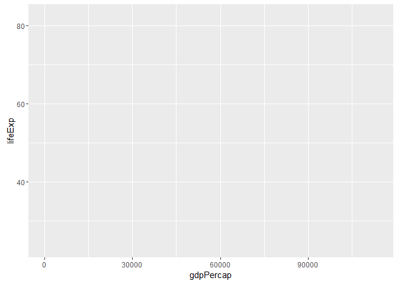

Gapminder, ggplot2 and dplyr single table verbs
================
Gokul Raj Suresh Kumar
2016-10-03

Starting
--------

``` r
library(tidyverse) #gets me ggplot2
```

    ## Loading tidyverse: ggplot2
    ## Loading tidyverse: tibble
    ## Loading tidyverse: tidyr
    ## Loading tidyverse: readr
    ## Loading tidyverse: purrr
    ## Loading tidyverse: dplyr

    ## Conflicts with tidy packages ----------------------------------------------

    ## filter(): dplyr, stats
    ## lag():    dplyr, stats

``` r
library(gapminder)
ggplot(gapminder , aes(x = gdpPercap, y = lifeExp)) # won't plot anything
```


