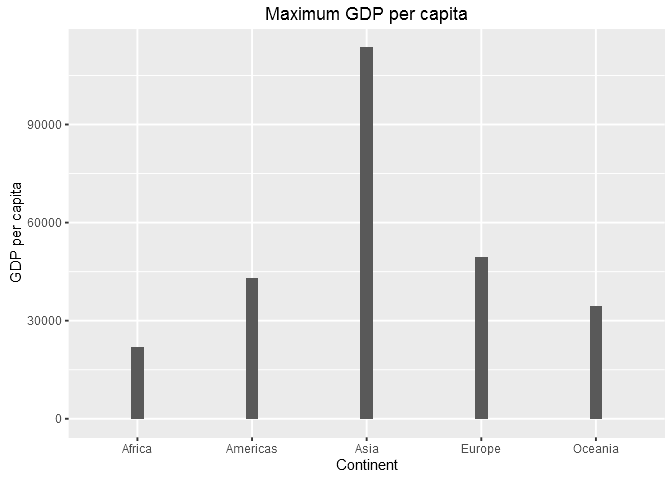
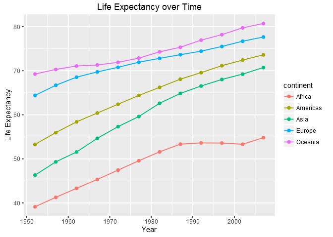
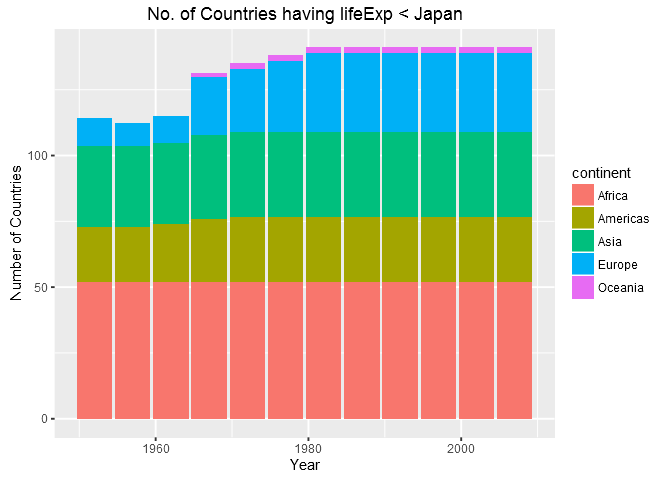

Gapminder, ggplot2 and dplyr single table verbs
================
Gokul Raj Suresh Kumar
2016-10-18

Manipulate and Explore Gapminder with dplyr & ggplot2
=====================================================

Tasks
-----

#### Loading the tidyverse and gapminder packages

``` r
library( tidyverse )
library( gapminder )
```

#### Maximum and Minimum of `gdpPercap` for all continents

``` r
my_gap <- gapminder #copying the data.frame to an object

min_max_gdp <- my_gap %>% 
  group_by( continent ) %>% 
  summarize( min_gdp_percap = min( gdpPercap ) , max_gdp_percap = max( gdpPercap ) ) 

knitr::kable( min_max_gdp ) #displaying data in a nice table
```

| continent |  min\_gdp\_percap|  max\_gdp\_percap|
|:----------|-----------------:|-----------------:|
| Africa    |          241.1659|          21951.21|
| Americas  |         1201.6372|          42951.65|
| Asia      |          331.0000|         113523.13|
| Europe    |          973.5332|          49357.19|
| Oceania   |        10039.5956|          34435.37|

``` r
min_max_gdp %>% 
  ggplot( aes( x = continent , y = min_gdp_percap ) ) +
  geom_bar( width = 0.10 , stat = "identity" ) + 
  labs( title = "Minimum GDP per capita" , x = "Continent" , y = "GDP per capita" )
```


``` r
min_max_gdp %>% 
  ggplot( aes( x = continent , y = max_gdp_percap ) ) +
  geom_bar( width = 0.10 , stat = "identity" ) +
  labs( title = "Maximum GDP per capita" , x = "Continent" , y = "GDP per capita" )
```



#### Weighted Mean of `lifeExp` (by population)

``` r
le_wt_mean <- my_gap %>% 
  group_by( continent ) %>% 
  summarize( mean_wt_le = weighted.mean( lifeExp, pop ) ) %>% #pop is the weighting factor
  print( n = Inf ) #prints all the results
```

    ## # A tibble: 5 × 2
    ##   continent mean_wt_le
    ##      <fctr>      <dbl>
    ## 1    Africa   50.59279
    ## 2  Americas   69.50691
    ## 3      Asia   61.11856
    ## 4    Europe   72.30718
    ## 5   Oceania   75.48954

``` r
le_wt_mean %>% 
  ggplot( aes( x = continent , y = mean_wt_le ) ) +
  geom_bar( width = 0.10 , stat = "identity" ) +
  labs( title = "Weighted Mean of Life Expectancy" , x = "Continent" , y = "Mean Life     Expectancy" )
```


#### `lifeExp` over time for different continents

``` r
le_over_time <- my_gap %>%
  select( continent , lifeExp , year ) %>%
  group_by( continent , year ) %>% 
  summarise( avg_life_exp = mean( lifeExp ) ) %>% 
  print( n = 10 ) #prints the first 10 results alone 
```

    ## Source: local data frame [60 x 3]
    ## Groups: continent [?]
    ## 
    ##    continent  year avg_life_exp
    ##       <fctr> <int>        <dbl>
    ## 1     Africa  1952     39.13550
    ## 2     Africa  1957     41.26635
    ## 3     Africa  1962     43.31944
    ## 4     Africa  1967     45.33454
    ## 5     Africa  1972     47.45094
    ## 6     Africa  1977     49.58042
    ## 7     Africa  1982     51.59287
    ## 8     Africa  1987     53.34479
    ## 9     Africa  1992     53.62958
    ## 10    Africa  1997     53.59827
    ## # ... with 50 more rows

``` r
le_over_time %>%
  ggplot( aes( x = year , y = avg_life_exp ) ) + 
  geom_point( aes( color = continent ) ) + 
  geom_line( aes( color =   continent ) ) +
  labs( title = "Life Expectancy over Time" , x = "Year" , y = "Life Expectancy" )
```



#### Relative abundance of countries with low `lifeExp` over time by continent

``` r
benchmark_country <- my_gap %>% 
  filter( country == "India" )

rel_le <- my_gap %>% 
  mutate( temp = rep( benchmark_country$lifeExp , nlevels( country ) ), #creating replicates
          lifeExpRel = lifeExp/temp, #calculating the relative life expectancy
          temp = NULL )
```

``` r
rel_le %>% 
  filter( country == "India" ) %>% #sanity check
  select( country , year , lifeExp , lifeExpRel )
```

    ## # A tibble: 12 × 4
    ##    country  year lifeExp lifeExpRel
    ##     <fctr> <int>   <dbl>      <dbl>
    ## 1    India  1952  37.373          1
    ## 2    India  1957  40.249          1
    ## 3    India  1962  43.605          1
    ## 4    India  1967  47.193          1
    ## 5    India  1972  50.651          1
    ## 6    India  1977  54.208          1
    ## 7    India  1982  56.596          1
    ## 8    India  1987  58.553          1
    ## 9    India  1992  60.223          1
    ## 10   India  1997  61.765          1
    ## 11   India  2002  62.879          1
    ## 12   India  2007  64.698          1

``` r
rel_abundance <- rel_le %>%
  group_by( continent , year ) %>% 
  filter( lifeExpRel < 1 ) %>% #filtering out the countries having lesser life expectancy
  summarise( n_countries = n_distinct( country ) ) %>% 
  print( n = 10 ) #prints the first 10 results alone 
```

    ## Source: local data frame [34 x 3]
    ## Groups: continent [?]
    ## 
    ##    continent  year n_countries
    ##       <fctr> <int>       <int>
    ## 1     Africa  1952          19
    ## 2     Africa  1957          23
    ## 3     Africa  1962          28
    ## 4     Africa  1967          33
    ## 5     Africa  1972          37
    ## 6     Africa  1977          39
    ## 7     Africa  1982          39
    ## 8     Africa  1987          38
    ## 9     Africa  1992          39
    ## 10    Africa  1997          44
    ## # ... with 24 more rows

``` r
rel_abundance %>%
  ggplot( aes( x = year , y = n_countries , fill = continent ) ) + 
  geom_bar( stat = "identity" , position = "stack" ) +
  labs( title = "No. of Countries having lifeExp < India" , x = "Year" , y = "Number of Countries" )
```


I believe that I have **unintentionally** arrived at a highly reproducable workflow for this task ! The benchmark country can be changed easily in the above code. The plot above implies that there are no countries from Oceania and Europe that had a GDP per capita lesser than India any point of time that is under consideration. I am changing the benchmark country below, in an attempt to capture countries from all continents, by using a country that has had significantly high GDP per capita over the years.

``` r
benchmark_country <- my_gap %>% 
  filter( country == "Japan" ) # That's the only change I had to make!

rel_le <- my_gap %>% 
  mutate( temp = rep( benchmark_country$lifeExp , nlevels( country ) ), 
          lifeExpRel = lifeExp/temp, 
          temp = NULL )

rel_abundance <- rel_le %>%
  group_by( continent , year ) %>% 
  filter( lifeExpRel < 1 ) %>% 
  summarise( n_countries = n_distinct( country ) ) %>% 
  print( n = 10 )
```

    ## Source: local data frame [57 x 3]
    ## Groups: continent [?]
    ## 
    ##    continent  year n_countries
    ##       <fctr> <int>       <int>
    ## 1     Africa  1952          52
    ## 2     Africa  1957          52
    ## 3     Africa  1962          52
    ## 4     Africa  1967          52
    ## 5     Africa  1972          52
    ## 6     Africa  1977          52
    ## 7     Africa  1982          52
    ## 8     Africa  1987          52
    ## 9     Africa  1992          52
    ## 10    Africa  1997          52
    ## # ... with 47 more rows

``` r
rel_abundance %>%
  ggplot( aes( x = year , y = n_countries , fill = continent ) ) + 
  geom_bar( stat = "identity" , position = "stack" ) +
  labs( title = "No. of Countries having lifeExp < Japan" , x = "Year" , y = "Number of Countries" )
```



The Process
-----------

I found this assignment really interesting. I was able to build on the concepts explained in [`dplyr functions for a single dataset`](http://stat545.com/block010_dplyr-end-single-table.html) and relied heavily on [`Jenny's ggplot2 tutorial`](https://github.com/jennybc/ggplot2-tutorial) to arrive at the solutions for the tasks. [`RStudio's ggplot2 cheatsheet`](https://www.rstudio.com/wp-content/uploads/2015/12/ggplot2-cheatsheet-2.0.pdf) was also of great help when I encountered roadblocks.
