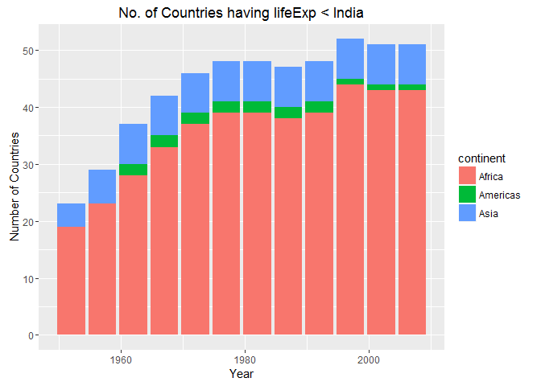

Gapminder, ggplot2 and dplyr single table verbs
================
Gokul Raj Suresh Kumar
2016-10-04

Manipulate and Explore Gapminder with dplyr & ggplot2
=====================================================

Bringing rectangular data in
----------------------------

#### Loading the tidyverse and gapminder packages

``` r
library( tidyverse )
library( gapminder )
```

Tasks
-----

#### Maximum and Minimum of `gdpPercap` for all continents

``` r
my_gap <- gapminder

gdp_data <- my_gap %>% 
  group_by( continent ) %>% 
  summarize( min_gdp_percap = min( gdpPercap ) , max_gdp_percap = max( gdpPercap ))

knitr::kable( gdp_data )
```

| continent |  min\_gdp\_percap|  max\_gdp\_percap|
|:----------|-----------------:|-----------------:|
| Africa    |          241.1659|          21951.21|
| Americas  |         1201.6372|          42951.65|
| Asia      |          331.0000|         113523.13|
| Europe    |          973.5332|          49357.19|
| Oceania   |        10039.5956|          34435.37|

``` r
gdp_data %>% 
  ggplot(aes( x = continent , y = min_gdp_percap , fill = continent)) +
  geom_bar( stat = "identity")
```


``` r
gdp_data %>% 
  ggplot(aes( x = continent , y = max_gdp_percap , fill = continent)) +
  geom_bar( stat = "identity")
```


#### Spread of `gdpPercap` within the continents

``` r
spread_data <- my_gap %>%
  group_by( continent ) %>% 
  summarize( spread_by_continent = ( max( gdpPercap ) - min( gdpPercap )))

knitr::kable( spread_data )
```

| continent |  spread\_by\_continent|
|:----------|----------------------:|
| Africa    |               21710.05|
| Americas  |               41750.02|
| Asia      |              113192.13|
| Europe    |               48383.66|
| Oceania   |               24395.77|

``` r
spread_data %>%
  ggplot( aes( x = continent , y = spread_by_continent )) + 
  geom_point( size = 4 )
```


#### Life expectancy over time for different continents

``` r
expectancy_data <- my_gap %>%
  select( continent , lifeExp , year ) %>%
  group_by( continent , year ) %>% 
  summarise( avg_life_exp = mean( lifeExp )) %>% 
  print( n = 10 )
```

    ## Source: local data frame [60 x 3]
    ## Groups: continent [?]
    ## 
    ##    continent  year avg_life_exp
    ##       <fctr> <int>        <dbl>
    ## 1     Africa  1952     39.13550
    ## 2     Africa  1957     41.26635
    ## 3     Africa  1962     43.31944
    ## 4     Africa  1967     45.33454
    ## 5     Africa  1972     47.45094
    ## 6     Africa  1977     49.58042
    ## 7     Africa  1982     51.59287
    ## 8     Africa  1987     53.34479
    ## 9     Africa  1992     53.62958
    ## 10    Africa  1997     53.59827
    ## # ... with 50 more rows

``` r
expectancy_data %>%
  ggplot( aes( x = year , y = avg_life_exp )) + 
  geom_point( aes( color = continent )) + 
  geom_line( aes( group = continent , color =   continent ))
```


#### Relative abundance of country with low life expectancy over time by continent

``` r
benchmark <- my_gap %>% 
  filter( country == "India" )

relative_life_expectancy <- my_gap %>% 
  mutate( temp = rep( benchmark$lifeExp , nlevels( country )), 
          lifeExpRel = lifeExp/temp, 
          temp = NULL)

relative_abundance <- relative_life_expectancy %>%
  group_by( continent , year)%>% 
  filter( lifeExpRel < 1 )%>% 
  summarise( n_countries = n_distinct( country )) %>% 
  print( n = 10 )
```

    ## Source: local data frame [34 x 3]
    ## Groups: continent [?]
    ## 
    ##    continent  year n_countries
    ##       <fctr> <int>       <int>
    ## 1     Africa  1952          19
    ## 2     Africa  1957          23
    ## 3     Africa  1962          28
    ## 4     Africa  1967          33
    ## 5     Africa  1972          37
    ## 6     Africa  1977          39
    ## 7     Africa  1982          39
    ## 8     Africa  1987          38
    ## 9     Africa  1992          39
    ## 10    Africa  1997          44
    ## # ... with 24 more rows

``` r
relative_life_expectancy %>%
  ggplot( aes( x = year , y = lifeExpRel )) + 
  geom_point() + facet_wrap( ~ continent ) + 
  geom_line( aes( group = country ))
```


