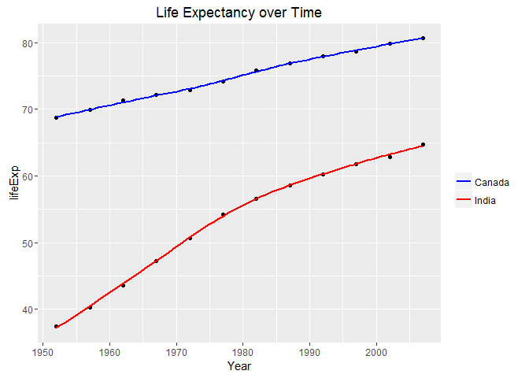
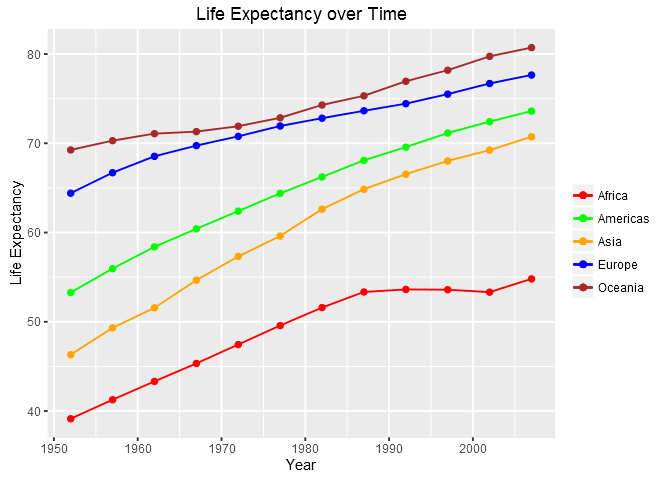

Tidy data and joins
================
Gokul Raj Suresh Kumar
2016-10-09

Tidying data and performing joins
=================================

#### Loading the tidyverse and gapminder packages

``` r
library( tidyverse )
library( gapminder )
```

General data reshaping and relationship to aggregation
------------------------------------------------------

### Activity \#2

#### Life expectancy for different countries by year

``` r
different_countries <- gapminder %>% 
  select( year , country , lifeExp ) %>% 
  filter( country %in% c( "India" , "Canada" , "United States" , "China" , "Japan" ) )

le_by_year <- different_countries %>% 
  spread ( key = "country" , value = "lifeExp" ) %>% 
  rename( Year = year )

knitr::kable( le_by_year )
```

|  Year|  Canada|     China|   India|   Japan|  United States|
|-----:|-------:|---------:|-------:|-------:|--------------:|
|  1952|  68.750|  44.00000|  37.373|  63.030|         68.440|
|  1957|  69.960|  50.54896|  40.249|  65.500|         69.490|
|  1962|  71.300|  44.50136|  43.605|  68.730|         70.210|
|  1967|  72.130|  58.38112|  47.193|  71.430|         70.760|
|  1972|  72.880|  63.11888|  50.651|  73.420|         71.340|
|  1977|  74.210|  63.96736|  54.208|  75.380|         73.380|
|  1982|  75.760|  65.52500|  56.596|  77.110|         74.650|
|  1987|  76.860|  67.27400|  58.553|  78.670|         75.020|
|  1992|  77.950|  68.69000|  60.223|  79.360|         76.090|
|  1997|  78.610|  70.42600|  61.765|  80.690|         76.810|
|  2002|  79.770|  72.02800|  62.879|  82.000|         77.310|
|  2007|  80.653|  72.96100|  64.698|  82.603|         78.242|

``` r
le_by_year %>% ggplot( ) +
  geom_point( aes( x = Year , y = India ) ) +  
  geom_smooth( aes( x = Year , y = India ) , color = "Purple" , se = FALSE ) +
  geom_point( aes( x = Year , y = Canada ) ) +  
  geom_smooth( aes( x = Year , y = Canada ) , color = "Green" , se = FALSE ) +
  labs( title = "Life Expectancy over Time" , x = "Year" , y = "lifeExp" )
```



Activity \#3
------------

#### Mean life expectancy for all years by continent

``` r
all_continents <- gapminder %>% 
  select( continent , year , lifeExp ) %>% 
  group_by( year , continent ) %>% 
  summarise( mean_lifeExp = mean( lifeExp ) ) %>% 
  arrange( continent )

le_continents <- all_continents %>% 
  spread( key = "continent" , value = "mean_lifeExp") %>% 
  rename( Year = year )

knitr::kable( le_continents )
```

|  Year|    Africa|  Americas|      Asia|    Europe|  Oceania|
|-----:|---------:|---------:|---------:|---------:|--------:|
|  1952|  39.13550|  53.27984|  46.31439|  64.40850|  69.2550|
|  1957|  41.26635|  55.96028|  49.31854|  66.70307|  70.2950|
|  1962|  43.31944|  58.39876|  51.56322|  68.53923|  71.0850|
|  1967|  45.33454|  60.41092|  54.66364|  69.73760|  71.3100|
|  1972|  47.45094|  62.39492|  57.31927|  70.77503|  71.9100|
|  1977|  49.58042|  64.39156|  59.61056|  71.93777|  72.8550|
|  1982|  51.59287|  66.22884|  62.61794|  72.80640|  74.2900|
|  1987|  53.34479|  68.09072|  64.85118|  73.64217|  75.3200|
|  1992|  53.62958|  69.56836|  66.53721|  74.44010|  76.9450|
|  1997|  53.59827|  71.15048|  68.02052|  75.50517|  78.1900|
|  2002|  53.32523|  72.42204|  69.23388|  76.70060|  79.7400|
|  2007|  54.80604|  73.60812|  70.72848|  77.64860|  80.7195|

``` r
le_continents %>% ggplot( ) +
  geom_point( aes( x = Year , y = Africa ) ) +
  geom_smooth( aes( x = Year , y = Africa ) , color = "red" , se = FALSE ) +
  geom_point( aes( x = Year , y = Americas ) ) +
  geom_smooth( aes( x = Year , y = Americas ) , color = "orange" , se = FALSE ) +
  geom_point( aes( x = Year , y = Asia ) ) +
  geom_smooth( aes( x = Year , y = Asia ) , color = "green" , se = FALSE ) +
  geom_point( aes( x = Year , y = Europe ) ) +
  geom_smooth( aes( x = Year , y = Europe ) , color = "brown" , se = FALSE ) +
  geom_point( aes( x = Year , y = Oceania ) ) + 
  geom_smooth( aes( x = Year , y = Oceania ) , color = "Purple" , se = FALSE ) +
  labs( title = "Life Expectancy over Time" , x = "Year" , y = "Life Expectancy" )
```



Activity \#4
------------

#### Countries having lowest and highest life expectancy by year

``` r
min_max_le <- gapminder %>%
  select( year , continent , lifeExp ) %>%
  group_by( year ) %>%
  filter( min_rank( desc( lifeExp) ) == 1 | min_rank( lifeExp ) == 1 ) %>% 
  arrange( year )

min_max_le_continent <- min_max_le %>% 
  spread( key = "continent" , value = "lifeExp" ) %>% 
  rename( Year = year )

knitr::kable( min_max_le_continent )
```

|  Year|  Africa|    Asia|  Europe|
|-----:|-------:|-------:|-------:|
|  1952|      NA|  28.801|   72.67|
|  1957|      NA|  30.332|   73.47|
|  1962|      NA|  31.997|   73.68|
|  1967|      NA|  34.020|   74.16|
|  1972|  35.400|      NA|   74.72|
|  1977|      NA|  31.220|   76.11|
|  1982|  38.445|  77.110|      NA|
|  1987|  39.906|  78.670|      NA|
|  1992|  23.599|  79.360|      NA|
|  1997|  36.087|  80.690|      NA|
|  2002|  39.193|  82.000|      NA|
|  2007|  39.613|  82.603|      NA|
