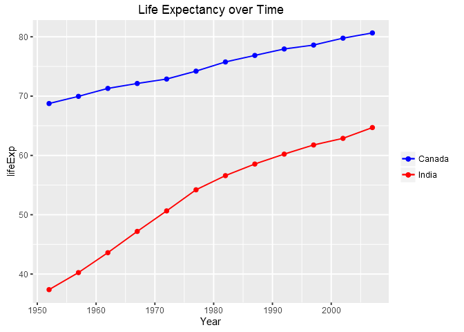

Tidy data and joins
================
Gokul Raj Suresh Kumar
2016-10-11

Tidying data and performing joins
=================================

#### Loading the tidyverse and gapminder packages

``` r
library( tidyverse )
library( gapminder )
```

General data reshaping and relationship to aggregation
------------------------------------------------------

### Activity \#2

#### Life expectancy for different countries by year

``` r
# filtering down to 5 countries to make life easier
different_countries <- gapminder %>% 
  select( year , country , lifeExp ) %>% 
  filter( country %in% c( "India" , "Canada" , "United States" , "China" , "Japan" ) ) %>% 
  print( n = 10 )
```

    ## # A tibble: 60 × 3
    ##     year country lifeExp
    ##    <int>  <fctr>   <dbl>
    ## 1   1952  Canada   68.75
    ## 2   1957  Canada   69.96
    ## 3   1962  Canada   71.30
    ## 4   1967  Canada   72.13
    ## 5   1972  Canada   72.88
    ## 6   1977  Canada   74.21
    ## 7   1982  Canada   75.76
    ## 8   1987  Canada   76.86
    ## 9   1992  Canada   77.95
    ## 10  1997  Canada   78.61
    ## # ... with 50 more rows

``` r
# making a tibble with one row per year and columns for life expectancy for 5 countries
le_by_year <- different_countries %>% 
  spread ( key = "country" , value = "lifeExp" ) %>% 
  rename( Year = year )
knitr::kable( le_by_year )
```

|  Year|  Canada|     China|   India|   Japan|  United States|
|-----:|-------:|---------:|-------:|-------:|--------------:|
|  1952|  68.750|  44.00000|  37.373|  63.030|         68.440|
|  1957|  69.960|  50.54896|  40.249|  65.500|         69.490|
|  1962|  71.300|  44.50136|  43.605|  68.730|         70.210|
|  1967|  72.130|  58.38112|  47.193|  71.430|         70.760|
|  1972|  72.880|  63.11888|  50.651|  73.420|         71.340|
|  1977|  74.210|  63.96736|  54.208|  75.380|         73.380|
|  1982|  75.760|  65.52500|  56.596|  77.110|         74.650|
|  1987|  76.860|  67.27400|  58.553|  78.670|         75.020|
|  1992|  77.950|  68.69000|  60.223|  79.360|         76.090|
|  1997|  78.610|  70.42600|  61.765|  80.690|         76.810|
|  2002|  79.770|  72.02800|  62.879|  82.000|         77.310|
|  2007|  80.653|  72.96100|  64.698|  82.603|         78.242|

``` r
# plotting life expectancy for India against that for Canada
le_by_year %>% ggplot( aes( x = Year , y = India , color = "India" ) ) +
  geom_point( ) + geom_line( ) +
  geom_point( aes( x = Year , y = Canada , color = "Canada" ) ) +  
  geom_line( aes( x = Year , y = Canada , color = "Canada" ) ) +
  scale_color_manual( name = "" , values = c( "India" = "red" ,
                                              "Canada" = "blue" ) ) +
  labs( title = "Life Expectancy over Time" , x = "Year" , y = "lifeExp" )
```



### Activity \#3

#### Mean life expectancy for all years by continent

``` r
# mean life expectancy for each continent by year
all_continents <- gapminder %>% 
  select( continent , year , lifeExp ) %>% 
  group_by( year , continent ) %>% 
  summarise( mean_lifeExp = mean( lifeExp ) ) %>% 
  arrange( continent ) %>% 
  print( n = 10 )
```

    ## Source: local data frame [60 x 3]
    ## Groups: year [12]
    ## 
    ##     year continent mean_lifeExp
    ##    <int>    <fctr>        <dbl>
    ## 1   1952    Africa     39.13550
    ## 2   1957    Africa     41.26635
    ## 3   1962    Africa     43.31944
    ## 4   1967    Africa     45.33454
    ## 5   1972    Africa     47.45094
    ## 6   1977    Africa     49.58042
    ## 7   1982    Africa     51.59287
    ## 8   1987    Africa     53.34479
    ## 9   1992    Africa     53.62958
    ## 10  1997    Africa     53.59827
    ## # ... with 50 more rows

``` r
# reshaping to one row per year and one variable for each continent
le_continents <- all_continents %>% 
  spread( key = "continent" , value = "mean_lifeExp") %>% 
  rename( Year = year )
knitr::kable( le_continents )
```

|  Year|    Africa|  Americas|      Asia|    Europe|  Oceania|
|-----:|---------:|---------:|---------:|---------:|--------:|
|  1952|  39.13550|  53.27984|  46.31439|  64.40850|  69.2550|
|  1957|  41.26635|  55.96028|  49.31854|  66.70307|  70.2950|
|  1962|  43.31944|  58.39876|  51.56322|  68.53923|  71.0850|
|  1967|  45.33454|  60.41092|  54.66364|  69.73760|  71.3100|
|  1972|  47.45094|  62.39492|  57.31927|  70.77503|  71.9100|
|  1977|  49.58042|  64.39156|  59.61056|  71.93777|  72.8550|
|  1982|  51.59287|  66.22884|  62.61794|  72.80640|  74.2900|
|  1987|  53.34479|  68.09072|  64.85118|  73.64217|  75.3200|
|  1992|  53.62958|  69.56836|  66.53721|  74.44010|  76.9450|
|  1997|  53.59827|  71.15048|  68.02052|  75.50517|  78.1900|
|  2002|  53.32523|  72.42204|  69.23388|  76.70060|  79.7400|
|  2007|  54.80604|  73.60812|  70.72848|  77.64860|  80.7195|

``` r
# trying to plot the life expectancy over time for different continents !
# this attempt is definitely not the most efficient way to go about this ! 
# is there a better way ? I wonder . .
le_continents %>% ggplot( aes( x = Year , y = Africa , color = "Africa") ) +
  geom_point( ) + geom_line( ) +
  geom_point( aes( x = Year , y = Americas , color = "Americas" ) ) +
  geom_line( aes( x = Year , y = Americas , color = "Americas" ) ) +
  geom_point( aes( x = Year , y = Asia , color = "Asia" ) ) +
  geom_line( aes( x = Year , y = Asia , color = "Asia" ) ) +
  geom_point( aes( x = Year , y = Europe , color = "Europe" ) ) +
  geom_line( aes( x = Year , y = Europe , color = "Europe" ) ) +
  geom_point( aes( x = Year , y = Oceania , color = "Oceania" ) ) +
  geom_line( aes( x = Year , y = Oceania , color = "Oceania" ) ) +
  scale_color_manual( name = "" , values = c( "Africa" = "red" , 
                                              "Americas" = "green" ,
                                              "Asia" = "orange" , 
                                              "Europe" = "blue" ,
                                              "Oceania" = "brown") ) + 
    labs( title = "Life Expectancy over Time" , x = "Year" , y = "Life Expectancy" )
```


**Take home message**:

**Listen to Jenny**. When she said that **tidy data is integral to efficient data analysis and visualization**, she meant it.

### Activity \#4

#### Continents having lowest and highest life expectancy by year

``` r
# the tibble referred-to by Jenny, modified to give continent with 
# lowest and highest life expectancy by year
min_max_le <- gapminder %>%
  select( year , continent , lifeExp ) %>%
  group_by( year ) %>%
  filter( min_rank( desc( lifeExp) ) == 1 | min_rank( lifeExp ) == 1 ) %>% 
  arrange( year ) %>% 
  print( n = 10 )
```

    ## Source: local data frame [24 x 3]
    ## Groups: year [12]
    ## 
    ##     year continent lifeExp
    ##    <int>    <fctr>   <dbl>
    ## 1   1952      Asia  28.801
    ## 2   1952    Europe  72.670
    ## 3   1957      Asia  30.332
    ## 4   1957    Europe  73.470
    ## 5   1962      Asia  31.997
    ## 6   1962    Europe  73.680
    ## 7   1967      Asia  34.020
    ## 8   1967    Europe  74.160
    ## 9   1972    Africa  35.400
    ## 10  1972    Europe  74.720
    ## # ... with 14 more rows

``` r
# reshaping the above tibble to get one row per year 
min_max_le_continent <- min_max_le %>% 
  spread( key = "continent" , value = "lifeExp" ) %>% 
  rename( Year = year )
knitr::kable( min_max_le_continent )
```

|  Year|  Africa|    Asia|  Europe|
|-----:|-------:|-------:|-------:|
|  1952|      NA|  28.801|   72.67|
|  1957|      NA|  30.332|   73.47|
|  1962|      NA|  31.997|   73.68|
|  1967|      NA|  34.020|   74.16|
|  1972|  35.400|      NA|   74.72|
|  1977|      NA|  31.220|   76.11|
|  1982|  38.445|  77.110|      NA|
|  1987|  39.906|  78.670|      NA|
|  1992|  23.599|  79.360|      NA|
|  1997|  36.087|  80.690|      NA|
|  2002|  39.193|  82.000|      NA|
|  2007|  39.613|  82.603|      NA|

`NA`'s are returned for countries that don't have the minimum or maximum life expectancy for a specific year.

Join, merge, look up
--------------------

### Activity \#1

#### Joining Gapminder with a complimentary data frame

``` r
# filtering Asian countries which had life expectancy greater than 75 in 2007
knitr::kable( gapminder_data <- gapminder %>% 
  filter( continent == "Asia" , year == 2007 , lifeExp > 75 ) %>% 
  select( country , lifeExp, gdpPercap ) )
```

| country          |  lifeExp|  gdpPercap|
|:-----------------|--------:|----------:|
| Bahrain          |   75.635|   29796.05|
| Hong Kong, China |   82.208|   39724.98|
| Israel           |   80.745|   25523.28|
| Japan            |   82.603|   31656.07|
| Korea, Rep.      |   78.623|   23348.14|
| Kuwait           |   77.588|   47306.99|
| Oman             |   75.640|   22316.19|
| Singapore        |   79.972|   47143.18|
| Taiwan           |   78.400|   28718.28|

``` r
# creating the complementary dataframe for gapminder
country_info <- "
     country, capitol_city, language_spoken
     Bahrain,       Manama,          Arabic
       Japan,        Tokyo,        Japanese
      Israel,    Jerusalem,          Hebrew
      Taiwan,       Taipei,        Mandarin
       India,    New Delhi,           Hindi
    Cambodia,   Phnom Penh,           Khmer
    Pakistan,    Islamabad,            Urdu
"
country_info <- read_csv( country_info , trim_ws = TRUE , skip = 1 )
knitr::kable( country_info )
```

| country  | capitol\_city | language\_spoken |
|:---------|:--------------|:-----------------|
| Bahrain  | Manama        | Arabic           |
| Japan    | Tokyo         | Japanese         |
| Israel   | Jerusalem     | Hebrew           |
| Taiwan   | Taipei        | Mandarin         |
| India    | New Delhi     | Hindi            |
| Cambodia | Phnom Penh    | Khmer            |
| Pakistan | Islamabad     | Urdu             |

``` r
# inner_join( gapminder_data , country_info )
knitr::kable( inner_join( gapminder_data , country_info ) )
```

    ## Joining, by = "country"

    ## Warning in inner_join_impl(x, y, by$x, by$y, suffix$x, suffix$y): joining
    ## factor and character vector, coercing into character vector

| country |  lifeExp|  gdpPercap| capitol\_city | language\_spoken |
|:--------|--------:|----------:|:--------------|:-----------------|
| Bahrain |   75.635|   29796.05| Manama        | Arabic           |
| Israel  |   80.745|   25523.28| Jerusalem     | Hebrew           |
| Japan   |   82.603|   31656.07| Tokyo         | Japanese         |
| Taiwan  |   78.400|   28718.28| Taipei        | Mandarin         |

We lose `Hong Kong`, `Korea`, `Kuwait`, `Oman` and `Singapore` because their names don't appear in `country_info`. The result has all variables from `gapminder_data` plus `capitol_city` and `language_spoken` from `country_info`.

``` r
# semi_join( gapminder_data , country_info )
knitr::kable( semi_join( gapminder_data , country_info ) )
```

    ## Joining, by = "country"

| country |  lifeExp|  gdpPercap|
|:--------|--------:|----------:|
| Bahrain |   75.635|   29796.05|
| Japan   |   82.603|   31656.07|
| Israel  |   80.745|   25523.28|
| Taiwan  |   78.400|   28718.28|

Results are similar to the above `inner_join`'s result, but variables from`country_info` are not returned.

``` r
# left_join( gapminder_data , country_info )
knitr::kable( left_join( gapminder_data , country_info ) )
```

    ## Joining, by = "country"

    ## Warning in left_join_impl(x, y, by$x, by$y, suffix$x, suffix$y): joining
    ## character vector and factor, coercing into character vector

| country          |  lifeExp|  gdpPercap| capitol\_city | language\_spoken |
|:-----------------|--------:|----------:|:--------------|:-----------------|
| Bahrain          |   75.635|   29796.05| Manama        | Arabic           |
| Hong Kong, China |   82.208|   39724.98| NA            | NA               |
| Israel           |   80.745|   25523.28| Jerusalem     | Hebrew           |
| Japan            |   82.603|   31656.07| Tokyo         | Japanese         |
| Korea, Rep.      |   78.623|   23348.14| NA            | NA               |
| Kuwait           |   77.588|   47306.99| NA            | NA               |
| Oman             |   75.640|   22316.19| NA            | NA               |
| Singapore        |   79.972|   47143.18| NA            | NA               |
| Taiwan           |   78.400|   28718.28| Taipei        | Mandarin         |

`gapminder_data` is returned along with `capitol_city` and `language_spoken` from `country_info` with `NA`'s for countries that don't appear in `country_info`.

``` r
# anti_join( gapminder_data , country_info )
knitr::kable( anti_join( gapminder_data , country_info ) )
```

    ## Joining, by = "country"

| country          |  lifeExp|  gdpPercap|
|:-----------------|--------:|----------:|
| Hong Kong, China |   82.208|   39724.98|
| Korea, Rep.      |   78.623|   23348.14|
| Kuwait           |   77.588|   47306.99|
| Oman             |   75.640|   22316.19|
| Singapore        |   79.972|   47143.18|

Countries from `gapminder_data` that don't appear in `country_info` are returned, without `capitol_city` and `language_spoken`.

``` r
# inner_join( country_info , gapminder_data )
knitr::kable( inner_join( country_info , gapminder_data ) )
```

    ## Joining, by = "country"

    ## Warning in inner_join_impl(x, y, by$x, by$y, suffix$x, suffix$y): joining
    ## character vector and factor, coercing into character vector

| country | capitol\_city | language\_spoken |  lifeExp|  gdpPercap|
|:--------|:--------------|:-----------------|--------:|----------:|
| Bahrain | Manama        | Arabic           |   75.635|   29796.05|
| Japan   | Tokyo         | Japanese         |   82.603|   31656.07|
| Israel  | Jerusalem     | Hebrew           |   80.745|   25523.28|
| Taiwan  | Taipei        | Mandarin         |   78.400|   28718.28|

We lose `Hong Kong`, `Korea`, `Kuwait`, `Oman` and `Singapore` because their names don't appear in `country_info`. The result has all variables from `country_info` plus `lifeExp` and `gdpPercap` from `gapminder_data`.

``` r
# semi_join( country_info , gapminder_data )
knitr::kable( semi_join( country_info , gapminder_data ) )
```

    ## Joining, by = "country"

| country | capitol\_city | language\_spoken |
|:--------|:--------------|:-----------------|
| Bahrain | Manama        | Arabic           |
| Israel  | Jerusalem     | Hebrew           |
| Japan   | Tokyo         | Japanese         |
| Taiwan  | Taipei        | Mandarin         |

Results are similar to the above `inner_join`'s result, but variables from`gapminder_data` are not returned.

``` r
# left_join( country_info , gapminder_data )
knitr::kable( left_join( country_info , gapminder_data ) )
```

    ## Joining, by = "country"

    ## Warning in left_join_impl(x, y, by$x, by$y, suffix$x, suffix$y): joining
    ## factor and character vector, coercing into character vector

| country  | capitol\_city | language\_spoken |  lifeExp|  gdpPercap|
|:---------|:--------------|:-----------------|--------:|----------:|
| Bahrain  | Manama        | Arabic           |   75.635|   29796.05|
| Japan    | Tokyo         | Japanese         |   82.603|   31656.07|
| Israel   | Jerusalem     | Hebrew           |   80.745|   25523.28|
| Taiwan   | Taipei        | Mandarin         |   78.400|   28718.28|
| India    | New Delhi     | Hindi            |       NA|         NA|
| Cambodia | Phnom Penh    | Khmer            |       NA|         NA|
| Pakistan | Islamabad     | Urdu             |       NA|         NA|

`country_info` is returned along with `lifeExp` and `gdpPercap` from `gapminder_data` with `NA`'s for countries that don't appear in `gapminder_data`.

``` r
# anti_join( country_info , gapminder_data )
knitr::kable( anti_join( country_info , gapminder_data ) )
```

    ## Joining, by = "country"

| country  | capitol\_city | language\_spoken |
|:---------|:--------------|:-----------------|
| Cambodia | Phnom Penh    | Khmer            |
| India    | New Delhi     | Hindi            |
| Pakistan | Islamabad     | Urdu             |

Countries from `country_info` that don't appear in `gapminder_data` are returned, without `lifeExp` and `gdpPercap`.

``` r
# full_join( gapminder_data , country_info )
knitr::kable( full_join( gapminder_data , country_info ) )
```

    ## Joining, by = "country"

    ## Warning in full_join_impl(x, y, by$x, by$y, suffix$x, suffix$y): joining
    ## character vector and factor, coercing into character vector

| country          |  lifeExp|  gdpPercap| capitol\_city | language\_spoken |
|:-----------------|--------:|----------:|:--------------|:-----------------|
| Bahrain          |   75.635|   29796.05| Manama        | Arabic           |
| Hong Kong, China |   82.208|   39724.98| NA            | NA               |
| Israel           |   80.745|   25523.28| Jerusalem     | Hebrew           |
| Japan            |   82.603|   31656.07| Tokyo         | Japanese         |
| Korea, Rep.      |   78.623|   23348.14| NA            | NA               |
| Kuwait           |   77.588|   47306.99| NA            | NA               |
| Oman             |   75.640|   22316.19| NA            | NA               |
| Singapore        |   79.972|   47143.18| NA            | NA               |
| Taiwan           |   78.400|   28718.28| Taipei        | Mandarin         |
| India            |       NA|         NA| New Delhi     | Hindi            |
| Cambodia         |       NA|         NA| Phnom Penh    | Khmer            |
| Pakistan         |       NA|         NA| Islamabad     | Urdu             |

We get all rows of `gapminder_data` and 3 rows from `country_info` (`India`, `Cambodia` and `Pakistan`) with columns `capitol_city` and `language_spoken`. `NA`'s are returned for rows that derive solely from either tables.

Reflections
-----------

I got super curious and ended up solving multiple prompts. Apologies if my lengthy document having so many activities annoys the reviewer. Knowledge gained through this assignment was huge!

Jenny's [ggplot2 tutorial](https://github.com/jennybc/ggplot2-tutorial) and her [Cheatsheet for dplyr join functions](http://stat545.com/bit001_dplyr-cheatsheet.html) were of massive help. I wonder how the figures in her tutorial look so polished ! I tried !

I referred to [Beautiful plotting in R: A ggplot2 cheatsheet](http://www.cs.utexas.edu/~cannata/dataVis/Class%20Notes/Beautiful%20plotting%20in%20R_%20A%20ggplot2%20cheatsheet%20_%20Technical%20Tidbits%20From%20Spatial%20Analysis%20&%20Data%20Science.pdf) to manually set colors in plots.
