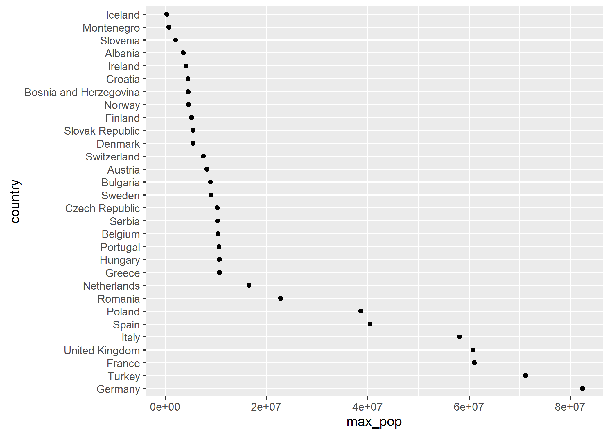
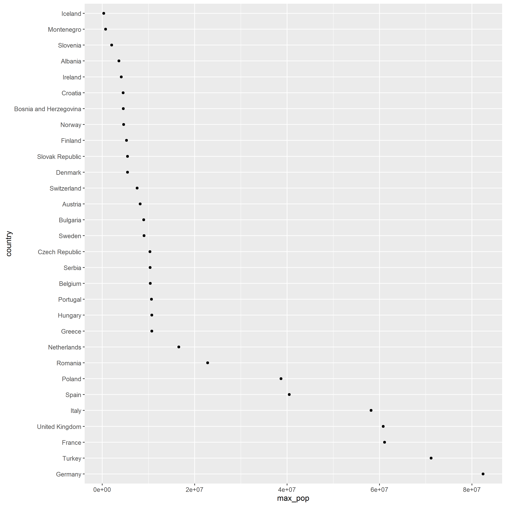
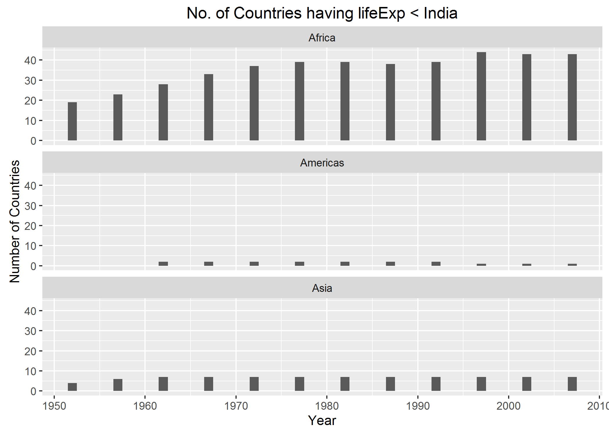

```{r setup, include=FALSE}
knitr::opts_chunk$set(echo = TRUE)
```

#Factor and Figure Management

####Loading the required packages

```{r message=FALSE}
library(gapminder)
library(tidyverse)
library(forcats)
```

##Factor Management

###Dropping Oceania

####Gapminder's details

```{r}
# total number of observations in each continent
gapminder %>% 
  count( continent )
# total number of rows in the data.frame
nrow( gapminder )
# number of levels for the factor continent
nlevels( gapminder$continent )
# number of levels for the factor country
nlevels( gapminder$country )
```

####Oceania's details (for manual validation)

```{r}
#filtering Oceania's details
just_oceania <- gapminder %>%
  filter( continent == "Oceania" ) %>%
  droplevels()
# total number of observations in Oceania
just_oceania %>%
  count( continent )
# total number of rows in the data.frame for Oceania
nrow( just_oceania )
# number of levels for the factor continent
nlevels( just_oceania$continent )
# number of levels for the factor country
nlevels( just_oceania$country )
```

####Details after dropping Oceania

```{r}
# dropping Oceania and it's factor levels
(without_oceania <- gapminder %>%
  filter( continent != "Oceania" ) %>%
  droplevels())
# this tibble shows that Oceania has been removed
without_oceania %>%
  count( continent )
# 1704 - 24 (Observations for all continents - Observations for Oceania)
nrow( without_oceania )
# 5 - 1 (All continents - Oceania)
nlevels( without_oceania$continent )
# 142 - 2 (All countries - (New Zealand + Australia))
nlevels( without_oceania$country )
```

The number of rows got reduced by 24 after Oceania was dropped.
The number of levels of factors reduced by 2 as well, the 2 factors assigned to Australia and New Zealand.

###Reordering the levels of `country`

####Extracting maximum population of Countries in Europe (between 1952 and 2007)

```{r}
# population is the quantitative variable being summarized to obtain the maximum value
max_pop_europe <- gapminder %>%
  filter( continent == "Europe" ) %>%
  group_by( country ) %>% 
  summarize( max_pop = max( pop ) ) %>%
  droplevels() %>%
  ungroup()
# sanity check   
head( max_pop_europe )
# total number of countries in Europe according to Gapminder
nrow( max_pop_europe )
# first 6 levels of the factor 'country'
max_pop_europe$country %>%
  levels() %>%
  head()
```

####Reordering factor levels of European countries based on descending order of maximum population

```{r}
# reordering levels of the factors 
pop_reorder_europe <- max_pop_europe %>% 
  mutate( country = fct_reorder( country , max_pop , .desc = TRUE ) )
# first 6 levels of the reordered factor 'country'
head( levels( pop_reorder_europe$country ) )
# order of pop_reorder_europe doesn't change!
head( pop_reorder_europe )
```

####Exploring the effects of `arrange()`

```{r}
# arranging countries in Europe by descending order of Max life expectancy
pop_arr_europe <- max_pop_europe %>%
  arrange( desc( max_pop ) ) 
# sanity check
head(pop_arr_europe)
# first 6 levels of the factor 'country' ! Levels have not changed !
pop_arr_europe$country %>% 
  levels() %>% 
  head()
# plotting arranged data without level reorder
pop_arr_europe %>%
  ggplot( aes( x = max_pop , y = country ) ) + geom_point()
```

From the above plot, we can infer that merely arranging the data doesn't have any effect on the figure.

####Exploring the effects of reordering a factor( without `arrange()`)

```{r}
# displaying the first 6 levels of the reordered data for reference
pop_reorder_europe$country %>%
  levels() %>%
  head()
# plotting the level-reordered data
(p <- pop_reorder_europe %>% 
  ggplot( aes( x = max_pop , y = country ) ) + geom_point())
```

From the above plot, we can infer that we can obtain better plots by just reordering factors and not arranging the data 

####Exploring the effects of factor reordering with `arrange()`

```{r}
# displaying the first 6 levels of arranged data without level reorder
head(pop_arr_europe)
# plotting arranged data with level reorder
pop_arr_europe %>% 
  ggplot( aes( x = max_pop, y = fct_reorder( country , max_pop , .desc = TRUE ) ) ) + geom_point()
```

From the above plot, we can infer that performing arranging operation on level reordered data doesn't have any effect on the figure

##File I/O

###Data to be used for experimentation

```{r}
# dataset on which file manipulation is going to be performed(level reordered data)
head( pop_reorder_europe )
# displaying the first 5 levels of the reordered data for reference
head( levels( pop_reorder_europe$country ) )
```

###Writing to (`write_csv()`) and reading from (`read_csv()`) a comma-delimited file 

```{r}
# writing to a csv file
write_csv( pop_reorder_europe , "pop_reorder_europe.csv" )
# reading from a csv file
eur_csv_data <- read_csv( "pop_reorder_europe.csv" )
# sanity check
head( eur_csv_data )
# confirmation that levels have not been preserved
head( levels( eur_csv_data$country ) )
```

###Writing to (`saveRDS()`) and reading from (`readRDS()`) a file while preserving factor levels

```{r}
# writing to an RDS file
saveRDS( pop_reorder_europe , "pop_reorder_europe.rds" )
# reading from an RDS file
eur_rds_data <- readRDS( "pop_reorder_europe.rds" )
# sanity check
head( eur_rds_data )
# confirmation that reordered levels have been preserved
head( levels( eur_rds_data$country ) )
```

###Writing to (`dput()`) and reading from (`dget()`) a file while preserving factor levels

```{r}
# writing to a text file
dput( pop_reorder_europe , "pop_reorder_europe-dput.txt" )
# reading from a text file
eur_txt_data <- dget( "pop_reorder_europe-dput.txt" )
# sanity check
head( eur_txt_data )
# confirmation that reordered levels have been preserved
head( levels( eur_txt_data$country ) )
```

##Visualization design

###Code to generate the number of countries having relative life expectancy < India (Assignment 3)

```{r}
my_gap <- gapminder

benchmark_country <- my_gap %>% 
  filter( country == "India" )
# calculating relative life expectancy
rel_le <- my_gap %>% 
  mutate( temp = rep( benchmark_country$lifeExp , nlevels( country ) ), 
          lifeExpRel = lifeExp/temp, 
          temp = NULL )
# number of countries in each continent having relative life expectancy < 1 for each year
rel_abundance <- rel_le %>%
  group_by( continent , year ) %>% 
  filter( lifeExpRel < 1 ) %>% 
  summarise( n_countries = n_distinct( country ) )
```

###Oops! I have used a stacked barplot in assignment 3

```{r dev='CairoPNG'}
rel_abundance %>%
  ggplot( aes( x = year , y = n_countries , fill = continent ) ) + 
  geom_bar( stat = "identity" , position = "stack" ) +
  labs( title = "No. of Countries having lifeExp < India" , x = "Year" , y = "Number of Countries" )
```

Stacked bar charts appeared under the **No no's** in Jenny's [Do's and Don'ts for Effective graphs](http://stat545.com/block015_graph-dos-donts.html), and so I decided to come up with a better visualization for this dataset. 

###Partitioning the above into small multiple bar charts (One chart per continent)

```{r dev='CairoPNG', fig.width=8, fig.height=6}
(q <- rel_abundance %>% 
  ggplot( aes( x = year , y = n_countries ) ) + 
  geom_bar( width = 1 , stat = "identity" ) + 
  facet_wrap( ~continent , nrow = 3 ) + 
  labs( title = "No. of Countries having lifeExp < India" , x = "Year" , y = "Number of Countries" ))
```

This approach of visualization was inspired from Tamara Munzner's presentation on [Visualization Analysis and Design](http://www.cs.ubc.ca/~tmm/talks/minicourse14/vad16bryan.pdf), from the section about **Partitioning: List Alignment**. Using continent colors didn't seem to be the best thing to do for my scenario, since the facetted plot displays all the essentials and any further information would be redundant.

##Writing figures to a file

###Using `ggsave()` to write a figure to a file Explicitly

```{r}
# object p contains the plot for the level ordered data (done above)
ggsave( "max_pop_europe.png" , plot = p )
```



###Changing size of the plot to be saved using the `width=` and `height=` argument to `ggsave()`

```{r}
# manually specifying width and height of the image
ggsave( "resized_max_pop_europe.png" , plot = p , height = 10 , width = 10 )
```



###Scenario where explicit provision of the plot object matters

Let's assume that I want to save the new improvised chart that I derived from the stacked barplot into a file.

If I am not being explicit:

```{r}
# plot not specified
ggsave( "rel_lifeExp_lt_India.png" )
```


The resultant plot is not the expected one. It prints the plot that was lastly generated using ggplot. In such scenarios and for a logical workflow, I need to be explicit about the plot that I want to print.

```{r}
# q is the facetted barplot (done above)
ggsave( "rel_lifeExp_lt_India_for_sure.png" , plot = q )
```



Problem solved !

## Cleaning up the repo

- Added a table of contents in the README.md
- Removed unnecessary downstream stuff
- Left the generated csv, txt and RDS files since they're part of the workflow for HW5
- Same applies to the generated images for HW5 as well, as I have linked them to the markdown document

## Reflection

- I can confidently handle factors henceforth, thanks to this extremely informative assignment.
- Made extensive use of Jenny's [Be the boss of your factors](http://stat545.com/block029_factors.html) and [Writing figures to file](http://stat545.com/block017_write-figure-to-file.html) to get insight in order to solve the prompts.
- Excited for STAT 547!!
