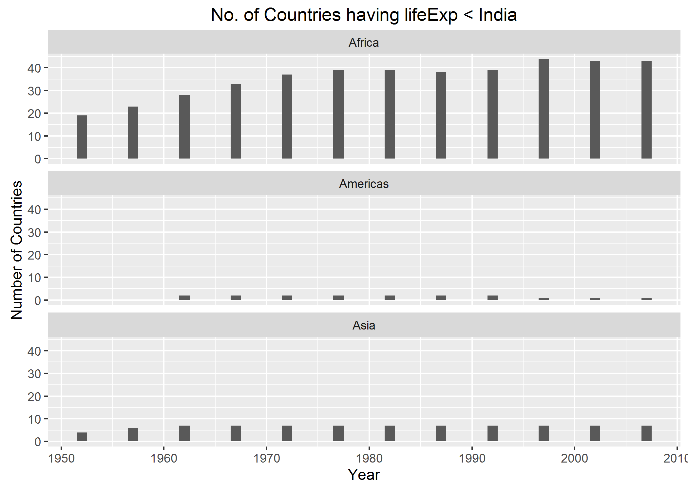

Factor and Figure Management
================
Gokul Raj Suresh Kumar
2016-10-21

Factor and Figure Management
============================

#### Loading the required packages

``` r
library(gapminder)
library(tidyverse)
library(forcats)
```

Factor Management
-----------------

### Dropping Oceania

#### Gapminder's details

``` r
# total number of observations in each continent
gapminder %>% 
  count( continent )
```

    ## # A tibble: 5 × 2
    ##   continent     n
    ##      <fctr> <int>
    ## 1    Africa   624
    ## 2  Americas   300
    ## 3      Asia   396
    ## 4    Europe   360
    ## 5   Oceania    24

``` r
# total number of rows in the data.frame
nrow( gapminder )
```

    ## [1] 1704

``` r
# number of levels for the factor continent
nlevels( gapminder$continent )
```

    ## [1] 5

``` r
# number of levels for the factor country
nlevels( gapminder$country )
```

    ## [1] 142

#### Oceania's details (for manual validation)

``` r
#filtering Oceania's details
just_oceania <- gapminder %>%
  filter( continent == "Oceania" ) %>%
  droplevels()
# total number of observations in Oceania
just_oceania %>%
  count( continent )
```

    ## # A tibble: 1 × 2
    ##   continent     n
    ##      <fctr> <int>
    ## 1   Oceania    24

``` r
# total number of rows in the data.frame for Oceania
nrow( just_oceania )
```

    ## [1] 24

``` r
# number of levels for the factor continent
nlevels( just_oceania$continent )
```

    ## [1] 1

``` r
# number of levels for the factor country
nlevels( just_oceania$country )
```

    ## [1] 2

#### Details after dropping Oceania

``` r
# dropping Oceania and it's factor levels
(without_oceania <- gapminder %>%
  filter( continent != "Oceania" ) %>%
  droplevels())
```

    ## # A tibble: 1,680 × 6
    ##        country continent  year lifeExp      pop gdpPercap
    ##         <fctr>    <fctr> <int>   <dbl>    <int>     <dbl>
    ## 1  Afghanistan      Asia  1952  28.801  8425333  779.4453
    ## 2  Afghanistan      Asia  1957  30.332  9240934  820.8530
    ## 3  Afghanistan      Asia  1962  31.997 10267083  853.1007
    ## 4  Afghanistan      Asia  1967  34.020 11537966  836.1971
    ## 5  Afghanistan      Asia  1972  36.088 13079460  739.9811
    ## 6  Afghanistan      Asia  1977  38.438 14880372  786.1134
    ## 7  Afghanistan      Asia  1982  39.854 12881816  978.0114
    ## 8  Afghanistan      Asia  1987  40.822 13867957  852.3959
    ## 9  Afghanistan      Asia  1992  41.674 16317921  649.3414
    ## 10 Afghanistan      Asia  1997  41.763 22227415  635.3414
    ## # ... with 1,670 more rows

``` r
# this tibble shows that Oceania has been removed
without_oceania %>%
  count( continent )
```

    ## # A tibble: 4 × 2
    ##   continent     n
    ##      <fctr> <int>
    ## 1    Africa   624
    ## 2  Americas   300
    ## 3      Asia   396
    ## 4    Europe   360

``` r
# 1704 - 24 (Observations for all continents - Observations for Oceania)
nrow( without_oceania )
```

    ## [1] 1680

``` r
# 5 - 1 (All continents - Oceania)
nlevels( without_oceania$continent )
```

    ## [1] 4

``` r
# 142 - 2 (All countries - (New Zealand + Australia))
nlevels( without_oceania$country )
```

    ## [1] 140

The number of rows got reduced by 24 after Oceania was dropped. The number of levels of factors reduced by 2 as well, the 2 factors assigned to Australia and New Zealand.

### Reordering the levels of `country`

#### Extracting maximum population of Countries in Europe (between 1952 and 2007)

``` r
# population is the quantitative variable being summarized to obtain the maximum value
max_pop_europe <- gapminder %>%
  filter( continent == "Europe" ) %>%
  group_by( country ) %>% 
  summarize( max_pop = max( pop ) ) %>%
  droplevels() %>%
  ungroup()
# sanity check   
head( max_pop_europe )
```

    ## # A tibble: 6 × 2
    ##                  country  max_pop
    ##                   <fctr>    <int>
    ## 1                Albania  3600523
    ## 2                Austria  8199783
    ## 3                Belgium 10392226
    ## 4 Bosnia and Herzegovina  4552198
    ## 5               Bulgaria  8971958
    ## 6                Croatia  4494013

``` r
# total number of countries in Europe according to Gapminder
nrow( max_pop_europe )
```

    ## [1] 30

``` r
# first 6 levels of the factor 'country'
max_pop_europe$country %>%
  levels() %>%
  head()
```

    ## [1] "Albania"                "Austria"               
    ## [3] "Belgium"                "Bosnia and Herzegovina"
    ## [5] "Bulgaria"               "Croatia"

#### Reordering factor levels of European countries based on descending order of maximum population

``` r
# reordering levels of the factors 
pop_reorder_europe <- max_pop_europe %>% 
  mutate( country = fct_reorder( country , max_pop , .desc = TRUE ) )
# first 6 levels of the reordered factor 'country'
head( levels( pop_reorder_europe$country ) )
```

    ## [1] "Germany"        "Turkey"         "France"         "United Kingdom"
    ## [5] "Italy"          "Spain"

``` r
# order of pop_reorder_europe doesn't change!
head( pop_reorder_europe )
```

    ## # A tibble: 6 × 2
    ##                  country  max_pop
    ##                   <fctr>    <int>
    ## 1                Albania  3600523
    ## 2                Austria  8199783
    ## 3                Belgium 10392226
    ## 4 Bosnia and Herzegovina  4552198
    ## 5               Bulgaria  8971958
    ## 6                Croatia  4494013

#### Exploring the effects of `arrange()`

``` r
# arranging countries in Europe by descending order of Max life expectancy
pop_arr_europe <- max_pop_europe %>%
  arrange( desc( max_pop ) ) 
# sanity check
head(pop_arr_europe)
```

    ## # A tibble: 6 × 2
    ##          country  max_pop
    ##           <fctr>    <int>
    ## 1        Germany 82400996
    ## 2         Turkey 71158647
    ## 3         France 61083916
    ## 4 United Kingdom 60776238
    ## 5          Italy 58147733
    ## 6          Spain 40448191

``` r
# first 6 levels of the factor 'country' ! Levels have not changed !
pop_arr_europe$country %>% 
  levels() %>% 
  head()
```

    ## [1] "Albania"                "Austria"               
    ## [3] "Belgium"                "Bosnia and Herzegovina"
    ## [5] "Bulgaria"               "Croatia"

``` r
# plotting arranged data without level reorder
pop_arr_europe %>%
  ggplot( aes( x = max_pop , y = country ) ) + geom_point()
```


From the above plot, we can infer that merely arranging the data doesn't have any effect on the figure.

#### Exploring the effects of reordering a factor( without `arrange()`)

``` r
# displaying the first 6 levels of the reordered data for reference
pop_reorder_europe$country %>%
  levels() %>%
  head()
```

    ## [1] "Germany"        "Turkey"         "France"         "United Kingdom"
    ## [5] "Italy"          "Spain"

``` r
# plotting the level-reordered data
(p <- pop_reorder_europe %>% 
  ggplot( aes( x = max_pop , y = country ) ) + geom_point())
```


From the above plot, we can infer that we can obtain better plots by just reordering factors and not arranging the data

#### Exploring the effects of factor reordering with `arrange()`

``` r
# displaying the first 6 levels of arranged data without level reorder
head(pop_arr_europe)
```

    ## # A tibble: 6 × 2
    ##          country  max_pop
    ##           <fctr>    <int>
    ## 1        Germany 82400996
    ## 2         Turkey 71158647
    ## 3         France 61083916
    ## 4 United Kingdom 60776238
    ## 5          Italy 58147733
    ## 6          Spain 40448191

``` r
# plotting arranged data with level reorder
pop_arr_europe %>% 
  ggplot( aes( x = max_pop, y = fct_reorder( country , max_pop , .desc = TRUE ) ) ) + geom_point()
```


From the above plot, we can infer that performing arranging operation on level reordered data doesn't have any effect on the figure

File I/O
--------

### Data to be used for experimentation

``` r
# dataset on which file manipulation is going to be performed(level reordered data)
head( pop_reorder_europe )
```

    ## # A tibble: 6 × 2
    ##                  country  max_pop
    ##                   <fctr>    <int>
    ## 1                Albania  3600523
    ## 2                Austria  8199783
    ## 3                Belgium 10392226
    ## 4 Bosnia and Herzegovina  4552198
    ## 5               Bulgaria  8971958
    ## 6                Croatia  4494013

``` r
# displaying the first 5 levels of the reordered data for reference
head( levels( pop_reorder_europe$country ) )
```

    ## [1] "Germany"        "Turkey"         "France"         "United Kingdom"
    ## [5] "Italy"          "Spain"

### Writing to (`write_csv()`) and reading from (`read_csv()`) a comma-delimited file

``` r
# writing to a csv file
write_csv( pop_reorder_europe , "pop_reorder_europe.csv" )
# reading from a csv file
eur_csv_data <- read_csv( "pop_reorder_europe.csv" )
```

    ## Parsed with column specification:
    ## cols(
    ##   country = col_character(),
    ##   max_pop = col_integer()
    ## )

``` r
# sanity check
head( eur_csv_data )
```

    ## # A tibble: 6 × 2
    ##                  country  max_pop
    ##                    <chr>    <int>
    ## 1                Albania  3600523
    ## 2                Austria  8199783
    ## 3                Belgium 10392226
    ## 4 Bosnia and Herzegovina  4552198
    ## 5               Bulgaria  8971958
    ## 6                Croatia  4494013

``` r
# confirmation that levels have not been preserved
head( levels( eur_csv_data$country ) )
```

    ## NULL

### Writing to (`saveRDS()`) and reading from (`readRDS()`) a file while preserving factor levels

``` r
# writing to an RDS file
saveRDS( pop_reorder_europe , "pop_reorder_europe.rds" )
# reading from an RDS file
eur_rds_data <- readRDS( "pop_reorder_europe.rds" )
# sanity check
head( eur_rds_data )
```

    ## # A tibble: 6 × 2
    ##                  country  max_pop
    ##                   <fctr>    <int>
    ## 1                Albania  3600523
    ## 2                Austria  8199783
    ## 3                Belgium 10392226
    ## 4 Bosnia and Herzegovina  4552198
    ## 5               Bulgaria  8971958
    ## 6                Croatia  4494013

``` r
# confirmation that reordered levels have been preserved
head( levels( eur_rds_data$country ) )
```

    ## [1] "Germany"        "Turkey"         "France"         "United Kingdom"
    ## [5] "Italy"          "Spain"

### Writing to (`dput()`) and reading from (`dget()`) a file while preserving factor levels

``` r
# writing to a text file
dput( pop_reorder_europe , "pop_reorder_europe-dput.txt" )
# reading from a text file
eur_txt_data <- dget( "pop_reorder_europe-dput.txt" )
# sanity check
head( eur_txt_data )
```

    ## # A tibble: 6 × 2
    ##                  country  max_pop
    ##                   <fctr>    <int>
    ## 1                Albania  3600523
    ## 2                Austria  8199783
    ## 3                Belgium 10392226
    ## 4 Bosnia and Herzegovina  4552198
    ## 5               Bulgaria  8971958
    ## 6                Croatia  4494013

``` r
# confirmation that reordered levels have been preserved
head( levels( eur_txt_data$country ) )
```

    ## [1] "Germany"        "Turkey"         "France"         "United Kingdom"
    ## [5] "Italy"          "Spain"

Visualization design
--------------------

### Code to generate the number of countries having relative life expectancy &lt; India (Assignment 3)

``` r
my_gap <- gapminder

benchmark_country <- my_gap %>% 
  filter( country == "India" )
# calculating relative life expectancy
rel_le <- my_gap %>% 
  mutate( temp = rep( benchmark_country$lifeExp , nlevels( country ) ), 
          lifeExpRel = lifeExp/temp, 
          temp = NULL )
# number of countries in each continent having relative life expectancy < 1 for each year
rel_abundance <- rel_le %>%
  group_by( continent , year ) %>% 
  filter( lifeExpRel < 1 ) %>% 
  summarise( n_countries = n_distinct( country ) )
```

### Oops! I have used a stacked barplot in assignment 3

``` r
rel_abundance %>%
  ggplot( aes( x = year , y = n_countries , fill = continent ) ) + 
  geom_bar( stat = "identity" , position = "stack" ) +
  labs( title = "No. of Countries having lifeExp < India" , x = "Year" , y = "Number of Countries" )
```


Stacked bar charts appeared under the **No no's** in Jenny's [Do's and Don'ts for Effective graphs](http://stat545.com/block015_graph-dos-donts.html), and so I decided to come up with a better visualization for this dataset.

### Partitioning the above into small multiple bar charts (One chart per continent)

``` r
(q <- rel_abundance %>% 
  ggplot( aes( x = year , y = n_countries ) ) + 
  geom_bar( width = 1 , stat = "identity" ) + 
  facet_wrap( ~continent , nrow = 3 ) + 
  labs( title = "No. of Countries having lifeExp < India" , x = "Year" , y = "Number of Countries" ))
```


This approach of visualization was inspired from Tamara Munzner's presentation on [Visualization Analysis and Design](http://www.cs.ubc.ca/~tmm/talks/minicourse14/vad16bryan.pdf), from the section about **Partitioning: List Alignment**. Using continent colors didn't seem to be the best thing to do for my scenario, since the facetted plot displays all the essentials and any further information would be redundant.

Writing figures to a file
-------------------------

### Using `ggsave()` to write a figure to a file Explicitly

``` r
# object p contains the plot for the level ordered data (done above)
ggsave( "max_pop_europe.png" , plot = p )
```

    ## Saving 7 x 5 in image


### Changing size of the plot to be saved using the `width=` and `height=` argument to `ggsave()`

``` r
# manually specifying width and height of the image
ggsave( "resized_max_pop_europe.png" , plot = p , height = 10 , width = 10 )
```


### Scenario where explicit provision of the plot object matters

Let's assume that I want to save the new improvised chart that I derived from the stacked barplot into a file.

If I am not being explicit:

``` r
# plot not specified
ggsave( "rel_lifeExp_lt_India.png" )
```

    ## Saving 7 x 5 in image


The resultant plot is not the expected one. It prints the plot that was lastly generated using ggplot. In such scenarios and for a logical workflow, I need to be explicit about the plot that I want to print.

``` r
# q is the facetted barplot (done above)
ggsave( "rel_lifeExp_lt_India_for_sure.png" , plot = q )
```

    ## Saving 7 x 5 in image



Problem solved !

Cleaning up the repo
--------------------

-   Added a table of contents in the README.md
-   Removed unnecessary downstream stuff
-   Left the generated csv, txt and RDS files since they're part of the workflow for HW5
-   Same applies to the generated images for HW5 as well, as I have linked them to the markdown document

Reflection
----------

-   I can confidently handle factors henceforth, thanks to this extremely informative assignment.
-   Made extensive use of Jenny's [Be the boss of your factors](http://stat545.com/block029_factors.html) and [Writing figures to file](http://stat545.com/block017_write-figure-to-file.html) to get insight to solve the prompts.
-   Excited for STAT 547!!
