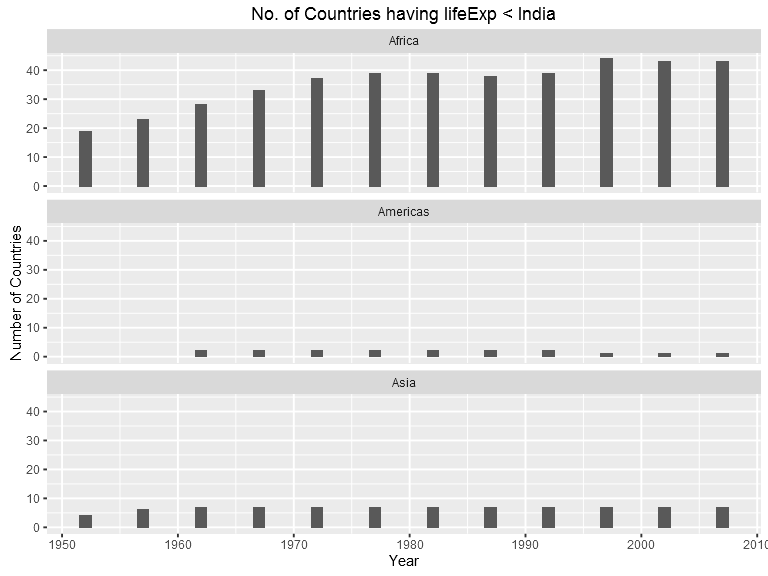

Factor and Figure Management
================
Gokul Raj Suresh Kumar
2016-10-21

Factor and Figure Management
============================

#### Loading the required packages

``` r
library(gapminder)
library(tidyverse)
library(forcats)
```

Factor Management
-----------------

### Dropping Oceania

#### Gapminder's details

``` r
gapminder %>% 
  count( continent )
```

    ## # A tibble: 5 × 2
    ##   continent     n
    ##      <fctr> <int>
    ## 1    Africa   624
    ## 2  Americas   300
    ## 3      Asia   396
    ## 4    Europe   360
    ## 5   Oceania    24

``` r
nrow( gapminder )
```

    ## [1] 1704

``` r
nlevels( gapminder$continent )
```

    ## [1] 5

``` r
nlevels( gapminder$country )
```

    ## [1] 142

#### Oceania's details (for manual validation)

``` r
just_oceania <- gapminder %>%
  filter( continent == "Oceania" ) %>%
  droplevels()
just_oceania %>%
  count( continent )
```

    ## # A tibble: 1 × 2
    ##   continent     n
    ##      <fctr> <int>
    ## 1   Oceania    24

``` r
nrow( just_oceania )
```

    ## [1] 24

``` r
nlevels( just_oceania$continent )
```

    ## [1] 1

``` r
nlevels( just_oceania$country )
```

    ## [1] 2

#### Details after dropping Oceania

``` r
# Dropping Oceania and it's factor levels
(without_oceania <- gapminder %>%
  filter( continent != "Oceania" ) %>%
  droplevels())
```

    ## # A tibble: 1,680 × 6
    ##        country continent  year lifeExp      pop gdpPercap
    ##         <fctr>    <fctr> <int>   <dbl>    <int>     <dbl>
    ## 1  Afghanistan      Asia  1952  28.801  8425333  779.4453
    ## 2  Afghanistan      Asia  1957  30.332  9240934  820.8530
    ## 3  Afghanistan      Asia  1962  31.997 10267083  853.1007
    ## 4  Afghanistan      Asia  1967  34.020 11537966  836.1971
    ## 5  Afghanistan      Asia  1972  36.088 13079460  739.9811
    ## 6  Afghanistan      Asia  1977  38.438 14880372  786.1134
    ## 7  Afghanistan      Asia  1982  39.854 12881816  978.0114
    ## 8  Afghanistan      Asia  1987  40.822 13867957  852.3959
    ## 9  Afghanistan      Asia  1992  41.674 16317921  649.3414
    ## 10 Afghanistan      Asia  1997  41.763 22227415  635.3414
    ## # ... with 1,670 more rows

``` r
# The tibble shows that Oceania has been removed
without_oceania %>%
  count( continent )
```

    ## # A tibble: 4 × 2
    ##   continent     n
    ##      <fctr> <int>
    ## 1    Africa   624
    ## 2  Americas   300
    ## 3      Asia   396
    ## 4    Europe   360

``` r
# 1704 - 24 (Observations for all continents - Observations for Oceania)
nrow( without_oceania )
```

    ## [1] 1680

``` r
# 5 - 1 (All continents - Oceania)
nlevels( without_oceania$continent )
```

    ## [1] 4

``` r
# 142 - 2 (All countries - (New Zealand + Australia))
nlevels( without_oceania$country )
```

    ## [1] 140

### Reordering the levels of `country`

#### Extracting maximum population of Countries in Europe (between 1952 and 2007)

``` r
max_pop_europe <- gapminder %>%
  filter( continent == "Europe" ) %>%
  group_by( country ) %>% 
  summarize( max_pop = max( pop ) ) %>%
  droplevels() %>%
  ungroup()
  
head( max_pop_europe )
```

    ## # A tibble: 6 × 2
    ##                  country  max_pop
    ##                   <fctr>    <int>
    ## 1                Albania  3600523
    ## 2                Austria  8199783
    ## 3                Belgium 10392226
    ## 4 Bosnia and Herzegovina  4552198
    ## 5               Bulgaria  8971958
    ## 6                Croatia  4494013

``` r
nrow( max_pop_europe )
```

    ## [1] 30

``` r
max_pop_europe$country %>%
  levels() %>%
  head()
```

    ## [1] "Albania"                "Austria"               
    ## [3] "Belgium"                "Bosnia and Herzegovina"
    ## [5] "Bulgaria"               "Croatia"

#### Reordering factor levels of European countries based on descending order of maximum population

``` r
head( levels( max_pop_europe$country ) )
```

    ## [1] "Albania"                "Austria"               
    ## [3] "Belgium"                "Bosnia and Herzegovina"
    ## [5] "Bulgaria"               "Croatia"

``` r
pop_reorder_europe <- max_pop_europe %>% 
  mutate( country = fct_reorder( country , max_pop , .desc = TRUE ) )

head( levels( pop_reorder_europe$country ) )
```

    ## [1] "Germany"        "Turkey"         "France"         "United Kingdom"
    ## [5] "Italy"          "Spain"

``` r
head( pop_reorder_europe )
```

    ## # A tibble: 6 × 2
    ##                  country  max_pop
    ##                   <fctr>    <int>
    ## 1                Albania  3600523
    ## 2                Austria  8199783
    ## 3                Belgium 10392226
    ## 4 Bosnia and Herzegovina  4552198
    ## 5               Bulgaria  8971958
    ## 6                Croatia  4494013

#### Exploring the effects of `arrange()`

``` r
pop_arr_europe <- max_pop_europe %>%
  arrange( desc( max_pop ) ) 

head(pop_arr_europe)
```

    ## # A tibble: 6 × 2
    ##          country  max_pop
    ##           <fctr>    <int>
    ## 1        Germany 82400996
    ## 2         Turkey 71158647
    ## 3         France 61083916
    ## 4 United Kingdom 60776238
    ## 5          Italy 58147733
    ## 6          Spain 40448191

``` r
pop_arr_europe$country %>% 
  levels() %>% 
  head()
```

    ## [1] "Albania"                "Austria"               
    ## [3] "Belgium"                "Bosnia and Herzegovina"
    ## [5] "Bulgaria"               "Croatia"

``` r
pop_arr_europe %>%
  ggplot( aes( x = max_pop , y = country ) ) + geom_point()
```


#### Exploring the effects of reordering a factor( without `arrange()`)

``` r
pop_reorder_europe$country %>%
  levels() %>%
  head()
```

    ## [1] "Germany"        "Turkey"         "France"         "United Kingdom"
    ## [5] "Italy"          "Spain"

``` r
p <- pop_reorder_europe %>% 
  ggplot( aes( x = max_pop , y = country ) ) + geom_point()

p
```


#### Exploring the effects of factor reordering with `arrange()`

``` r
head(pop_arr_europe)
```

    ## # A tibble: 6 × 2
    ##          country  max_pop
    ##           <fctr>    <int>
    ## 1        Germany 82400996
    ## 2         Turkey 71158647
    ## 3         France 61083916
    ## 4 United Kingdom 60776238
    ## 5          Italy 58147733
    ## 6          Spain 40448191

``` r
pop_arr_europe %>% 
  ggplot( aes( x = max_pop, y = fct_reorder( country , max_pop , .desc = TRUE ) ) ) + geom_point()
```


File I/O
--------

### Data to be used for experimentation

``` r
head( pop_reorder_europe )
```

    ## # A tibble: 6 × 2
    ##                  country  max_pop
    ##                   <fctr>    <int>
    ## 1                Albania  3600523
    ## 2                Austria  8199783
    ## 3                Belgium 10392226
    ## 4 Bosnia and Herzegovina  4552198
    ## 5               Bulgaria  8971958
    ## 6                Croatia  4494013

``` r
head( levels( pop_reorder_europe$country ) )
```

    ## [1] "Germany"        "Turkey"         "France"         "United Kingdom"
    ## [5] "Italy"          "Spain"

### Writing to (`write_csv()`) and reading from (`read_csv()`) a comma-delimited file

``` r
write_csv( pop_reorder_europe , "pop_reorder_europe.csv" )

eur_csv_data <- read_csv( "pop_reorder_europe.csv" )
```

    ## Parsed with column specification:
    ## cols(
    ##   country = col_character(),
    ##   max_pop = col_integer()
    ## )

``` r
head( eur_csv_data )
```

    ## # A tibble: 6 × 2
    ##                  country  max_pop
    ##                    <chr>    <int>
    ## 1                Albania  3600523
    ## 2                Austria  8199783
    ## 3                Belgium 10392226
    ## 4 Bosnia and Herzegovina  4552198
    ## 5               Bulgaria  8971958
    ## 6                Croatia  4494013

``` r
head( levels( eur_csv_data$country ) )
```

    ## NULL

### Writing to (`saveRDS()`) and reading from (`readRDS()`) a file while preserving factor levels

``` r
saveRDS( pop_reorder_europe , "pop_reorder_europe.rds" )

eur_rds_data <- readRDS( "pop_reorder_europe.rds" )

head( eur_rds_data )
```

    ## # A tibble: 6 × 2
    ##                  country  max_pop
    ##                   <fctr>    <int>
    ## 1                Albania  3600523
    ## 2                Austria  8199783
    ## 3                Belgium 10392226
    ## 4 Bosnia and Herzegovina  4552198
    ## 5               Bulgaria  8971958
    ## 6                Croatia  4494013

``` r
head( levels( eur_rds_data$country ) )
```

    ## [1] "Germany"        "Turkey"         "France"         "United Kingdom"
    ## [5] "Italy"          "Spain"

### Writing to (`dput()`) and reading from (`dget()`) a file while preserving factor levels

``` r
dput( pop_reorder_europe , "pop_reorder_europe-dput.txt" )

eur_txt_data <- dget( "pop_reorder_europe-dput.txt" )

head( eur_txt_data )
```

    ## # A tibble: 6 × 2
    ##                  country  max_pop
    ##                   <fctr>    <int>
    ## 1                Albania  3600523
    ## 2                Austria  8199783
    ## 3                Belgium 10392226
    ## 4 Bosnia and Herzegovina  4552198
    ## 5               Bulgaria  8971958
    ## 6                Croatia  4494013

``` r
head( levels( eur_txt_data$country ) )
```

    ## [1] "Germany"        "Turkey"         "France"         "United Kingdom"
    ## [5] "Italy"          "Spain"

Visualization design
--------------------

### Code to generate the number of countries having relative life expectancy &lt; India

``` r
my_gap <- gapminder

benchmark_country <- my_gap %>% 
  filter( country == "India" )

rel_le <- my_gap %>% 
  mutate( temp = rep( benchmark_country$lifeExp , nlevels( country ) ), 
          lifeExpRel = lifeExp/temp, 
          temp = NULL )

rel_abundance <- rel_le %>%
  group_by( continent , year ) %>% 
  filter( lifeExpRel < 1 ) %>% 
  summarise( n_countries = n_distinct( country ) )
```

### Oops! I have used a stacked barplot in assignment 3

``` r
rel_abundance %>%
  ggplot( aes( x = year , y = n_countries , fill = continent ) ) + 
  geom_bar( stat = "identity" , position = "stack" ) +
  labs( title = "No. of Countries having lifeExp < India" , x = "Year" , y = "Number of Countries" )
```


### Partitioning the above into small multiple bar charts (One chart per continent)

``` r
q <- rel_abundance %>% 
  ggplot( aes( x = year , y = n_countries ) ) + 
  geom_bar( width = 1 , stat = "identity" ) + 
  facet_wrap( ~continent , nrow = 3 ) + 
  labs( title = "No. of Countries having lifeExp < India" , x = "Year" , y = "Number of Countries" )

q
```



Writing figures to a file
-------------------------

### Using `ggsave()` to write a figure to a file Explicitly

``` r
ggsave( "max_pop_europe.png" , plot = p )
```

    ## Saving 7 x 5 in image

### Changing size of the plot to be saved using the `width=` and `height=` argument to `ggsave()`

``` r
ggsave( "resized_max_pop_europe.png" , plot = p , height = 10 , width = 10 )
```

### Scenario where explicit provision of the plot object matters

``` r
ggsave( "rel_lifeExp_lt_India.png" )
```

    ## Saving 7 x 5 in image

``` r
ggsave( "rel_lifeExp_lt_India_for_sure.png" , plot = q )
```

    ## Saving 7 x 5 in image
