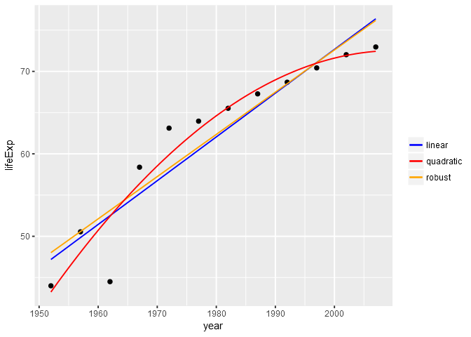

Data Wrangling Conclusion
================
Gokul Raj Suresh Kumar
2016-11-07

Data Wrangling Conclusion
=========================

#### Loading the required packages

``` r
library(gapminder)
library(tidyverse)
```

    ## Warning: package 'tidyverse' was built under R version 3.3.2

    ## Warning: package 'dplyr' was built under R version 3.3.2

``` r
library(dplyr)
library(stringr)
library(testthat)
library(ggplot2)
library(MASS)
```

Writing Functions
-----------------

``` r
selected_country <- "China"

( selected_country_info <- gapminder %>% 
    filter( country == selected_country ) )
```

    ## # A tibble: 12 × 6
    ##    country continent  year  lifeExp        pop gdpPercap
    ##     <fctr>    <fctr> <int>    <dbl>      <int>     <dbl>
    ## 1    China      Asia  1952 44.00000  556263527  400.4486
    ## 2    China      Asia  1957 50.54896  637408000  575.9870
    ## 3    China      Asia  1962 44.50136  665770000  487.6740
    ## 4    China      Asia  1967 58.38112  754550000  612.7057
    ## 5    China      Asia  1972 63.11888  862030000  676.9001
    ## 6    China      Asia  1977 63.96736  943455000  741.2375
    ## 7    China      Asia  1982 65.52500 1000281000  962.4214
    ## 8    China      Asia  1987 67.27400 1084035000 1378.9040
    ## 9    China      Asia  1992 68.69000 1164970000 1655.7842
    ## 10   China      Asia  1997 70.42600 1230075000 2289.2341
    ## 11   China      Asia  2002 72.02800 1280400000 3119.2809
    ## 12   China      Asia  2007 72.96100 1318683096 4959.1149

``` r
p <- selected_country_info %>% 
  ggplot( aes( x = year , y = lifeExp ) )

p + geom_point( ) + geom_smooth( method = "lm" , aes( color = "lm" ) , lwd = 0.5 ) + 
  geom_smooth( method = "rlm" , aes( color = "rlm" ) , lwd = 0.5 )
```



``` r
robust_fit <- rlm( lifeExp ~ I( year - 1952 ) , data = selected_country_info )

coef( robust_fit )
```

    ##    (Intercept) I(year - 1952) 
    ##     48.0172254      0.5120964

``` r
le_robust_fit <- function( data, offset = 1952 ) {
  robust_fit <- rlm( lifeExp ~ I(year - offset) , data = data )
  setNames( coef( robust_fit ) , c( "Intercept" , "Slope" ) )
}

le_robust_fit(selected_country_info)
```

    ##  Intercept      Slope 
    ## 48.0172254  0.5120964

<http://www.alastairsanderson.com/R/tutorials/robust-regression-in-R/>
