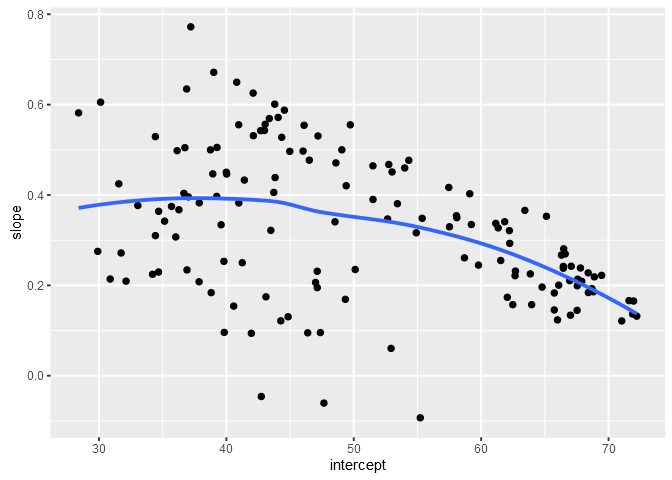
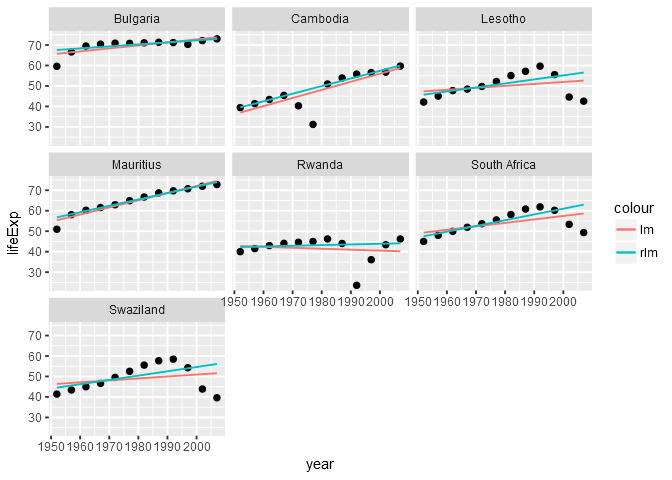

Data Wrangling Conclusion
================
Gokul Raj Suresh Kumar
2016-11-14

Data Wrangling Conclusion
-------------------------

#### Loading the required packages

``` r
library(gapminder)
library(tidyverse)
library(ggplot2)
library(MASS)
library(broom)
```

Writing functions to do `linear`, `robust` and `quadratic` regression
---------------------------------------------------------------------

``` r
## Choosing a specific country for the function to operate upon

knitr::kable( ( selected_country_info <- gapminder %>% 
                  filter( country == "China" ) ) %>% 
                head( ) )
```

| country | continent |  year|   lifeExp|        pop|  gdpPercap|
|:--------|:----------|-----:|---------:|----------:|----------:|
| China   | Asia      |  1952|  44.00000|  556263527|   400.4486|
| China   | Asia      |  1957|  50.54896|  637408000|   575.9870|
| China   | Asia      |  1962|  44.50136|  665770000|   487.6740|
| China   | Asia      |  1967|  58.38112|  754550000|   612.7057|
| China   | Asia      |  1972|  63.11888|  862030000|   676.9001|
| China   | Asia      |  1977|  63.96736|  943455000|   741.2375|

``` r
## Plotting the data before fitting the regression

## The 3 types of regression are superimposed on the same plot

p <- selected_country_info %>% 
  ggplot( aes( x = year , y = lifeExp ) )

p + geom_point( ) + 
  geom_smooth( method = "lm" , aes( colour = "linear" ) , lwd = 0.5 , se = FALSE ) + 
  geom_smooth( method = "rlm" , aes( colour = "robust" ) , lwd = 0.5 , se = FALSE ) +
  geom_smooth( method = "lm" , formula = y ~ x + I( x^2 ) , aes( colour = "quadratic" ) , lwd = 0.5 , se = FALSE ) +
  scale_color_manual( name = "" , values = c( "linear" = "blue" , "robust" = "orange" , "quadratic" = "red" ) )
```


``` r
## Fitting linear regression ( based on Jenny's implementation )

## Implementing logic to fit into the function

linear_fit <- lm( lifeExp ~ I( year - 1952 ) , data = selected_country_info )

coef( linear_fit )
```

    ##    (Intercept) I(year - 1952) 
    ##     47.1904815      0.5307149

``` r
## Implementing the above logic into a function

le_linear_fit <- function( data , offset = 1952 ){
  linear_fit <- lm( lifeExp ~ I( year - offset ) , data = data )
  setNames( coef( linear_fit ) , c( "intercept" , "slope" ) )
}

## Smell testing to see if the result obtained above matches

le_linear_fit( selected_country_info )
```

    ##  intercept      slope 
    ## 47.1904815  0.5307149

``` r
## Fitting robust regression 

## Implementing logic to fit into the function

robust_fit <- rlm( lifeExp ~ I( year - 1952 ) , data = selected_country_info )

coef( robust_fit )
```

    ##    (Intercept) I(year - 1952) 
    ##     48.0172254      0.5120964

``` r
## Implementing the above logic into a function

le_robust_fit <- function( data , offset = 1952 ) {
  robust_fit <- rlm( lifeExp ~ I( year - offset ) , data = data )
  setNames( coef( robust_fit ) , c( "intercept" , "slope" ) )
}

## Smell testing to see if the result obtained above matches

le_robust_fit( selected_country_info )
```

    ##  intercept      slope 
    ## 48.0172254  0.5120964

``` r
## Fitting quadratic regression 

## Implementing logic to fit into the function

quadratic_fit <- lm( lifeExp ~ I( year - 1952 ) + I( ( year - 1952 )^2 ) , data = selected_country_info )

coef( quadratic_fit )
```

    ##        (Intercept)     I(year - 1952) I((year - 1952)^2) 
    ##        43.24529473         1.00413727        -0.00860768

``` r
## Implementing the above logic into a function

le_quadratic_fit <- function( data , offset = 1952 ){
  quadratic_fit <- lm( lifeExp ~ I( year - offset ) + I( ( year - offset )^2 ) , data = data )
  setNames( coef( quadratic_fit ) , c( "intercept" , "slope 1" , "slope 2" ) )
}

## Smell testing to see if the result obtained above matches

le_quadratic_fit( selected_country_info )
```

    ##   intercept     slope 1     slope 2 
    ## 43.24529473  1.00413727 -0.00860768

Working with a nested data frame
--------------------------------

``` r
## Creating a nested version of gapminder df

nested_gap <- gapminder %>% 
  group_by( continent , country ) %>% 
  nest( ) %>% 
  print( n = 5 ) 
```

    ## # A tibble: 142 × 3
    ##   continent     country              data
    ##      <fctr>      <fctr>            <list>
    ## 1      Asia Afghanistan <tibble [12 × 4]>
    ## 2    Europe     Albania <tibble [12 × 4]>
    ## 3    Africa     Algeria <tibble [12 × 4]>
    ## 4    Africa      Angola <tibble [12 × 4]>
    ## 5  Americas   Argentina <tibble [12 × 4]>
    ## # ... with 137 more rows

``` r
## Mapping Linear regression to a nested df ( based on Jenny's implementation )

## Smell testing to see if the linear regression function implemented 
## earlier is compatible. 25 represents China in the nested data frame

le_linear_fit( nested_gap$data[[25]] )
```

    ##  intercept      slope 
    ## 47.1904815  0.5307149

``` r
## Smell testing the mapping of the first two list columns
## before scaling it to the whole data frame

map( nested_gap$data[1:2] , le_linear_fit )
```

    ## [[1]]
    ##  intercept      slope 
    ## 29.9072949  0.2753287 
    ## 
    ## [[2]]
    ##  intercept      slope 
    ## 59.2291282  0.3346832

``` r
## Mapping the linear regression function to the entire nested dataframe

le_lin_fit_all <- nested_gap %>% 
  mutate( linear_fit = map( data , le_linear_fit ) ) %>% 
  print( n = 5 )
```

    ## # A tibble: 142 × 4
    ##   continent     country              data linear_fit
    ##      <fctr>      <fctr>            <list>     <list>
    ## 1      Asia Afghanistan <tibble [12 × 4]>  <dbl [2]>
    ## 2    Europe     Albania <tibble [12 × 4]>  <dbl [2]>
    ## 3    Africa     Algeria <tibble [12 × 4]>  <dbl [2]>
    ## 4    Africa      Angola <tibble [12 × 4]>  <dbl [2]>
    ## 5  Americas   Argentina <tibble [12 × 4]>  <dbl [2]>
    ## # ... with 137 more rows

``` r
## Smell testing to see if the regression was mapped correctly

le_lin_fit_all$linear_fit[[25]]
```

    ##  intercept      slope 
    ## 47.1904815  0.5307149

``` r
## Using the broom package's tidy function to extract tidy information

tidy( le_lin_fit_all$linear_fit[[25]] )
```

    ## # A tibble: 2 × 2
    ##       names          x
    ##       <chr>      <dbl>
    ## 1 intercept 47.1904815
    ## 2     slope  0.5307149

``` r
## Mapping the tidy function to the entire nested dataframe

le_lin_fit_all <- le_lin_fit_all %>% 
  mutate( tidy = map( linear_fit , tidy ) ) %>% 
  print( n = 5 )
```

    ## # A tibble: 142 × 5
    ##   continent     country              data linear_fit             tidy
    ##      <fctr>      <fctr>            <list>     <list>           <list>
    ## 1      Asia Afghanistan <tibble [12 × 4]>  <dbl [2]> <tibble [2 × 2]>
    ## 2    Europe     Albania <tibble [12 × 4]>  <dbl [2]> <tibble [2 × 2]>
    ## 3    Africa     Algeria <tibble [12 × 4]>  <dbl [2]> <tibble [2 × 2]>
    ## 4    Africa      Angola <tibble [12 × 4]>  <dbl [2]> <tibble [2 × 2]>
    ## 5  Americas   Argentina <tibble [12 × 4]>  <dbl [2]> <tibble [2 × 2]>
    ## # ... with 137 more rows

``` r
## Smell testing to see if tidy was mapped correctly

le_lin_fit_all$tidy[[25]]
```

    ## # A tibble: 2 × 2
    ##       names          x
    ##       <chr>      <dbl>
    ## 1 intercept 47.1904815
    ## 2     slope  0.5307149

``` r
## Simplifying to a normal tibble by retaining just the needed information

knitr::kable( ( le_lin_coefs <- le_lin_fit_all %>% 
                  dplyr::select( continent , country , tidy ) %>% 
                  unnest( tidy ) ) %>% 
                head( ) )
```

| continent | country     | names     |           x|
|:----------|:------------|:----------|-----------:|
| Asia      | Afghanistan | intercept |  29.9072949|
| Asia      | Afghanistan | slope     |   0.2753287|
| Europe    | Albania     | intercept |  59.2291282|
| Europe    | Albania     | slope     |   0.3346832|
| Africa    | Algeria     | intercept |  43.3749744|
| Africa    | Algeria     | slope     |   0.5692797|

``` r
## Reshaping the data into a consumable format for exploratory analysis

knitr::kable( ( le_lin_ests <- le_lin_coefs %>% 
                  dplyr::select( continent:x ) %>% 
                  spread( key = "names" , value = "x" ) ) %>% 
                head( ) )
```

| continent | country      |  intercept|      slope|
|:----------|:-------------|----------:|----------:|
| Africa    | Algeria      |   43.37497|  0.5692797|
| Africa    | Angola       |   32.12665|  0.2093399|
| Africa    | Benin        |   39.58851|  0.3342329|
| Africa    | Botswana     |   52.92912|  0.0606685|
| Africa    | Burkina Faso |   34.68469|  0.3639748|
| Africa    | Burundi      |   40.57864|  0.1541343|

``` r
## Alternate way to achieve results that can be reshaped into the data above

le_lin_fit_broom <- gapminder %>% 
  group_by( continent , country ) %>% 
  do( fit = lm( lifeExp ~ I( year - 1952 ) , . ) ) %>% 
  print( n = 5 )
```

    ## Source: local data frame [142 x 3]
    ## Groups: <by row>
    ## 
    ## # A tibble: 142 × 3
    ##   continent      country      fit
    ## *    <fctr>       <fctr>   <list>
    ## 1    Africa      Algeria <S3: lm>
    ## 2    Africa       Angola <S3: lm>
    ## 3    Africa        Benin <S3: lm>
    ## 4    Africa     Botswana <S3: lm>
    ## 5    Africa Burkina Faso <S3: lm>
    ## # ... with 137 more rows

``` r
## Using the broom package's tidy function to extract tidy information

knitr::kable( ( le_lin_fit_broom %>% 
                  tidy( fit ) ) %>% 
                head( ) )
```

| continent | country | term           |    estimate|  std.error|  statistic|  p.value|
|:----------|:--------|:---------------|-----------:|----------:|----------:|--------:|
| Africa    | Algeria | (Intercept)    |  43.3749744|  0.7184202|  60.375491|  0.0e+00|
| Africa    | Algeria | I(year - 1952) |   0.5692797|  0.0221271|  25.727749|  0.0e+00|
| Africa    | Angola  | (Intercept)    |  32.1266538|  0.7640355|  42.048641|  0.0e+00|
| Africa    | Angola  | I(year - 1952) |   0.2093399|  0.0235320|   8.895964|  4.6e-06|
| Africa    | Benin   | (Intercept)    |  39.5885128|  0.6378819|  62.062453|  0.0e+00|
| Africa    | Benin   | I(year - 1952) |   0.3342329|  0.0196465|  17.012320|  0.0e+00|

``` r
## Mapping Robust regression to a nested df 

## Smell testing to see if the robust regression function implemented 
## earlier is compatible. 25 represents China in the nested data frame

le_robust_fit( nested_gap$data[[25]] )
```

    ##  intercept      slope 
    ## 48.0172254  0.5120964

``` r
## Smell testing the mapping of the first two list columns
## before scaling it to the whole data frame

map( nested_gap$data[1:2] , le_robust_fit )
```

    ## [[1]]
    ##  intercept      slope 
    ## 29.9072949  0.2753287 
    ## 
    ## [[2]]
    ##  intercept      slope 
    ## 59.9416820  0.3160949

``` r
## Mapping the robust regression function to the entire nested dataframe

le_rob_fit_all <- nested_gap %>% 
  mutate( robust_fit = map( data , le_robust_fit ) ) %>% 
  print( n = 5 )
```

    ## # A tibble: 142 × 4
    ##   continent     country              data robust_fit
    ##      <fctr>      <fctr>            <list>     <list>
    ## 1      Asia Afghanistan <tibble [12 × 4]>  <dbl [2]>
    ## 2    Europe     Albania <tibble [12 × 4]>  <dbl [2]>
    ## 3    Africa     Algeria <tibble [12 × 4]>  <dbl [2]>
    ## 4    Africa      Angola <tibble [12 × 4]>  <dbl [2]>
    ## 5  Americas   Argentina <tibble [12 × 4]>  <dbl [2]>
    ## # ... with 137 more rows

``` r
## Smell testing to see if the regression was mapped correctly

le_rob_fit_all$robust_fit[[25]]
```

    ##  intercept      slope 
    ## 48.0172254  0.5120964

``` r
## Using the broom package's tidy function to extract tidy information

tidy( le_rob_fit_all$robust_fit[[25]] )
```

    ## # A tibble: 2 × 2
    ##       names          x
    ##       <chr>      <dbl>
    ## 1 intercept 48.0172254
    ## 2     slope  0.5120964

``` r
## Mapping the tidy function to the entire nested dataframe

le_rob_fit_all <- le_rob_fit_all %>% 
  mutate( tidy = map( robust_fit , tidy ) ) %>% 
  print( n = 5 )
```

    ## # A tibble: 142 × 5
    ##   continent     country              data robust_fit             tidy
    ##      <fctr>      <fctr>            <list>     <list>           <list>
    ## 1      Asia Afghanistan <tibble [12 × 4]>  <dbl [2]> <tibble [2 × 2]>
    ## 2    Europe     Albania <tibble [12 × 4]>  <dbl [2]> <tibble [2 × 2]>
    ## 3    Africa     Algeria <tibble [12 × 4]>  <dbl [2]> <tibble [2 × 2]>
    ## 4    Africa      Angola <tibble [12 × 4]>  <dbl [2]> <tibble [2 × 2]>
    ## 5  Americas   Argentina <tibble [12 × 4]>  <dbl [2]> <tibble [2 × 2]>
    ## # ... with 137 more rows

``` r
## Smell testing to see if tidy was mapped correctly

le_rob_fit_all$tidy[[25]]
```

    ## # A tibble: 2 × 2
    ##       names          x
    ##       <chr>      <dbl>
    ## 1 intercept 48.0172254
    ## 2     slope  0.5120964

``` r
## Simplifying to a normal tibble by retaining just the needed information

knitr::kable( ( le_rob_coefs <- le_rob_fit_all %>% 
                  dplyr::select( continent , country , tidy ) %>% 
                  unnest( tidy ) ) %>% 
                head( ) )
```

| continent | country     | names     |           x|
|:----------|:------------|:----------|-----------:|
| Asia      | Afghanistan | intercept |  29.9072949|
| Asia      | Afghanistan | slope     |   0.2753287|
| Europe    | Albania     | intercept |  59.9416820|
| Europe    | Albania     | slope     |   0.3160949|
| Africa    | Algeria     | intercept |  43.1580026|
| Africa    | Algeria     | slope     |   0.5758313|

``` r
## Reshaping the data into a consumable format for exploratory analysis

knitr::kable( ( le_rob_ests <- le_rob_coefs %>% 
                  dplyr::select( continent:x ) %>% 
                  spread( key = "names" , value = "x" ) ) %>% 
                head( ) )
```

| continent | country      |  intercept|      slope|
|:----------|:-------------|----------:|----------:|
| Africa    | Algeria      |   43.15800|  0.5758313|
| Africa    | Angola       |   32.13493|  0.2090313|
| Africa    | Benin        |   39.58851|  0.3342329|
| Africa    | Botswana     |   52.92912|  0.0606685|
| Africa    | Burkina Faso |   34.68469|  0.3639748|
| Africa    | Burundi      |   40.57864|  0.1541343|

``` r
## Alternate way to achieve results that can be reshaped into the data above

le_rob_fit_broom <- gapminder %>% 
  group_by( continent , country ) %>% 
  do( fit = rlm( lifeExp ~ I( year - 1952 ) , . ) ) %>% 
  print( n = 5 )
```

    ## Source: local data frame [142 x 3]
    ## Groups: <by row>
    ## 
    ## # A tibble: 142 × 3
    ##   continent      country       fit
    ## *    <fctr>       <fctr>    <list>
    ## 1    Africa      Algeria <S3: rlm>
    ## 2    Africa       Angola <S3: rlm>
    ## 3    Africa        Benin <S3: rlm>
    ## 4    Africa     Botswana <S3: rlm>
    ## 5    Africa Burkina Faso <S3: rlm>
    ## # ... with 137 more rows

``` r
## Using the broom package's tidy function to extract tidy information

knitr::kable( ( le_rob_fit_broom %>% 
                  tidy( fit ) ) %>% 
                head( ) )
```

| continent | country | term           |    estimate|  std.error|  statistic|
|:----------|:--------|:---------------|-----------:|----------:|----------:|
| Africa    | Algeria | (Intercept)    |  43.1580026|  0.6009940|  71.811039|
| Africa    | Algeria | I(year - 1952) |   0.5758313|  0.0185104|  31.108554|
| Africa    | Angola  | (Intercept)    |  32.1349259|  0.9409453|  34.151748|
| Africa    | Angola  | I(year - 1952) |   0.2090313|  0.0289808|   7.212763|
| Africa    | Benin   | (Intercept)    |  39.5885128|  0.6378819|  62.062453|
| Africa    | Benin   | I(year - 1952) |   0.3342329|  0.0196465|  17.012320|

``` r
## Mapping Quadratic regression to a nested df 

## Smell testing to see if the quadratic regression function implemented 
## earlier is compatible. 25 represents China in the nested data frame

le_quadratic_fit( nested_gap$data[[25]] )
```

    ##   intercept     slope 1     slope 2 
    ## 43.24529473  1.00413727 -0.00860768

``` r
## Smell testing the mapping of the first two list columns
## before scaling it to the whole data frame

map( nested_gap$data[1:2] , le_quadratic_fit )
```

    ## [[1]]
    ##    intercept      slope 1      slope 2 
    ## 28.178686813  0.482761638 -0.003771508 
    ## 
    ## [[2]]
    ##    intercept      slope 1      slope 2 
    ## 56.853134615  0.619802448 -0.005183986

``` r
## Mapping the quadratic regression function to the entire nested dataframe

le_quad_fit_all <- nested_gap %>% 
  mutate( quadratic_fit = map( data , le_quadratic_fit ) ) %>% 
  print( n = 5 )
```

    ## # A tibble: 142 × 4
    ##   continent     country              data quadratic_fit
    ##      <fctr>      <fctr>            <list>        <list>
    ## 1      Asia Afghanistan <tibble [12 × 4]>     <dbl [3]>
    ## 2    Europe     Albania <tibble [12 × 4]>     <dbl [3]>
    ## 3    Africa     Algeria <tibble [12 × 4]>     <dbl [3]>
    ## 4    Africa      Angola <tibble [12 × 4]>     <dbl [3]>
    ## 5  Americas   Argentina <tibble [12 × 4]>     <dbl [3]>
    ## # ... with 137 more rows

``` r
## Smell testing to see if the regression was mapped correctly

le_quad_fit_all$quadratic_fit[[25]]
```

    ##   intercept     slope 1     slope 2 
    ## 43.24529473  1.00413727 -0.00860768

``` r
## Using the broom package's tidy function to extract tidy information

tidy( le_quad_fit_all$quadratic_fit[[25]] )
```

    ## # A tibble: 3 × 2
    ##       names           x
    ##       <chr>       <dbl>
    ## 1 intercept 43.24529473
    ## 2   slope 1  1.00413727
    ## 3   slope 2 -0.00860768

``` r
## Mapping the tidy function to the entire nested dataframe

le_quad_fit_all <- le_quad_fit_all %>% 
  mutate( tidy = map( quadratic_fit , tidy ) ) %>% 
  print( n = 5 )
```

    ## # A tibble: 142 × 5
    ##   continent     country              data quadratic_fit             tidy
    ##      <fctr>      <fctr>            <list>        <list>           <list>
    ## 1      Asia Afghanistan <tibble [12 × 4]>     <dbl [3]> <tibble [3 × 2]>
    ## 2    Europe     Albania <tibble [12 × 4]>     <dbl [3]> <tibble [3 × 2]>
    ## 3    Africa     Algeria <tibble [12 × 4]>     <dbl [3]> <tibble [3 × 2]>
    ## 4    Africa      Angola <tibble [12 × 4]>     <dbl [3]> <tibble [3 × 2]>
    ## 5  Americas   Argentina <tibble [12 × 4]>     <dbl [3]> <tibble [3 × 2]>
    ## # ... with 137 more rows

``` r
## Smell testing to see if tidy was mapped correctly

le_quad_fit_all$tidy[[25]]
```

    ## # A tibble: 3 × 2
    ##       names           x
    ##       <chr>       <dbl>
    ## 1 intercept 43.24529473
    ## 2   slope 1  1.00413727
    ## 3   slope 2 -0.00860768

``` r
## Simplifying to a normal tibble by retaining just the needed information

knitr::kable( ( le_quad_coefs <- le_quad_fit_all %>% 
                  dplyr::select( continent , country , tidy ) %>% 
                  unnest( tidy ) ) %>% 
                head( ) )
```

| continent | country     | names     |           x|
|:----------|:------------|:----------|-----------:|
| Asia      | Afghanistan | intercept |  28.1786868|
| Asia      | Afghanistan | slope 1   |   0.4827616|
| Asia      | Afghanistan | slope 2   |  -0.0037715|
| Europe    | Albania     | intercept |  56.8531346|
| Europe    | Albania     | slope 1   |   0.6198024|
| Europe    | Albania     | slope 2   |  -0.0051840|

``` r
## Reshaping the data into a consumable format for exploratory analysis

knitr::kable( ( le_quad_ests <- le_quad_coefs %>% 
                  dplyr::select( continent:x ) %>% 
                  spread( key = "names" , value = "x" ) ) %>% 
                head( ) )
```

| continent | country      |  intercept|    slope 1|     slope 2|
|:----------|:-------------|----------:|----------:|-----------:|
| Africa    | Algeria      |   41.94224|  0.7412083|  -0.0031260|
| Africa    | Angola       |   30.11767|  0.4504179|  -0.0043832|
| Africa    | Benin        |   37.86994|  0.5404620|  -0.0037496|
| Africa    | Botswana     |   44.91197|  1.0227257|  -0.0174919|
| Africa    | Burkina Faso |   31.54945|  0.7402045|  -0.0068405|
| Africa    | Burundi      |   39.26621|  0.3116255|  -0.0028635|

``` r
## Alternate way to achieve results that can be reshaped into the data above

le_quad_fit_broom <- gapminder %>% 
  group_by( continent , country ) %>% 
  do( fit = rlm( lifeExp ~ I( year - 1952 ) + I( ( year - 1952 )^2 ) , . ) ) %>% 
  print( n = 5 )
```

    ## Source: local data frame [142 x 3]
    ## Groups: <by row>
    ## 
    ## # A tibble: 142 × 3
    ##   continent      country       fit
    ## *    <fctr>       <fctr>    <list>
    ## 1    Africa      Algeria <S3: rlm>
    ## 2    Africa       Angola <S3: rlm>
    ## 3    Africa        Benin <S3: rlm>
    ## 4    Africa     Botswana <S3: rlm>
    ## 5    Africa Burkina Faso <S3: rlm>
    ## # ... with 137 more rows

``` r
## Using the broom package's tidy function to extract tidy information

knitr::kable( ( le_quad_fit_broom %>% 
                  tidy( fit ) ) %>% 
                head( ) )
```

| continent | country | term               |    estimate|  std.error|  statistic|
|:----------|:--------|:-------------------|-----------:|----------:|----------:|
| Africa    | Algeria | (Intercept)        |  41.9515513|  0.8291323|  50.596934|
| Africa    | Algeria | I(year - 1952)     |   0.7396406|  0.0700841|  10.553619|
| Africa    | Algeria | I((year - 1952)^2) |  -0.0031008|  0.0012278|  -2.525517|
| Africa    | Angola  | (Intercept)        |  30.0430420|  0.4447693|  67.547472|
| Africa    | Angola  | I(year - 1952)     |   0.4640168|  0.0375950|  12.342508|
| Africa    | Angola  | I((year - 1952)^2) |  -0.0047149|  0.0006586|  -7.158823|

``` r
## Estimating the difference in parameters obtained using linear and robust regression

## Performing a left join by 'continent' and 'country' on the two regression estimates 

knitr::kable( ( le_lin_rob_est <- left_join( le_lin_ests , 
                                             le_rob_ests , 
                                             by = c( "continent", "country" ) 
                                             ) ) %>% 
                head( ) )
```

| continent | country      |  intercept.x|    slope.x|  intercept.y|    slope.y|
|:----------|:-------------|------------:|----------:|------------:|----------:|
| Africa    | Algeria      |     43.37497|  0.5692797|     43.15800|  0.5758313|
| Africa    | Angola       |     32.12665|  0.2093399|     32.13493|  0.2090313|
| Africa    | Benin        |     39.58851|  0.3342329|     39.58851|  0.3342329|
| Africa    | Botswana     |     52.92912|  0.0606685|     52.92912|  0.0606685|
| Africa    | Burkina Faso |     34.68469|  0.3639748|     34.68469|  0.3639748|
| Africa    | Burundi      |     40.57864|  0.1541343|     40.57864|  0.1541343|

``` r
## Determining the difference in the estimated parameters under the two approaches

le_lin_rob_est <- le_lin_rob_est %>% 
  mutate( slope_diff = (slope.x - slope.y ) , intercept_diff = (intercept.x - intercept.y ) ) %>%  
  dplyr::select( country , slope_diff , intercept_diff )

knitr::kable( le_lin_rob_est %>% head( ) )
```

| country      |  slope\_diff|  intercept\_diff|
|:-------------|------------:|----------------:|
| Algeria      |   -0.0065516|        0.2169717|
| Angola       |    0.0003085|       -0.0082721|
| Benin        |    0.0000000|        0.0000000|
| Botswana     |    0.0000000|        0.0000000|
| Burkina Faso |    0.0000000|        0.0000000|
| Burundi      |    0.0000000|        0.0000000|

``` r
## Plotting the difference in the estimated parameters obtained from the above step

ggplot( le_lin_rob_est , aes( x = intercept_diff , y = slope_diff ) ) + geom_point( )
```



``` r
## Performing a filter based on the values from the above graph to shortlist interesting countries

knitr::kable( interesting_countries <- le_lin_rob_est %>% 
                filter( ( slope_diff > 0.024 ) | ( slope_diff < -0.075 ) ) ) 
```

| country      |  slope\_diff|  intercept\_diff|
|:-------------|------------:|----------------:|
| Lesotho      |   -0.1011116|        1.6412003|
| Mauritius    |    0.0361848|       -1.4281125|
| Rwanda       |   -0.0782100|        0.4262397|
| South Africa |   -0.1116327|        1.8028066|
| Swaziland    |   -0.1150924|        1.8377640|
| Cambodia     |    0.0241815|       -2.5259164|
| Bulgaria     |    0.0479174|       -1.8368321|

``` r
## Performing a semi join by 'country' on 'gapminder' and 'interesting_countries' 
## to extract infromation about these specific countries alone

knitr::kable( ( interesting_countries_info <-  semi_join( gapminder , 
                                                          interesting_countries , 
                                                          by = "country" ) ) %>%
                head( ) )
```

| country | continent |  year|  lifeExp|      pop|  gdpPercap|
|:--------|:----------|-----:|--------:|--------:|----------:|
| Lesotho | Africa    |  1952|   42.138|   748747|   298.8462|
| Lesotho | Africa    |  1957|   45.047|   813338|   335.9971|
| Lesotho | Africa    |  1962|   47.747|   893143|   411.8006|
| Lesotho | Africa    |  1967|   48.492|   996380|   498.6390|
| Lesotho | Africa    |  1972|   49.767|  1116779|   496.5816|
| Lesotho | Africa    |  1977|   52.208|  1251524|   745.3695|

``` r
## Plotting the estimated for the interesting countries

## The linear and robust regression lines are superimposed on the same plot

p <- interesting_countries_info %>% 
  ggplot( aes( x = year , y = lifeExp ) )

p + geom_point( ) + 
  facet_wrap( ~ country ) + 
  geom_smooth( method = "lm" , lwd = 0.5 , aes( colour = "lm" ) , se = FALSE ) + 
  geom_smooth( method = "rlm" , lwd = 0.5 , aes( colour = "rlm" ) , se = FALSE )
```



Inference
---------

Based on the above plot, we can see that influential outliers were brought into limelight by taking the difference of estimates obtained by performing linear and robust regression. Out of the 7 interesting countries that we have obtained above, 5 have significant drop in life expectancy at some point between 1952 and 2007. The major reasons have been deciphered below.

-   The genocide in [Cambodia](https://en.wikipedia.org/wiki/Khmer_Rouge_Killing_Fields) carried out by Khmer Rouge led by Pol Pot (1975).
-   The genocide in [Rwanda](https://en.wikipedia.org/wiki/Rwandan_genocide) by the Hutu majority government (1994).
-   The prevalence of HIV/AIDS in [Lesotho](http://www.worldlifeexpectancy.com/lesotho-life-expectancy) , [South Africa](http://businesstech.co.za/news/general/118214/south-africa-has-the-lowest-life-expectancy-in-the-world/) and [Swaziland](http://sundayexpress.co.ls/lesotho-has-lowest-life-expectancy/) causing a steep decline in life expectancy.

Reflections
-----------

The assignment was a bit on the heavier side, but was a very rewarding experience nonetheless, as it involved the usage of multiple techniques from the previous assignments along with concepts that it inculcated on it's own. As always, Jenny's material (cited below) were of major help and laid the foundation to build on. The analysis led me to interesting revelations! Highly inspirational prompts !

References
----------

-   Jenny Bryan's [Linear regression of life expectancy on year](http://stat545.com/block012_function-regress-lifeexp-on-year.html) and [Split-Apply-Combine](http://stat545.com/block024_group-nest-split-map.html)
-   [Explanation of Linear regression by stat.yale.edu](http://www.stat.yale.edu/Courses/1997-98/101/linreg.htm)
-   [Robust regression using R by Alastair Sanderson](http://www.alastairsanderson.com/R/tutorials/robust-regression-in-R)
-   [Fitting a quadratic model in R by The Analysis Factor](http://www.theanalysisfactor.com/r-tutorial-4/)
-   [Stata Data Analysis Examples by IDRE-UCLA](http://www.ats.ucla.edu/stat/stata/dae/rreg.htm)
-   [Exploring different smooths in ggplot2 by IDRE-UCLA](http://statistics.ats.ucla.edu/stat/r/faq/smooths.htm)
