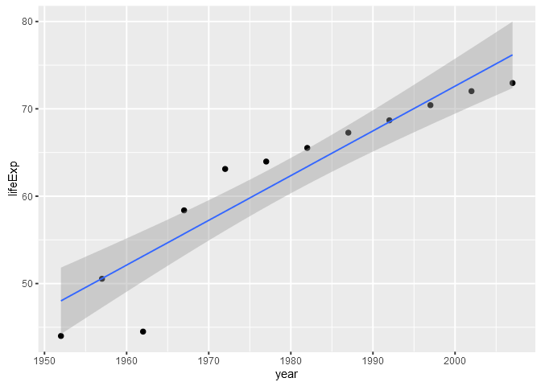
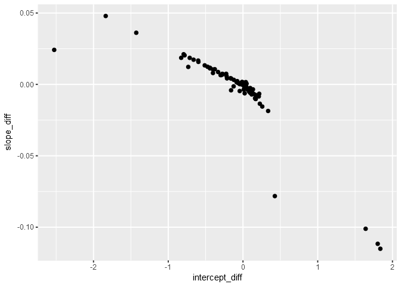

Data Wrangling Conclusion
================
Gokul Raj Suresh Kumar
2016-11-12

Data Wrangling Conclusion
=========================

#### Loading the required packages

``` r
library(gapminder)
library(tidyverse)
library(dplyr)
library(stringr)
library(testthat)
library(ggplot2)
library(MASS)
library(broom)
```

Writing Functions
-----------------

``` r
selected_country <- "China"

( selected_country_info <- gapminder %>% 
    filter( country == selected_country ) )
```

    ## # A tibble: 12 × 6
    ##    country continent  year  lifeExp        pop gdpPercap
    ##     <fctr>    <fctr> <int>    <dbl>      <int>     <dbl>
    ## 1    China      Asia  1952 44.00000  556263527  400.4486
    ## 2    China      Asia  1957 50.54896  637408000  575.9870
    ## 3    China      Asia  1962 44.50136  665770000  487.6740
    ## 4    China      Asia  1967 58.38112  754550000  612.7057
    ## 5    China      Asia  1972 63.11888  862030000  676.9001
    ## 6    China      Asia  1977 63.96736  943455000  741.2375
    ## 7    China      Asia  1982 65.52500 1000281000  962.4214
    ## 8    China      Asia  1987 67.27400 1084035000 1378.9040
    ## 9    China      Asia  1992 68.69000 1164970000 1655.7842
    ## 10   China      Asia  1997 70.42600 1230075000 2289.2341
    ## 11   China      Asia  2002 72.02800 1280400000 3119.2809
    ## 12   China      Asia  2007 72.96100 1318683096 4959.1149

``` r
p <- selected_country_info %>% 
  ggplot( aes( x = year , y = lifeExp ) )

# linear
linear_fit <- lm( lifeExp ~ I( year - 1952 ) , data = selected_country_info )

coef( linear_fit )
```

    ##    (Intercept) I(year - 1952) 
    ##     47.1904815      0.5307149

``` r
le_linear_fit <- function( data , offset = 1952 ){
  linear_fit <- lm( lifeExp ~ I( year - offset ) , data = data )
  setNames( coef( linear_fit ) , c( "intercept" , "slope" ) )
}

le_linear_fit( selected_country_info )
```

    ##  intercept      slope 
    ## 47.1904815  0.5307149

``` r
p + geom_point( ) + geom_smooth( method = "lm" , lwd = 0.5 )
```


``` r
# robust 
robust_fit <- rlm( lifeExp ~ I( year - 1952 ) , data = selected_country_info )

coef( robust_fit )
```

    ##    (Intercept) I(year - 1952) 
    ##     48.0172254      0.5120964

``` r
le_robust_fit <- function( data , offset = 1952 ) {
  robust_fit <- rlm( lifeExp ~ I( year - offset ) , data = data )
  setNames( coef( robust_fit ) , c( "intercept" , "slope" ) )
}

le_robust_fit( selected_country_info )
```

    ##  intercept      slope 
    ## 48.0172254  0.5120964

``` r
p + geom_point( ) + geom_smooth( method = "rlm" , lwd = 0.5 )
```



``` r
# quadratic
quadratic_fit <- lm( lifeExp ~ I( year - 1952 ) + I( ( year - 1952 )^2 ) , data = selected_country_info )

coef( quadratic_fit )
```

    ##        (Intercept)     I(year - 1952) I((year - 1952)^2) 
    ##        43.24529473         1.00413727        -0.00860768

``` r
le_quadratic_fit <- function( data , offset = 1952 ){
  quadratic_fit <- lm( lifeExp ~ I( year - offset ) + I( ( year - offset )^2 ) , data = data )
  setNames( coef( quadratic_fit ) , c( "intercept" , "slope 1" , "slope 2" ) )
}

le_quadratic_fit( selected_country_info )
```

    ##   intercept     slope 1     slope 2 
    ## 43.24529473  1.00413727 -0.00860768

``` r
p + geom_point( ) + geom_smooth( method = "lm" , formula = y ~ x + I( x^2 ) , lwd = 0.5 )
```


Working with a nested data frame
--------------------------------

``` r
( nested_gap <- gapminder %>% 
    group_by( continent , country ) %>% 
    nest( ) )
```

    ## # A tibble: 142 × 3
    ##    continent     country              data
    ##       <fctr>      <fctr>            <list>
    ## 1       Asia Afghanistan <tibble [12 × 4]>
    ## 2     Europe     Albania <tibble [12 × 4]>
    ## 3     Africa     Algeria <tibble [12 × 4]>
    ## 4     Africa      Angola <tibble [12 × 4]>
    ## 5   Americas   Argentina <tibble [12 × 4]>
    ## 6    Oceania   Australia <tibble [12 × 4]>
    ## 7     Europe     Austria <tibble [12 × 4]>
    ## 8       Asia     Bahrain <tibble [12 × 4]>
    ## 9       Asia  Bangladesh <tibble [12 × 4]>
    ## 10    Europe     Belgium <tibble [12 × 4]>
    ## # ... with 132 more rows

``` r
# linear
le_linear_fit( nested_gap$data[[25]] )
```

    ##  intercept      slope 
    ## 47.1904815  0.5307149

``` r
le_linear_res <- map( nested_gap$data[1:2] , le_linear_fit )

le_lin_fit_all <- nested_gap %>% 
  mutate( linear_fit = map( data , le_linear_fit ) )

le_lin_fit_all$linear_fit[[25]]
```

    ##  intercept      slope 
    ## 47.1904815  0.5307149

``` r
tidy( le_lin_fit_all$linear_fit[[25]] )
```

    ## # A tibble: 2 × 2
    ##       names          x
    ##       <chr>      <dbl>
    ## 1 intercept 47.1904815
    ## 2     slope  0.5307149

``` r
le_lin_fit_all <- le_lin_fit_all %>% 
  mutate( tidy = map( linear_fit , tidy ) )

le_lin_fit_all$tidy[[25]]
```

    ## # A tibble: 2 × 2
    ##       names          x
    ##       <chr>      <dbl>
    ## 1 intercept 47.1904815
    ## 2     slope  0.5307149

``` r
le_lin_coefs <- le_lin_fit_all %>% 
  dplyr::select( continent , country , tidy ) %>% 
  unnest( tidy )

le_lin_ests <- le_lin_coefs %>% 
  dplyr::select( continent:x ) %>% 
  spread( key = "names" , value = "x" )

knitr::kable( le_lin_ests %>% head( ) )
```

| continent | country      |  intercept|      slope|
|:----------|:-------------|----------:|----------:|
| Africa    | Algeria      |   43.37497|  0.5692797|
| Africa    | Angola       |   32.12665|  0.2093399|
| Africa    | Benin        |   39.58851|  0.3342329|
| Africa    | Botswana     |   52.92912|  0.0606685|
| Africa    | Burkina Faso |   34.68469|  0.3639748|
| Africa    | Burundi      |   40.57864|  0.1541343|

``` r
le_lin_fit_broom <- gapminder %>% 
  group_by( continent , country ) %>% 
  do( fit = lm( lifeExp ~ I( year - 1952 ) , . ) )

le_lin_fit_broom %>% 
  tidy( fit )
```

    ## Source: local data frame [284 x 7]
    ## Groups: continent, country [142]
    ## 
    ##    continent      country           term    estimate  std.error  statistic
    ##       <fctr>       <fctr>          <chr>       <dbl>      <dbl>      <dbl>
    ## 1     Africa      Algeria    (Intercept) 43.37497436 0.71842024 60.3754908
    ## 2     Africa      Algeria I(year - 1952)  0.56927972 0.02212707 25.7277493
    ## 3     Africa       Angola    (Intercept) 32.12665385 0.76403549 42.0486406
    ## 4     Africa       Angola I(year - 1952)  0.20933986 0.02353200  8.8959644
    ## 5     Africa        Benin    (Intercept) 39.58851282 0.63788186 62.0624528
    ## 6     Africa        Benin I(year - 1952)  0.33423287 0.01964652 17.0123200
    ## 7     Africa     Botswana    (Intercept) 52.92911538 3.31904058 15.9471131
    ## 8     Africa     Botswana I(year - 1952)  0.06066853 0.10222519  0.5934793
    ## 9     Africa Burkina Faso    (Intercept) 34.68469231 1.11161365 31.2021109
    ## 10    Africa Burkina Faso I(year - 1952)  0.36397483 0.03423728 10.6309510
    ## # ... with 274 more rows, and 1 more variables: p.value <dbl>

``` r
# robust
le_robust_fit( nested_gap$data[[25]] )
```

    ##  intercept      slope 
    ## 48.0172254  0.5120964

``` r
le_robust_res <- map( nested_gap$data[1:2] , le_robust_fit )

le_rob_fit_all <- nested_gap %>% 
  mutate( robust_fit = map( data , le_robust_fit ) )

le_rob_fit_all$robust_fit[[25]]
```

    ##  intercept      slope 
    ## 48.0172254  0.5120964

``` r
le_rob_fit_all <- le_rob_fit_all %>% 
  mutate( tidy = map( robust_fit , tidy ) )

le_rob_fit_all$tidy[[25]]
```

    ## # A tibble: 2 × 2
    ##       names          x
    ##       <chr>      <dbl>
    ## 1 intercept 48.0172254
    ## 2     slope  0.5120964

``` r
le_rob_coefs <- le_rob_fit_all %>% 
  dplyr::select( continent , country , tidy ) %>% 
  unnest( tidy )

le_rob_ests <- le_rob_coefs %>% 
  dplyr::select( continent:x ) %>% 
  spread( key = "names" , value = "x" )

knitr::kable( le_rob_ests %>% head( ) )
```

| continent | country      |  intercept|      slope|
|:----------|:-------------|----------:|----------:|
| Africa    | Algeria      |   43.15800|  0.5758313|
| Africa    | Angola       |   32.13493|  0.2090313|
| Africa    | Benin        |   39.58851|  0.3342329|
| Africa    | Botswana     |   52.92912|  0.0606685|
| Africa    | Burkina Faso |   34.68469|  0.3639748|
| Africa    | Burundi      |   40.57864|  0.1541343|

``` r
le_rob_fit_broom <- gapminder %>% 
  group_by( continent , country ) %>% 
  do( fit = rlm( lifeExp ~ I( year - 1952 ) , . ) )

le_rob_fit_broom %>% 
  tidy( fit )
```

    ## Source: local data frame [284 x 6]
    ## Groups: continent, country [142]
    ## 
    ##    continent      country           term    estimate  std.error  statistic
    ##       <fctr>       <fctr>          <chr>       <dbl>      <dbl>      <dbl>
    ## 1     Africa      Algeria    (Intercept) 43.15800264 0.60099398 71.8110394
    ## 2     Africa      Algeria I(year - 1952)  0.57583135 0.01851039 31.1085536
    ## 3     Africa       Angola    (Intercept) 32.13492594 0.94094528 34.1517479
    ## 4     Africa       Angola I(year - 1952)  0.20903132 0.02898076  7.2127625
    ## 5     Africa        Benin    (Intercept) 39.58851282 0.63788186 62.0624528
    ## 6     Africa        Benin I(year - 1952)  0.33423287 0.01964652 17.0123200
    ## 7     Africa     Botswana    (Intercept) 52.92911538 3.31904058 15.9471131
    ## 8     Africa     Botswana I(year - 1952)  0.06066853 0.10222519  0.5934793
    ## 9     Africa Burkina Faso    (Intercept) 34.68469231 1.11161365 31.2021109
    ## 10    Africa Burkina Faso I(year - 1952)  0.36397483 0.03423728 10.6309510
    ## # ... with 274 more rows

``` r
#quadratic
le_quadratic_fit( nested_gap$data[[25]] )
```

    ##   intercept     slope 1     slope 2 
    ## 43.24529473  1.00413727 -0.00860768

``` r
le_quad_res <- map( nested_gap$data[1:2] , le_quadratic_fit )

le_quad_fit_all <- nested_gap %>% 
  mutate( quadratic_fit = map( data , le_quadratic_fit ) )

le_quad_fit_all$quadratic_fit[[25]]
```

    ##   intercept     slope 1     slope 2 
    ## 43.24529473  1.00413727 -0.00860768

``` r
le_quad_fit_all <- le_quad_fit_all %>% 
  mutate( tidy = map( quadratic_fit , tidy ) )

le_quad_fit_all$tidy[[25]]
```

    ## # A tibble: 3 × 2
    ##       names           x
    ##       <chr>       <dbl>
    ## 1 intercept 43.24529473
    ## 2   slope 1  1.00413727
    ## 3   slope 2 -0.00860768

``` r
le_quad_coefs <- le_quad_fit_all %>% 
  dplyr::select( continent , country , tidy ) %>% 
  unnest( tidy )

le_quad_ests <- le_quad_coefs %>% 
  dplyr::select( continent:x ) %>% 
  spread( key = "names" , value = "x" ) 

knitr::kable( le_quad_ests %>% head( ) )
```

| continent | country      |  intercept|    slope 1|     slope 2|
|:----------|:-------------|----------:|----------:|-----------:|
| Africa    | Algeria      |   41.94224|  0.7412083|  -0.0031260|
| Africa    | Angola       |   30.11767|  0.4504179|  -0.0043832|
| Africa    | Benin        |   37.86994|  0.5404620|  -0.0037496|
| Africa    | Botswana     |   44.91197|  1.0227257|  -0.0174919|
| Africa    | Burkina Faso |   31.54945|  0.7402045|  -0.0068405|
| Africa    | Burundi      |   39.26621|  0.3116255|  -0.0028635|

``` r
le_quad_fit_broom <- gapminder %>% 
  group_by( continent , country ) %>% 
  do( fit = rlm( lifeExp ~ I( year - 1952 ) + I( ( year - 1952 )^2 ) , . ) )

le_quad_fit_broom %>% 
  tidy( fit )
```

    ## Source: local data frame [426 x 6]
    ## Groups: continent, country [142]
    ## 
    ##    continent  country               term     estimate    std.error
    ##       <fctr>   <fctr>              <chr>        <dbl>        <dbl>
    ## 1     Africa  Algeria        (Intercept) 41.951551299 0.8291322824
    ## 2     Africa  Algeria     I(year - 1952)  0.739640586 0.0700840706
    ## 3     Africa  Algeria I((year - 1952)^2) -0.003100787 0.0012277828
    ## 4     Africa   Angola        (Intercept) 30.043042009 0.4447693000
    ## 5     Africa   Angola     I(year - 1952)  0.464016821 0.0375950179
    ## 6     Africa   Angola I((year - 1952)^2) -0.004714918 0.0006586164
    ## 7     Africa    Benin        (Intercept) 37.891662339 0.2193079128
    ## 8     Africa    Benin     I(year - 1952)  0.532687034 0.0185374416
    ## 9     Africa    Benin I((year - 1952)^2) -0.003481666 0.0003247522
    ## 10    Africa Botswana        (Intercept) 44.935569344 2.8656565176
    ## # ... with 416 more rows, and 1 more variables: statistic <dbl>

``` r
#linear and robust comparison

ggplot( le_lin_ests , aes( x = intercept , y = slope ) ) +
  geom_point( ) +
  geom_smooth( se = FALSE )
```



``` r
ggplot( le_rob_ests , aes( x = intercept , y = slope ) ) +
  geom_point( ) +
  geom_smooth( se = FALSE )
```


``` r
le_lin_rob_est <- left_join( le_lin_ests , le_rob_ests , by = c( "continent", "country" ) )

le_lin_rob_est <- le_lin_rob_est %>% 
  mutate( slope_diff = (slope.x - slope.y ) , intercept_diff = (intercept.x - intercept.y ) ) %>%  
  dplyr::select( country , slope_diff , intercept_diff )

knitr::kable( le_lin_rob_est %>% head( ) )
```

| country      |  slope\_diff|  intercept\_diff|
|:-------------|------------:|----------------:|
| Algeria      |   -0.0065516|        0.2169717|
| Angola       |    0.0003085|       -0.0082721|
| Benin        |    0.0000000|        0.0000000|
| Botswana     |    0.0000000|        0.0000000|
| Burkina Faso |    0.0000000|        0.0000000|
| Burundi      |    0.0000000|        0.0000000|

``` r
ggplot( le_lin_rob_est , aes( x = intercept_diff , y = slope_diff ) ) + geom_point( ) 
```


Working with a list
-------------------

#### Trump Android Tweets

``` r
load( url( "http://varianceexplained.org/files/trump_tweets_df.rda" ) )

glimpse( trump_tweets_df )
```

    ## Observations: 1,512
    ## Variables: 16
    ## $ text          <chr> "My economic policy speech will be carried live ...
    ## $ favorited     <lgl> FALSE, FALSE, FALSE, FALSE, FALSE, FALSE, FALSE,...
    ## $ favoriteCount <dbl> 9214, 6981, 15724, 19837, 34051, 29831, 19223, 1...
    ## $ replyToSN     <chr> NA, NA, NA, NA, NA, NA, NA, NA, NA, NA, NA, NA, ...
    ## $ created       <dttm> 2016-08-08 15:20:44, 2016-08-08 13:28:20, 2016-...
    ## $ truncated     <lgl> FALSE, FALSE, FALSE, FALSE, FALSE, FALSE, FALSE,...
    ## $ replyToSID    <lgl> NA, NA, NA, NA, NA, NA, NA, NA, NA, NA, NA, NA, ...
    ## $ id            <chr> "762669882571980801", "762641595439190016", "762...
    ## $ replyToUID    <chr> NA, NA, NA, NA, NA, NA, NA, NA, NA, NA, NA, NA, ...
    ## $ statusSource  <chr> "<a href=\"http://twitter.com/download/android\"...
    ## $ screenName    <chr> "realDonaldTrump", "realDonaldTrump", "realDonal...
    ## $ retweetCount  <dbl> 3107, 2390, 6691, 6402, 11717, 9892, 5784, 7930,...
    ## $ isRetweet     <lgl> FALSE, FALSE, FALSE, FALSE, FALSE, FALSE, FALSE,...
    ## $ retweeted     <lgl> FALSE, FALSE, FALSE, FALSE, FALSE, FALSE, FALSE,...
    ## $ longitude     <chr> NA, NA, NA, NA, NA, NA, NA, NA, NA, NA, NA, NA, ...
    ## $ latitude      <chr> NA, NA, NA, NA, NA, NA, NA, NA, NA, NA, NA, NA, ...

``` r
tweets <- trump_tweets_df$text

tweets %>% head( ) %>% strtrim( 70 )
```

    ## [1] "My economic policy speech will be carried live at 12:15 P.M. Enjoy!"   
    ## [2] "Join me in Fayetteville, North Carolina tomorrow evening at 6pm. Ticke"
    ## [3] "#ICYMI: \"Will Media Apologize to Trump?\" https://t.co/ia7rKBmioA"    
    ## [4] "Michael Morell, the lightweight former Acting Director of C.I.A., and "
    ## [5] "The media is going crazy. They totally distort so many things on purpo"
    ## [6] "I see where Mayor Stephanie Rawlings-Blake of Baltimore is pushing Cro"

``` r
regex <- "badly|crazy|weak|spent|strong|dumb|joke|guns|funny|dead"

( tweets <- tweets[ c( 1 , 2 , 5 , 6 , 198 , 347 , 919 ) ] )
```

    ## [1] "My economic policy speech will be carried live at 12:15 P.M. Enjoy!"                                                                         
    ## [2] "Join me in Fayetteville, North Carolina tomorrow evening at 6pm. Tickets now available at: https://t.co/Z80d4MYIg8"                          
    ## [3] "The media is going crazy. They totally distort so many things on purpose. Crimea, nuclear, \"the baby\" and so much more. Very dishonest!"   
    ## [4] "I see where Mayor Stephanie Rawlings-Blake of Baltimore is pushing Crooked hard. Look at the job she has done in Baltimore. She is a joke!"  
    ## [5] "Bernie Sanders started off strong, but with the selection of Kaine for V.P., is ending really weak. So much for a movement! TOTAL DISRESPECT"
    ## [6] "Crooked Hillary Clinton is unfit to serve as President of the U.S. Her temperament is weak and her opponents are strong. BAD JUDGEMENT!"     
    ## [7] "The Cruz-Kasich pact is under great strain. This joke of a deal is falling apart, not being honored and almost dead. Very dumb!"

``` r
( matches <- gregexpr( regex , tweets ) )
```

    ## [[1]]
    ## [1] -1
    ## attr(,"match.length")
    ## [1] -1
    ## attr(,"useBytes")
    ## [1] TRUE
    ## 
    ## [[2]]
    ## [1] -1
    ## attr(,"match.length")
    ## [1] -1
    ## attr(,"useBytes")
    ## [1] TRUE
    ## 
    ## [[3]]
    ## [1] 20
    ## attr(,"match.length")
    ## [1] 5
    ## attr(,"useBytes")
    ## [1] TRUE
    ## 
    ## [[4]]
    ## [1] 134
    ## attr(,"match.length")
    ## [1] 4
    ## attr(,"useBytes")
    ## [1] TRUE
    ## 
    ## [[5]]
    ## [1] 28 95
    ## attr(,"match.length")
    ## [1] 6 4
    ## attr(,"useBytes")
    ## [1] TRUE
    ## 
    ## [[6]]
    ## [1]  87 114
    ## attr(,"match.length")
    ## [1] 4 6
    ## attr(,"useBytes")
    ## [1] TRUE
    ## 
    ## [[7]]
    ## [1]  50 112 123
    ## attr(,"match.length")
    ## [1] 4 4 4
    ## attr(,"useBytes")
    ## [1] TRUE

``` r
lengths( matches )
```

    ## [1] 1 1 1 1 2 2 3

``` r
map_int( matches , length )
```

    ## [1] 1 1 1 1 2 2 3

``` r
( m <- matches[[7]] )
```

    ## [1]  50 112 123
    ## attr(,"match.length")
    ## [1] 4 4 4
    ## attr(,"useBytes")
    ## [1] TRUE

``` r
attr( m , which = "match.length" )
```

    ## [1] 4 4 4

``` r
ml <- function( x ) attr( x , which = "match.length" )

( matches_length <- map( matches , ml ) )
```

    ## [[1]]
    ## [1] -1
    ## 
    ## [[2]]
    ## [1] -1
    ## 
    ## [[3]]
    ## [1] 5
    ## 
    ## [[4]]
    ## [1] 4
    ## 
    ## [[5]]
    ## [1] 6 4
    ## 
    ## [[6]]
    ## [1] 4 6
    ## 
    ## [[7]]
    ## [1] 4 4 4

``` r
m <- function( x ) sum( x > 0 )

map_int( matches , m )
```

    ## [1] 0 0 1 1 2 2 3

``` r
( matches_first <- map( matches , as.vector ) )
```

    ## [[1]]
    ## [1] -1
    ## 
    ## [[2]]
    ## [1] -1
    ## 
    ## [[3]]
    ## [1] 20
    ## 
    ## [[4]]
    ## [1] 134
    ## 
    ## [[5]]
    ## [1] 28 95
    ## 
    ## [[6]]
    ## [1]  87 114
    ## 
    ## [[7]]
    ## [1]  50 112 123

``` r
( tweet <- tweets[[7]] )
```

    ## [1] "The Cruz-Kasich pact is under great strain. This joke of a deal is falling apart, not being honored and almost dead. Very dumb!"

``` r
( t_first <- matches_first[[7]] )
```

    ## [1]  50 112 123

``` r
( t_length <- matches_length[[7]] )
```

    ## [1] 4 4 4

``` r
( t_last <- t_first + t_length - 1 ) 
```

    ## [1]  53 115 126

``` r
substring( tweet , t_first , t_last )
```

    ## [1] "joke" "dead" "dumb"

``` r
mlast <- function( x , y ) x + y - 1

matches_last <- map2( matches_first, matches_length , mlast )

matches_list <- list(text = tweets , first = matches_first , last = matches_last)

pmap( matches_list , substring )
```

    ## [[1]]
    ## [1] ""
    ## 
    ## [[2]]
    ## [1] ""
    ## 
    ## [[3]]
    ## [1] "crazy"
    ## 
    ## [[4]]
    ## [1] "joke"
    ## 
    ## [[5]]
    ## [1] "strong" "weak"  
    ## 
    ## [[6]]
    ## [1] "weak"   "strong"
    ## 
    ## [[7]]
    ## [1] "joke" "dead" "dumb"

<http://www.alastairsanderson.com/R/tutorials/robust-regression-in-R>

<http://statistics.ats.ucla.edu/stat/r/faq/smooths.htm>

<http://www.theanalysisfactor.com/r-tutorial-4/>

<http://www.stat.yale.edu/Courses/1997-98/101/linreg.htm>
