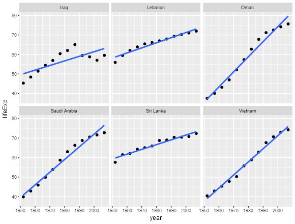
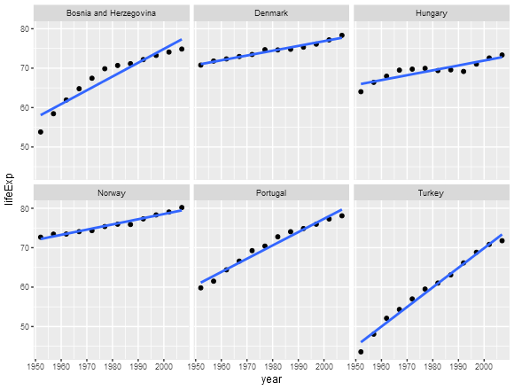

```{r setup, include=FALSE}
knitr::opts_chunk$set(echo = TRUE)
```

##Automating Data-analysis Pipelines

This R markdown document is populated using the code from the respective R scripts using `make` and is an integral part of the pipeline. 

###Downloading the data (00_download-data.R)

```{r code=readLines("00_download-data.R"), eval=FALSE}
```

###Performing Exploratory Analyses(01_plot-reorder-sort.R)

```{r code=readLines("01_plot-reorder-sort.R"), eval=FALSE}
```

####Embedding pre-existing figures


###Performing Statistical Analyses(02_fit-lin-reg.R)

```{r code=readLines("02_fit-lin-reg.R"), eval=FALSE}
```

###Generating Figures(03_generate-plot.R)

```{r code=readLines("03_generate-plot.R"), eval=FALSE}
```

####Embedding pre-existing figures






###Explanation of the working of the pipeline

Click [README.md](https://github.com/STAT545-UBC/suresh-kumar_gokul-raj/blob/master/hw07_automating-data-analysis-pipelines/README.md)

###References

- [Exporting nice plots in R from G-Forge](http://gforge.se/2013/02/exporting-nice-plots-in-r/)
- [Jenny Bryan's Split-apply-combine](http://stat545.com/block024_group-nest-split-map.html)
- [Jenny Bryan's dplyr functions for a single dataset](http://stat545.com/block010_dplyr-end-single-table.html)
- [Jenny Bryan's automation example using R and make](https://github.com/STAT545-UBC/STAT545-UBC.github.io/tree/master/automation10_holding-area/02_automation-example_r-and-make)
- [An example of a data analysis pipeline using Make by Shaun Jackman](https://github.com/sjackman/makefile-example/)
- [Making use of external R code in knitr and R markdown](http://zevross.com/blog/2014/07/09/making-use-of-external-r-code-in-knitr-and-r-markdown/)

