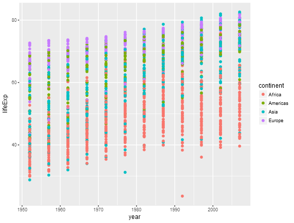
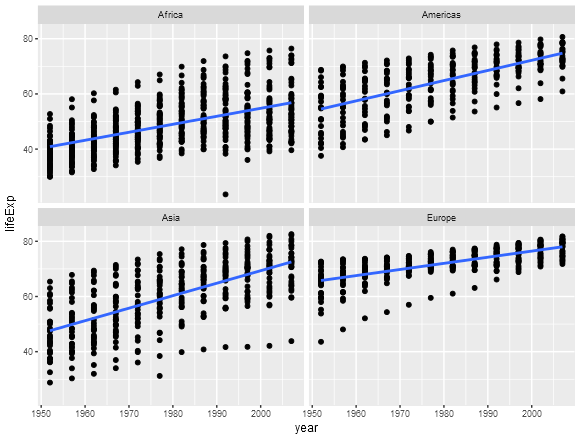
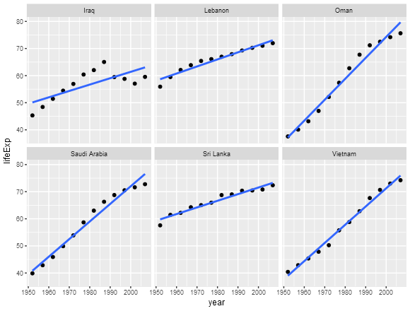
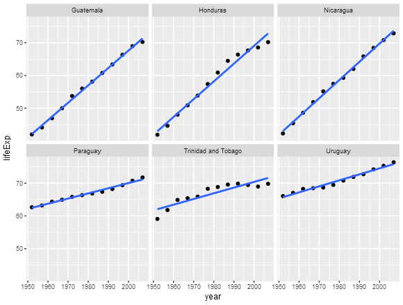
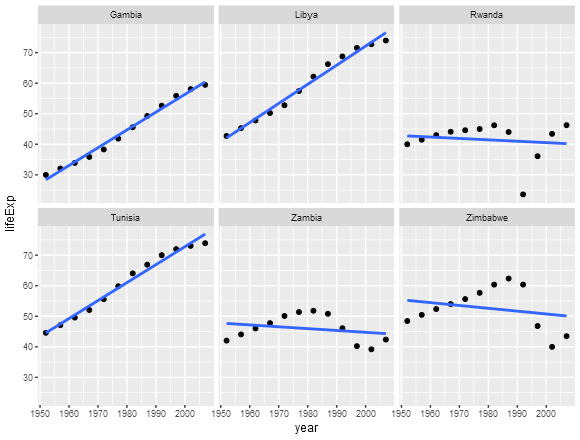
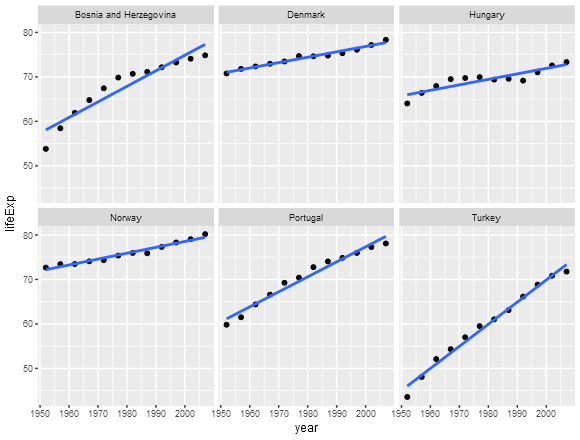

##Automating Data-analysis Pipelines

This R markdown document is populated using the code from the respective R scripts using `make` and is an integral part of the pipeline. 

###Downloading the data (00_download-data.R)


```r
# loading the necessary packages
library(downloader)

# fetching the gapminder data from the URL and saving it as a .tsv file
download( url = "https://raw.githubusercontent.com/jennybc/gapminder/master/inst/gapminder.tsv" , 
          destfile = "gapminder.tsv")
```

###Performing Exploratory Analyses(01_plot-reorder-sort.R)


```r
# loading the necessary packages
library(tidyverse)
library(ggplot2)
library(Cairo)

# importing the gapminder data
gapminder_tbl <- read_tsv("gapminder.tsv")

# dropping variables 'population' and 'gdp per capita' as they're not relevant for
# this analyses. Oceania has also been dropped to make life easier 
gap_data <- gapminder_tbl %>% 
  select( - pop , - gdpPercap ) %>% 
  filter( continent != "Oceania" )

# plotting life expectancy vs year for all the continents and saving to disk
CairoPNG( filename =  "le_vs_year.png" , width = 580 , height = 440 )
ggplot( gap_data , aes( x = year , y = lifeExp ) ) + 
  geom_point( aes( color = continent ) )
dev.off( )

# facetting the above plot by continent, applying linear regression and saving to disk
CairoPNG( filename =  "le_vs_year_lin_fit.png" , width = 580 , height = 440 )
ggplot( gap_data , aes( x = year , y = lifeExp ) ) + 
  facet_wrap( ~ continent ) +
  geom_point( ) + geom_smooth( method = "lm" , se = FALSE )
dev.off( )

# grouping the data based on continent and life expectancy
gap_reord_conti_le <- gap_data %>% 
  group_by( continent , lifeExp )

## @knitr gap_sort_conti_le
# sorting the grouped data on increasing order of life expectancy
gap_sort_conti_le <- gap_reord_conti_le %>% 
  arrange( continent , lifeExp )

# writing the data to file for future use
write_tsv( gap_sort_conti_le , "gap_sort_conti_le.tsv" )
```

####Embedding pre-existing figures





###Performing Statistical Analyses(02_fit-lin-reg.R)


```r
# loading the necessary packages
library(tidyverse)
library(broom)

# importing the rearranged data
gap_sort_conti_le <- read_tsv("gap_sort_conti_le.tsv")

# applying linear regression to the data
gap_lin_reg_broom <- gap_sort_conti_le %>% 
  group_by( continent , country ) %>% 
  do( fit = lm( lifeExp ~ I( year - 1952 ) , . ) )

# using 'broom::tidy()' to extract information from the linear model
gap_lin_reg_ests <- gap_lin_reg_broom %>% 
  tidy( fit ) %>% 
  select( -std.error , -statistic , -p.value ) %>% 
  spread( key = "term" , value = "estimate" ) %>% 
  rename( Intercept = `(Intercept)` , Slope = `I(year - 1952)` )

# function to select the 3 'best' and 'worst' countries based on life expectancy 
filter_sort_best_worst <- function( cont ){
  result <-  gap_lin_reg_ests %>% 
    filter( continent == cont ) %>% 
    group_by( continent ) %>% 
    filter( min_rank( desc( Slope ) ) < 4 | min_rank( Slope ) < 4 )
  return( result )
}

# determining the 3 best and worst countries in Asia
asia_best_worst_ests <- filter_sort_best_worst( "Asia" )

# performing a semi join with the sorted data to get the information of the chosen countries
asia_best_worst_countries <- semi_join( gap_sort_conti_le , asia_best_worst_ests )

# writing the data to file for future use
write_tsv( asia_best_worst_countries , "asia_best_worst_countries.tsv" )

# determining the 3 best and worst countries in Americas
americas_best_worst_ests <- filter_sort_best_worst( "Americas" )

# performing a semi join with the sorted data to get the information of the chosen countries
americas_best_worst_countries <- semi_join( gap_sort_conti_le , americas_best_worst_ests )

# writing the data to file for future use
write_tsv( americas_best_worst_countries , "americas_best_worst_countries.tsv" )

# determining the 3 best and worst countries in Africa
africa_best_worst_ests <- filter_sort_best_worst( "Africa" )

# performing a semi join with the sorted data to get the information of the chosen countries
africa_best_worst_countries <- semi_join( gap_sort_conti_le , africa_best_worst_ests )

# writing the data to file for future use
write_tsv( africa_best_worst_countries , "africa_best_worst_countries.tsv" )

# determining the 3 best and worst countries in Europe
europe_best_worst_ests <- filter_sort_best_worst("Europe")

# performing a semi join with the sorted data to get the information of the chosen countries
europe_best_worst_countries <- semi_join( gap_sort_conti_le , europe_best_worst_ests )

# writing the data to file for future use
write_tsv( europe_best_worst_countries , "europe_best_worst_countries.tsv" )
```

###Generating Figures(03_generate-plot.R)


```r
# loading the necessary packages
library(tidyverse)
library(ggplot2)
library(Cairo)

# importing the filtered data for Asia
asia_best_worst_countries <- read_tsv( "asia_best_worst_countries.tsv" )

# importing the filtered data for Americas
americas_best_worst_countries <- read_tsv( "americas_best_worst_countries.tsv" )

# importing the filtered data for Africa
africa_best_worst_countries <- read_tsv( "africa_best_worst_countries.tsv" )

# importing the filtered data for Europe
europe_best_worst_countries <- read_tsv( "europe_best_worst_countries.tsv" )

# function to plot life expectancy vs year, facet by continent and overlay the fitted line
plot_lm_facet <- function( country_under_test ){
  result_plot <- ggplot( country_under_test , aes( x = year , y = lifeExp ) ) + 
    geom_point( ) +
    facet_wrap( ~ country ) +
    geom_smooth( method = "lm" , se = FALSE )
  return( result_plot )
}

# plotting life expectancy vs year filtered countries of Asia and saving to disk
CairoPNG( filename =  "asia_best_worst_le.png" , width = 580 , height = 440 )
plot_lm_facet( asia_best_worst_countries )
dev.off( )

# plotting life expectancy vs year filtered countries of Americas and saving to disk
CairoPNG( filename =  "americas_best_worst_le.png" , width = 580 , height = 440 )
plot_lm_facet( americas_best_worst_countries )
dev.off( )

# plotting life expectancy vs year filtered countries of Africa and saving to disk
CairoPNG( filename =  "africa_best_worst_le.png" , width = 580 , height = 440 )
plot_lm_facet( africa_best_worst_countries )
dev.off( )

# plotting life expectancy vs year filtered countries of Europe and saving to disk
CairoPNG( filename =  "europe_best_worst_le.png" , width = 580 , height = 440 )
plot_lm_facet( europe_best_worst_countries )
dev.off( )
```

####Embedding pre-existing figures









###Explanation of the working of the pipeline

Click [README.md](https://github.com/STAT545-UBC/suresh-kumar_gokul-raj/blob/master/hw07_automating-data-analysis-pipelines/README.md)

###References

- [Exporting nice plots in R from G-Forge](http://gforge.se/2013/02/exporting-nice-plots-in-r/)
- [Jenny Bryan's Split-apply-combine](http://stat545.com/block024_group-nest-split-map.html)
- [Jenny Bryan's dplyr functions for a single dataset](http://stat545.com/block010_dplyr-end-single-table.html)
- [Jenny Bryan's automation example using R and make](https://github.com/STAT545-UBC/STAT545-UBC.github.io/tree/master/automation10_holding-area/02_automation-example_r-and-make)
- [An example of a data analysis pipeline using Make by Shaun Jackman](https://github.com/sjackman/makefile-example/)
- [Making use of external R code in knitr and R markdown](http://zevross.com/blog/2014/07/09/making-use-of-external-r-code-in-knitr-and-r-markdown/)

