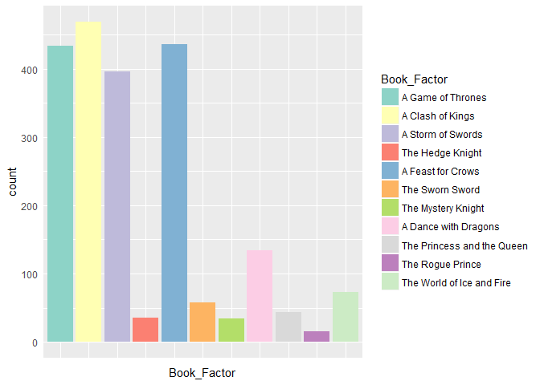

HW\_10-API-And-Scraping
================
Patrick Daniele
2017-01-15

<p>
Load Libraries
</p>
``` r
library(tidyverse)
```

    ## Warning: package 'tidyverse' was built under R version 3.3.2

    ## Loading tidyverse: ggplot2
    ## Loading tidyverse: tibble
    ## Loading tidyverse: tidyr
    ## Loading tidyverse: readr
    ## Loading tidyverse: purrr
    ## Loading tidyverse: dplyr

    ## Warning: package 'ggplot2' was built under R version 3.3.2

    ## Warning: package 'dplyr' was built under R version 3.3.2

    ## Conflicts with tidy packages ----------------------------------------------

    ## filter(): dplyr, stats
    ## lag():    dplyr, stats

``` r
library(httr)
```

    ## Warning: package 'httr' was built under R version 3.3.2

``` r
library(purrr)
library(forcats)
library(RColorBrewer)
```

<h2>
Task: Make API Queries "By-Hand" using HTTR
</h2>
<h3>
Goal: To create a dataset of characters (probably one line per person) and link it to other attributes. For example, I'll join on the house attributes for each character.
</h3>
<p>
I'll start by trying to grab a little bit of data, then move on to traversing the pages to get ALL of the data
</p>
``` r
## Make the query
chars <- GET('http://www.anapioficeandfire.com/api/characters/')

## Check the status
status_code(chars)
```

    ## [1] 200

``` r
## Success!!

#Parse the data into a list
chars_parsed <-content(chars, as='parsed')
## After looking into the structure with listviewer, it seems we only get 10 characters per request. 
## I want them ALL!!! I'll start by upping the page size to the max of 50, then try iterating over the 
## pages

## Again!

## Make the query
chars <- GET('http://www.anapioficeandfire.com/api/characters/?page=1&pageSize=50')

## Check the status
status_code(chars)
```

    ## [1] 200

``` r
## Success!!

#Parse the data into a list
chars_parsed <-content(chars, as='parsed')

## Success again. We were able to get 50 records. Now we will need to loop over all the pages
```

<p>
Instead of reinventing the wheel, I searched how to loop over pages in R. The following website was very helpful.
</p>
<https://cran.r-project.org/web/packages/jsonlite/vignettes/json-paging.html>

<p>
Important to note, there are 12 books, 444 houses and 2138 Characters. Will need to scrape all of that data. And make two datasets then join them on their allegiances and books. To make the task simpler, I'm going to ignore the list POVBooks and instead just use the books list. I'm also going to simplify the task a bit more, and match based on whatever values is first in any lists.
</p>
``` r
## Characters

## This is not my code, taken from the previous link. Modified by me
baseurl <- "http://www.anapioficeandfire.com/api/characters/"
characters <- list()

##This is grabbing a lot of data. It will take a minute.
for(i in 1:43){
  mydata <- GET(paste0(baseurl, "?page=", i, '&pageSize=50'))
  characters[[i]] <- content(mydata, as='parsed')
}

# That seems to work. I'll inspect a specific character to see what we get
characters[[2]][[12]]
```

    ## $url
    ## [1] "http://www.anapioficeandfire.com/api/characters/62"
    ## 
    ## $name
    ## [1] "Aerys II"
    ## 
    ## $gender
    ## [1] "Male"
    ## 
    ## $culture
    ## [1] ""
    ## 
    ## $born
    ## [1] "244 AC, at King's Landing"
    ## 
    ## $died
    ## [1] "283 AC, at the Red Keep in King's Landing"
    ## 
    ## $titles
    ## $titles[[1]]
    ## [1] "King of the Andals, the Rhoynar and the First Men"
    ## 
    ## $titles[[2]]
    ## [1] "Lord of the Seven Kingdoms"
    ## 
    ## $titles[[3]]
    ## [1] "Protector of the Realm"
    ## 
    ## 
    ## $aliases
    ## $aliases[[1]]
    ## [1] "The Mad King"
    ## 
    ## $aliases[[2]]
    ## [1] "King Scab"
    ## 
    ## 
    ## $father
    ## [1] "http://www.anapioficeandfire.com/api/characters/527"
    ## 
    ## $mother
    ## [1] "http://www.anapioficeandfire.com/api/characters/971"
    ## 
    ## $spouse
    ## [1] "http://www.anapioficeandfire.com/api/characters/869"
    ## 
    ## $allegiances
    ## list()
    ## 
    ## $books
    ## $books[[1]]
    ## [1] "http://www.anapioficeandfire.com/api/books/1"
    ## 
    ## $books[[2]]
    ## [1] "http://www.anapioficeandfire.com/api/books/2"
    ## 
    ## $books[[3]]
    ## [1] "http://www.anapioficeandfire.com/api/books/3"
    ## 
    ## $books[[4]]
    ## [1] "http://www.anapioficeandfire.com/api/books/5"
    ## 
    ## $books[[5]]
    ## [1] "http://www.anapioficeandfire.com/api/books/8"
    ## 
    ## $books[[6]]
    ## [1] "http://www.anapioficeandfire.com/api/books/11"
    ## 
    ## 
    ## $povBooks
    ## list()
    ## 
    ## $tvSeries
    ## $tvSeries[[1]]
    ## [1] "Season 6"
    ## 
    ## 
    ## $playedBy
    ## $playedBy[[1]]
    ## [1] "David Rintoul"

``` r
#Cool!

##Houses

## This is not my code, taken from the previous link. Modified by me
baseurl <- "http://www.anapioficeandfire.com/api/houses/"
houses <- list()

for(i in 1:10){
  mydata <- GET(paste0(baseurl, "?page=", i, '&pageSize=50'))
  houses[[i]] <- content(mydata, as='parsed')
}

# That seems to work. I'll inspect a specific house to see what we get
houses[[2]][[12]]
```

    ## $url
    ## [1] "http://www.anapioficeandfire.com/api/houses/62"
    ## 
    ## $name
    ## [1] "House Casterly of Casterly Rock"
    ## 
    ## $region
    ## [1] "The Westerlands"
    ## 
    ## $coatOfArms
    ## [1] ""
    ## 
    ## $words
    ## [1] ""
    ## 
    ## $titles
    ## $titles[[1]]
    ## [1] "Lord of Casterly Rock"
    ## 
    ## 
    ## $seats
    ## $seats[[1]]
    ## [1] "Casterly Rock"
    ## 
    ## 
    ## $currentLord
    ## [1] ""
    ## 
    ## $heir
    ## [1] ""
    ## 
    ## $overlord
    ## [1] ""
    ## 
    ## $founded
    ## [1] "Age of Heroes"
    ## 
    ## $founder
    ## [1] "http://www.anapioficeandfire.com/api/characters/1286"
    ## 
    ## $diedOut
    ## [1] ""
    ## 
    ## $ancestralWeapons
    ## list()
    ## 
    ## $cadetBranches
    ## $cadetBranches[[1]]
    ## [1] "http://www.anapioficeandfire.com/api/houses/229"
    ## 
    ## 
    ## $swornMembers
    ## $swornMembers[[1]]
    ## [1] "http://www.anapioficeandfire.com/api/characters/1286"

``` r
#Cool!


##Books

## No need to traverse pages here. Only 12 values.
mydata <- GET('http://www.anapioficeandfire.com/api/books/?page=1&pageSize=12')
books_list <- content(mydata, as='parsed')

# That seems to work. I'll inspect a specific book to see what we get
books_list[[2]][[2]]
```

    ## [1] "A Clash of Kings"

``` r
#Cool!
```

<p>
So now we have traversed the pages, next it's time to map them into data frames. I won't keep all the data, instead i'll just keep some specific variables such as Name, Gender, Culture, Year Born/Died, Father, Moth, Spouse, and Allegiances. I'll then merge the allegiances onto the houses to fill them in.
</p>
``` r
## Let's Start by simplify the data structure a little bit. We can use the flatten function on each
houses2 <- flatten(houses)
characters2 <- flatten(characters)


## Now I'll try to map some variables into a dataset
characters_temp <- map_df(characters2, `[`, c('url','name', 'gender', 'culture', 'born', 'died'))
characters_df <- characters_temp %>% 
  mutate(CharacterID=substr(url, start=49, stop=(49+nchar(url)-49))) %>% 
    select(-url)


##Getting Allegiances Data - I take no credit for this code. It was all Jenny's

allegiances <- characters2 %>% 
  tibble(
    url = map_chr(., "url"),
    allegiances = map(., "allegiances")
  )

## Creating ID Variables for Joining Later
allegiances_df <- allegiances %>% 
  mutate(House=map(allegiances, 1, c('allegiances')), HouseID= substr(House, start=45, stop=(45 +nchar(House)-45)),
                   CharacterID=substr(url, start=49, stop=(49+nchar(url)-49))) %>% 
  select(-allegiances, -House, -., -url)

## Same thing for books

books <- characters2 %>% 
  tibble(
    url = map_chr(., "url"),
    books = map(., "books")
  )

## Creating ID Variables for Joining Later
books_char_df <- books %>% 
  mutate(Book=map(books, 1, c('books')), BookID= substr(Book, start=44, stop=(44 +nchar(Book)-44)),
         CharacterID=substr(url, start=49, stop=(49+nchar(url)-49))) %>% 
  select(-books, -Book, -., -url)


## Grabbing Name, Region and URL (To turn into an ID variable)
houses_temp <-map_df(houses2, `[`, c('name', 'region', 'url'))
houses_df <- houses_temp %>% 
  mutate(HouseID=substr(url, start=45, stop=(45+nchar(url)-45))) %>% 
    select(-url) %>% 
  rename(House_Name=name)
##Perfect, After this, we have a variable called HouseID that we will be able to join on.


##Finally, let's grab the data we need from the books list
books_temp <- map_df(books_list, `[`, c('url', 'name'))
books_df <- books_temp %>% 
  mutate(BookID=substr(url, start=44, stop=(44+nchar(url)-44))) %>% 
  select(-url) %>% 
  rename(Book_Name=name)
```

<p>
Originally, I had to use for loops. But after some excellent suggestions from Jenny and Sam, I was able to use mapping functions instead. Much nicer.
</p>
<p>
To recap, we now have 5 datasets. <br> 1. Characters - Containing character specific data such as Name, Gender, and culture as well as a Character ID variable <br> 2. Allegancies - Contains a character ID variable and their house ID <br> 3. Houses - Contains HouseID and House specific variables such as Name, and Region <br> 4. Books (From Characters) - Contains CharacterID and BookID <br> 5. Books (From Books) - Contains BookID and Name of Book <br> Now, we slam all of this together! (Joins that is)
</p>
<p align="centre">
<a href="http://i.imgur.com/JGR3y6k.gif" target="_blank"></a>
</p>
``` r
# Step 1 - Merge Characters onto Allegancies so we get their HouseIDs linked to CharactersIDs
join1 <- full_join(characters_df, allegiances_df)
```

    ## Joining, by = "CharacterID"

``` r
# Step 2 - Merge previous dataset onto HouseIDs in the Houses Dataset
join2 <- full_join(join1, houses_df, by=c('HouseID'))

# Step 3 - Merge previous dataset onto CharacterID in the Books (From Characters) Dataset
join3 <- full_join(join2, books_char_df, by=c('CharacterID'))

# Step 3 - Merge previous dataset onto CharacterID in the Books (From Characters) Dataset
IaF_df <- full_join(join3, books_df, by=c('BookID'))

## Let's take a quick peak at what we've got
knitr::kable(IaF_df[32:42,]) 
```

| name            | gender | culture  | born                                | died                                      | CharacterID | HouseID | House\_Name                       | region          | BookID | Book\_Name                 |
|:----------------|:-------|:---------|:------------------------------------|:------------------------------------------|:------------|:--------|:----------------------------------|:----------------|:-------|:---------------------------|
| Addam Osgrey    | Male   |          | In 183 AC or 184 AC                 | In 196 AC, at Redgrass Field              | 32          | 291     | House Osgrey of Standfast         | The Reach       | 6      | The Sworn Sword            |
| Addam Velaryon  | Male   | Valyrian | In 114 AC, at Hull                  | In 130 AC, at Tumbleton                   | 33          | 378     | House Targaryen of King's Landing | The Crownlands  | 9      | The Princess and the Queen |
| Addison Hill    | Male   |          | At Cornfield                        |                                           | 34          | 374     | House Swyft of Cornfield          | The Westerlands | 5      | A Feast for Crows          |
| Aegon Blackfyre | Male   | Valyrian | In 184 AC                           | In 196 AC, at Redgrass Field              | 35          | 23      | House Blackfyre of King's Landing |                 | 3      | A Storm of Swords          |
| Aegon Frey      | Male   |          | In 249 AC (roughly)                 | In 299 AC, at the Twins                   | 36          | 143     | House Frey of the Crossing        | The Riverlands  | 2      | A Clash of Kings           |
| Aegon Frey      | Male   |          | In or between 253 AC and 272 AC     |                                           | 37          | 143     | House Frey of the Crossing        | The Riverlands  | 2      | A Clash of Kings           |
| Aegon I         | Male   |          | 27 BC, at Dragonstone               | 37 AC, at Dragonstone                     | 38          |         | NA                                | NA              | 1      | A Game of Thrones          |
| Aegon II        | Male   |          | 107 AC, at King's Landing           | 131 AC, at King's Landing                 | 39          |         | NA                                | NA              | 1      | A Game of Thrones          |
| Aegon III       | Male   | Valyrian | 120 AC, at Dragonstone              | 157 AC, at King's Landing                 | 40          |         | NA                                | NA              | 1      | A Game of Thrones          |
| Aegon IV        | Male   |          | 135 AC, at King's Landing           | 184 AC, at King's Landing                 | 41          |         | NA                                | NA              | 1      | A Game of Thrones          |
| Aegon Targaryen | Male   | Valyrian | In 281 AC or 282 AC, at Dragonstone | In 283 AC (Supposedly), at King's Landing | 42          | 378     | House Targaryen of King's Landing | The Crownlands  | 1      | A Game of Thrones          |

``` r
## A Few extra rows are left over as a result of the joins. I'll drop those now.
IaF_df <- IaF_df[1:2134,]

## Now clean up that workspace!
rm(list= ls()[!(ls() %in% c('IaF_df'))])
```

<p>
We have the desired results!!! Now time for a bit of exploration to verify our data!
</p>
``` r
## Good way to smell test would be to check a few specific people

## Let's start with Jon Snow. I'm Expecting Culture Northmen, Allegiance to house stark.
## I Happen to know he is character 583, so let's pull him.
knitr::kable(IaF_df[583,])
```

name gender culture born died CharacterID HouseID House\_Name region BookID Book\_Name
--------- ------- --------- ---------- ----- ------------ -------- -------------------------- ---------- ------- ------------------ Jon Snow Male Northmen In 283 AC 583 362 House Stark of Winterfell The North 5 A Feast for Crows
<p>
Interesting that the book he appears in first as per the API is book 5. This should be Book 1, but it looks like the API has him listed as book 5. Perhaps it has something to do the POVBooks variable.
</p>
<br>
<p>
Let's graph something, so I can feel like a real data person. For fun, let's do a bar plot of how many characters are in each book.
</p>
``` r
## I'd like to have the books show up in order as it appears in the API
IaF_df_plot <- IaF_df
IaF_df_plot$Book_Factor <- factor(IaF_df$Book_Name, levels=c("A Game of Thrones", "A Clash of Kings", 'A Storm of Swords', 'The Hedge Knight',
                                  'A Feast for Crows', 'The Sworn Sword', 'The Mystery Knight','A Dance with Dragons', 
                                  'The Princess and the Queen','The Rogue Prince', 'The World of Ice and Fire'))
levels(IaF_df_plot$Book_Factor)
```

    ##  [1] "A Game of Thrones"          "A Clash of Kings"          
    ##  [3] "A Storm of Swords"          "The Hedge Knight"          
    ##  [5] "A Feast for Crows"          "The Sworn Sword"           
    ##  [7] "The Mystery Knight"         "A Dance with Dragons"      
    ##  [9] "The Princess and the Queen" "The Rogue Prince"          
    ## [11] "The World of Ice and Fire"

``` r
plot <- IaF_df_plot %>% filter(!is.na(IaF_df_plot$Book_Name)) %>% 
  ggplot(aes(Book_Factor, fill=Book_Factor)) + 
  ## Bar Plot 
  geom_bar() +
  ## Remove x axis labels. Too long.
  theme(axis.text.x = element_blank(), axis.ticks = element_blank()) +
  ## Changing the colours just for fun
  scale_fill_brewer(palette = "Set3") 
  
plot
```



``` r
##Seems reasonable to me.
```

<p>
Data looks right to me! Pretty happy with the flat data results, next step is to export the finished dataset to csv so it can be used by anyone who wants (or really just for practice)
</p>
``` r
##This will save the file. I'll comment it out, because it will cause an error 
##for anyone who doesn't have the folder made.

# write.csv(IaF_df, file=paste0(getwd(), '/HW10_API_And_Scraping/ICEandFIRE.csv'))
```

<p>
Sweet! The dataset is saved, and I feel like I had a blast working with APIs through HTTR.
</p>
``` r
sessionInfo()
```

    ## R version 3.3.1 (2016-06-21)
    ## Platform: x86_64-w64-mingw32/x64 (64-bit)
    ## Running under: Windows 10 x64 (build 14393)
    ## 
    ## locale:
    ## [1] LC_COLLATE=English_Canada.1252  LC_CTYPE=English_Canada.1252   
    ## [3] LC_MONETARY=English_Canada.1252 LC_NUMERIC=C                   
    ## [5] LC_TIME=English_Canada.1252    
    ## 
    ## attached base packages:
    ## [1] stats     graphics  grDevices utils     datasets  methods   base     
    ## 
    ## other attached packages:
    ##  [1] RColorBrewer_1.1-2 forcats_0.1.1      httr_1.2.1        
    ##  [4] dplyr_0.5.0        purrr_0.2.2        readr_1.0.0       
    ##  [7] tidyr_0.6.0        tibble_1.2         ggplot2_2.2.0     
    ## [10] tidyverse_1.0.0   
    ## 
    ## loaded via a namespace (and not attached):
    ##  [1] Rcpp_0.12.8      knitr_1.15.1     magrittr_1.5     munsell_0.4.3   
    ##  [5] colorspace_1.3-1 R6_2.2.0         highr_0.6        stringr_1.1.0   
    ##  [9] plyr_1.8.4       tools_3.3.1      grid_3.3.1       gtable_0.2.0    
    ## [13] DBI_0.5-1        htmltools_0.3.5  yaml_2.1.14      lazyeval_0.2.0  
    ## [17] rprojroot_1.1    digest_0.6.10    assertthat_0.1   curl_2.3        
    ## [21] evaluate_0.10    rmarkdown_1.2    labeling_0.3     stringi_1.1.2   
    ## [25] scales_0.4.1     backports_1.0.4  jsonlite_1.1

<h2>
Reflections
</h2>
<p>
This activity was interesting and challenging. I still struggle with the mapping functions, but this hands on activity gave me some amazing practice. Learning how to use HTTR seemed like the most daunting part of the task, however, it came fairly quickly. The meat of the assignment turned out to be working with lists. That being said, I look forward to trying the other methods such as wrapped APIs and scraping, scraping seems particularly challenging. On a more general note, we were encouraged to build our previous assignments like cheat sheets to make referencing them easy. I'm already finding I use these notes more than any other class I've ever taken. The process of doing the assignments was enlightening, but now having such a strong resource to go back to is so helpful. I went back to joins, and working with nested lists for this assignment which made the assignment a whole lot easier.
</p>
